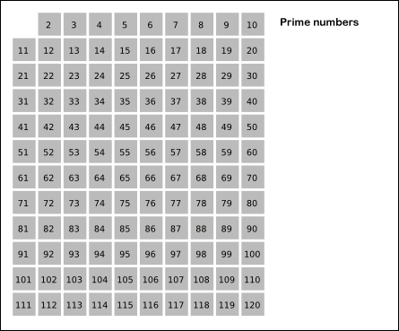

<!-- more -->

## 0200

// #region 0200

- [🟠 200 - 岛屿数量](https://leetcode.cn/problems/number-of-islands)

::: details 💡

:::

// #endregion 0200

## 0202

// #region 0202

- [🟢 202 - 快乐数](https://leetcode.cn/problems/happy-number)
    > 编写一个算法来判断一个数 n 是不是快乐数。
    > 快乐数: 将一个整数的每一位进行平分运算然后求和，求和结果继续循环进行上述操作，如果结果为 1 则表明是快数；如果结果始终不为 1，则表明不是快乐数。
    
        🌰
            输入：n = 19
            输出：true
            解释：
                1² + 9² = 82
                8² + 2² = 68
                6² + 8² = 100
                1² + 0² + 0² = 1

::: details 💡

::: code-tabs

@tab java
```java

```

:::

// #endregion 0202

## 0203 ✅

// #region 0203

- [🟢 203 - 移除链表元素](https://leetcode.cn/problems/remove-linked-list-elements)

        🌰
            输入：head = [1,2,6,3,4,5,6], val = 6
            输出：[1,2,3,4,5]

::: details 💡

【思路】双指针法

::: code-tabs

@tab java
```java
/**
 * Definition for singly-linked list.
 * public class ListNode {
 *     int val;
 *     ListNode next;
 *     ListNode() {}
 *     ListNode(int val) { this.val = val; }
 *     ListNode(int val, ListNode next) { this.val = val; this.next = next; }
 * }
 */
class Solution {
    public ListNode removeElements(ListNode head, int val) {
        ListNode dummy = new ListNode();
        dummy.next = head;
        ListNode fast = head;
        ListNode slow = dummy;
        while ( fast!= null ) {
            if ( fast.val != val ) {
                // 不等于目标值时，将慢节点后继节点指向快指针节点
                slow.next = fast;
                slow = slow.next;
            }
            fast = fast.next;
            // 如果已经是最后节点，需要将 slow 后继节点设为 null
            if ( fast == null ) {
                slow.next = null;
            }
        }
        return dummy.next;
    }
}
```

:::

// #endregion 0203

## 0204 ✅

// #region 0204

- [🟠 204 - 计数质数](https://leetcode.cn/problems/count-primes)
    > 给定整数 n ，返回 所有小于非负整数 n 的质数的数量 。
    
        🌰
            输入：n = 10
            输出：4
            解释：小于 10 的质数一共有 4 个, 它们是 2, 3, 5, 7 。

::: details 💡

::: code-tabs

【思路1】暴力法，通过统计所有小于 n 的每一个数是否是质数。

【思路2】埃拉托斯特尼筛法（Sieve of Eratosthenes），核心思想：一个质数的倍数不是质数(合数)，通过遍历遇到质数时，将它所有的倍数都标记为不是质数。

[👉🏻](https://zh.wikipedia.org/wiki/%E5%9F%83%E6%8B%89%E6%89%98%E6%96%AF%E7%89%B9%E5%B0%BC%E7%AD%9B%E6%B3%95)



@tab java 解法1 
```java
class Solution {
    public int countPrimes(int n) {
        int count = 0;
        // 统计 2 ~ n 的质数
        for (int i = 2; i < n; i++) {
            if (isPrimes(i)) count += 1;
        }
        return count;
    }

    /// 判断 n 是否是质数
    boolean isPrimes(int n) {
        for (int i = 2; i*i < n; i++) {
            if (n % i == 0) return false;
        }
        return true;
    }
}
```

@tab java 解法2 💯
```java
class Solution {
    public int countPrimes(int n) {
        boolean[] isPrimes = new boolean[n];
        // 先将所有位置标记 true
        Arrays.fill(isPrimes, true);
        for (int i = 2; i*i <= n; i++) {
            if (isPrimes[i]) {
                int j = i + i;
                while (j < n) {
                    isPrimes[j] = false; // 质数的倍数不是质数
                    j += i;
                }
            }
        }
        // 统计质数个数
        int count = 0;
        for (int i = 2; i < n; i++) {
            if (isPrimes[i]) count += 1;
        }
        return count;
    }
}
```

:::

// #endregion 0204

## 0206 ✅

// #region 0206

- [🟢 206 - 反转链表](https://leetcode.cn/problems/reverse-linked-list)
  > 通过单链表的头结点 head 进行反转链表，返回反转后的链表。
  
::: details 💡

【思路1】递归，使用递归进行链表的反转，底层来说是借助了递归栈

【思路2】遍历，使用两个指针，一个进行遍历，一个进行反转操作

::: code-tabs

@tab swift
```swift
/**
 * Definition for singly-linked list.
 * public class ListNode {
 *     public var val: Int
 *     public var next: ListNode?
 *     public init() { self.val = 0; self.next = nil; }
 *     public init(_ val: Int) { self.val = val; self.next = nil; }
 *     public init(_ val: Int, _ next: ListNode?) { self.val = val; self.next = next; }
 * }
 */
class Solution {
    func reverseList(_ head: ListNode?) -> ListNode? {
        guard head != nil, head?.next != nil else { return head }
        let last = reverseList(head?.next)
        head?.next?.next = head
        head?.next = nil
        return last
    }
}
```

@tab java
```java
/**
 * Definition for singly-linked list.
 * public class ListNode {
 *     int val;
 *     ListNode next;
 *     ListNode() {}
 *     ListNode(int val) { this.val = val; }
 *     ListNode(int val, ListNode next) { this.val = val; this.next = next; }
 * }
 */
class Solution {
    public ListNode reverseList(ListNode head) {
        ListNode result = null; // 结果链表头结点
        ListNode node = head; // 链表遍历节点
        while (node != null) {
            // 先保存当前节点下一个节点
            ListNode temp = node.next;

            // 当前节点指向结果链表(将遍历节点与结果链表相连)
            node.next = result;
            // 将结果链表指向当前遍历节点(已经反转的部分)
            result = node;
            
            // 遍历节点往前一步，继续遍历下一个节点
            node = temp;
        }
        return result;
    }
}
```

:::

// #endregion 0206

## 0207

// #region 0207

- [🟠 207 - 课程表](https://leetcode.cn/problems/course-schedule)

::: details 💡

::: code-tabs

@tab java
```java

```

:::

// #endregion 0207

## 0208

// #region 0208

- [🟠 208 - 实现 Trie (前缀树)](https://leetcode.cn/problems/implement-trie-prefix-tree)

::: details 💡

::: code-tabs

@tab java
```java

```

:::

// #endregion 0208


## 0210

// #region 0210

- [🟠 210 - 课程表 II](https://leetcode.cn/problems/course-schedule-ii)

::: details 💡

::: code-tabs

@tab java
```java

```

:::

// #endregion 0210

## 0211

// #region 0211

- [🟠 211 - 添加与搜索单词 - 数据结构设计](https://leetcode.cn/problems/design-add-and-search-words-data-structure)

::: details 💡

::: code-tabs

@tab java
```java

```

:::

// #endregion 0211


## 0213

// #region 0213

- [🟠 213 - 打家劫舍 II](https://leetcode.cn/problems/house-robber-ii)

::: details 💡

::: code-tabs

@tab java
```java

```

:::

// #endregion 0213

## 0214

// #region 0214

- [🔴 214 - 最短回文串](https://leetcode.cn/problems/shortest-palindrome)

::: details 💡

::: code-tabs

@tab java
```java

```

:::

// #endregion 0214

## 0215 ✅

// #region 0215

- [🟠 215 - 数组中的第K个最大元素](https://leetcode.cn/problems/kth-largest-element-in-an-array)
    > 给定整数数组 nums 和整数 k，请返回数组中第 k 个最大的元素。(要求: 时间复杂度 O(n))
        
        🌰
            输入: [3,2,1,5,6,4], k = 2
            输出: 5

::: details 💡

【思路1】快速选择，借用快排的分区，根据索引位置，判断第 k 大的元素在那一部分，进而只需要在另一区域进行继续分区判断；最终当分区索引恰好等于第 k 大元素的索引则就找到了第 k 大的元素。

【思路2】优先级队列。

::: code-tabs

@tab java 解法1(超时)
```java
class Solution {
    public int findKthLargest(int[] nums, int k) {
        int left = 0;
        int right = nums.length - 1;
        // 排序之后第 k 大元素的索引
        int target = nums.length - k;
        while (left <= right) {
            // 进行分区，返回分区索引
            int index = partition(nums, left, right);
            if (index > target) {
                // 目标值在左边，缩小右边界
                right = index - 1;
            } else if (index < target) {
                // 目标值在右边，缩小左边界
                left = index + 1;
            } else {
                // 找到目标值
                return nums[index];
            }
        }
        return 0;
    }
    
    // 对数组进行快排分区
    private int partition(int[] nums, int left, int right) {
        // 选取第一个值为分区值
        int num = nums[left];
        int l = left + 1;
        int r = right;
        while (l <= r) {
            // 找到左边一个大于 num 的索引
            while (l <= r && nums[l] <= num) {
                l += 1;
            }
            // 找到到右边第一个小于 num 的索引
            while (l <= r && nums[r] > num) {
                r -= 1;
            }
            if (l >= r) break;
            // 进行交换
            swap(nums, l, r);
        }
        // 最后交换第一个分区函数与 r 索引值
        swap(nums, left, r);

        return r;
    }
    // 交换数组中指定索引值
    private void swap(int[] nums, int i, int j) {
        int temp = nums[i];
        nums[i] = nums[j];
        nums[j] = temp;
    }
}
```

:::

// #endregion 0215

## 0216 ✅

// #region 0216

- [🟠 216 - 组合总和 III](https://leetcode.cn/problems/combination-sum-iii)
    > 使用数字 0 ~ 9 ，给定组合数量以及目标值，找出符合条件的所有组合(每一个数字只能使用一次)

        🌰
    
            输入: k = 3, n = 7
            输出: [[1,2,4]]

::: details 💡

::: code-tabs

@tab java
```java
class Solution {
    int[] nums = new int[] {1, 2, 3, 4, 5, 6, 7, 8, 9};
    List<List<Integer>> result = new LinkedList();
    List<Integer> track = new LinkedList();
    int trackSum = 0;

    public List<List<Integer>> combinationSum3(int k, int n) {
        backtrack(k, n, 0);
        return result;
    }

    void backtrack(int k, int n, int start) {
        if (trackSum > n) return; // 超过目标值，跳过
        if (track.size() > k) return; // 超过组合数量，跳过
        if (trackSum == n && track.size() == k) { // 等于目标值 && 等于组合数量收集组合
            result.add(new LinkedList(track));
            return;
        }
        for (int i = start; i < nums.length; i++) {
            int num = nums[i];
            track.add(num);
            trackSum += num;
            backtrack(k, n, i + 1);
            track.removeLast();
            trackSum -= num;
        }
    }
}
```

:::

// #endregion 0216

## 0222

// #region 0222

- [🟠 222 - 完全二叉树的节点个数](https://leetcode.cn/problems/count-complete-tree-nodes)

::: details 💡

:::

// #endregion 0222

## 0224

// #region 0224

- [🔴 224 - 基本计算器](https://leetcode.cn/problems/basic-calculator)

::: details 💡

:::

// #endregion 0224

## 0225 ✅

// #region 0225

- [🟢 225 - 用队列实现栈](https://leetcode.cn/problems/implement-stack-using-queues)
    > 请你仅使用两个队列实现一个后入先出（LIFO）的栈，并支持普通栈的全部四种操作（push、top、pop 和 empty）。

        实现 MyStack 类：
            void push(int x) 将元素 x 压入栈顶。
            int pop() 移除并返回栈顶元素。
            int top() 返回栈顶元素。
            boolean empty() 如果栈是空的，返回 true ；否则，返回 false 。

::: details 💡

【思路】用两个队列轮流当做数据队列，每次入栈时，在有数据的队列添加数据；出栈时，将数据队列中的数据倒入另一个空队列中，不是全部倒入剩下一个，就是栈顶元素；返回栈顶元素时，也是剩一个，先出队列临时保存，并添加进入另一个队列，返回这个临时保存的值。

::: code-tabs

@tab swift
```swift

class MyStack {
    init() {}
    
    private var queue1: [Int] = []
    private var queue2: [Int] = []

    // 先将 queue1 中的多余数据倒入 queue2
    private func queue1To2() {
        while (queue1.count > 1) {
            queue2.append(queue1.removeFirst())
        }
    }
    // 先将 queue2 中的多余数据倒入 queue1
    private func queue2To1() {
        while (queue2.count > 1) {
            queue1.append(queue2.removeFirst())
        }
    }
    
    // 入栈
    func push(_ x: Int) {
        // 在数据队列中添加数据
        if queue1.isEmpty {
            queue2.append(x)
        } else {
            queue1.append(x)
        }
    }
    // 出栈
    func pop() -> Int {
        if queue1.isEmpty {
            queue2To1()
            return queue2.removeFirst()
        } else {
            queue1To2()
            return queue1.removeFirst()
        }
    }
    // 查询栈顶元素
    func top() -> Int {
        if queue1.isEmpty {
            queue2To1()
            var num = queue2.removeFirst()
            queue1.append(num)
            return num
        } else {
            queue1To2()
            var num = queue1.removeFirst()
            queue2.append(num)
            return num
        }
    }
    // 栈是否为空
    func empty() -> Bool {
        queue1.isEmpty && queue2.isEmpty
    }
}

/**
 * Your MyStack object will be instantiated and called as such:
 * let obj = MyStack()
 * obj.push(x)
 * let ret_2: Int = obj.pop()
 * let ret_3: Int = obj.top()
 * let ret_4: Bool = obj.empty()
 */
```

:::

// #endregion 0225

## 0226 ✅

// #region 0226

- [🟠 226 - 翻转二叉树](https://leetcode.cn/problems/invert-binary-tree)

::: details 💡

::: code-tabs

@tab swift
```swift
/**
 * Definition for a binary tree node.
 * public class TreeNode {
 *     public var val: Int
 *     public var left: TreeNode?
 *     public var right: TreeNode?
 *     public init() { self.val = 0; self.left = nil; self.right = nil; }
 *     public init(_ val: Int) { self.val = val; self.left = nil; self.right = nil; }
 *     public init(_ val: Int, _ left: TreeNode?, _ right: TreeNode?) {
 *         self.val = val
 *         self.left = left
 *         self.right = right
 *     }
 * }
 */
class Solution {
    func invertTree(_ root: TreeNode?) -> TreeNode? {
        guard let root = root else { return nil }
        // 交换左右节点
        let node = root.left
        root.left = root.right
        root.right = node

        // 继续递归对左右节点进行同样操作
        invertTree(root.left)
        invertTree(root.right)
        return root
    }
}
```

:::

// #endregion 0226

## 0227

// #region 0227

- [🟠 227 - 基本计算器 II](https://leetcode.cn/problems/basic-calculator-ii)

::: details 💡

::: code-tabs

@tab java
```java

```

:::

// #endregion 0227

## 0229 ✅

// #region 0229

- [🟠 229 - 多数元素 II](https://leetcode.cn/problems/majority-element-ii)
    > 给定一个大小为 n 的整数数组，找出其中所有出现超过 n/3 次的元素。
    
        🌰
            输入：nums = [3,2,3]
            输出：[3]
        🌰
            输入：nums = [1,2]
            输出：[1,2]
    
::: details 💡

【思路1】使用哈希表进行统计，遍历数组通过哈希表进行计数，最后统计计数超过数组 1/3 的元素

【思路2】摩尔投票，通过两个计数来统计票数
  - 如果 vote1 为 0 时，设置第一个元素；如果 vote2 为 0 时，设置第二个元素
  - 如果元素等于第一个元素，则 vote1 进行 +1；如果元素等于第二个元素，则 vote2 进行 +1；如果均不相同，则 vote1、vote2 都进行 -1
  - 再次遍历数组，将投票数大于零的元素，进行票数统计
  - 最后根据技术是否超过 n/3，进行结果收集

::: code-tabs

@tab swift 解法1
```swift
class Solution {
    func majorityElement(_ nums: [Int]) -> [Int] {
        // 通过哈希表进行计数
        var map: [Int: Int] = [:]
        for num in nums {
            map[num] = (map[num] ?? 0) + 1
        }
        // 过滤出哈希表中值大于 n/3 的元素
        var result: [Int] = []
        let n3 = nums.count / 3
        for key in map.keys {
            guard (map[key] ?? 0) > n3 else { continue }
            result.append(key)
        }
        return result
    }
}
```

@tab swift 解法2 💯
```swift
class Solution {
    func majorityElement(_ nums: [Int]) -> [Int] {
        // 1> 先通过摩尔投票挑选出可能的多数元素
        //    由于超过 n/3 的多数元素，最多只可能有有两个
        //    使用两个计数来统计多数元素
        var element1 = 0
        var vote1 = 0 // 投票数1
        var element2 = 0
        var vote2 = 0 // 投票数2
        for num in nums {
            if vote1 > 0, num == element1 {
                // num 等于第一个多数元素时，进行投票 +1
                vote1 += 1
            } else if vote2 > 0, num == element2 {
                // num 等于第二个多数元素时，进行投票 +1
                vote2 += 1
            } else if vote1 == 0 {
                // vote1 为 0 时，设置第一个多数元素
                element1 = num
                vote1 += 1
            } else if vote2 == 0 {
                // vote2 为 0 时，设置第二多数元素
                element2 = num
                vote2 += 1
            } else {
                // num 为其他元素时，进行投票 -1
                vote1 -= 1
                vote2 -= 1
            }
        }
        // 2> 统计两个可能元素的票数
        var count1 = 0
        var count2 = 0
        for num in nums {
            if vote1 > 0, num == element1 {
                count1 += 1
            } else if vote2 > 0, num == element2 {
                count2 += 1
            }
        }
        // 3> 判断票数是否超过 n/3，进行答案收集
        var result = [Int]()
        let n3 = nums.count / 3
        if count1 > n3 {
            result.append(element1)
        }
        if count2 > n3 {
            result.append(element2)
        }
        return result
    }
}
```

:::

// #endregion 0229

## 0230

// #region 0230

- [🟠 230 - 二叉搜索树中第K小的元素](https://leetcode.cn/problems/kth-smallest-element-in-a-bst)

::: details 💡

::: code-tabs

@tab java
```java

```

:::

// #endregion 0230

## 0231 ✅

// #region 0231

- [🟢 231 - 2 的幂](https://leetcode.cn/problems/power-of-two)
  > 判断一个整数是否为 2 的幂次方

::: details 💡

【思路1】除余法，对 2 进行不停的除法，如果最后余数结果等于 1 则表明是 2 的幂次。

【思路2】位运算，如果 n 是 2 的幂次方，那么 n & (n - 1) == 0

::: code-tabs

@tab java 解法1
```java
class Solution {
    public boolean isPowerOfTwo(int n) {
        if (n <= 0) return false;
        while (n > 1) {
            if (n % 2 != 0) return false;
            n /= 2;
        }
        return n == 1;
    }
}
```

@tab java 解法2
```java
class Solution {
    public boolean isPowerOfTwo(int n) {
        if (n <= 0) return false;
        return (n & (n - 1)) == 0;
    }
}
```

@tab swift 解法2
```swift
class Solution {
    func isPowerOfTwo(_ n: Int) -> Bool {
        guard n > 0 else { return false }
        return n & (n - 1) == 0
    }
}
```

:::

// #endregion 0231

## 0232 ✅

// #region 0232

- [🟢 232 - 用栈实现队列](https://leetcode.cn/problems/implement-queue-using-stacks)
    > 请你仅使用两个栈实现先入先出队列。队列应当支持一般队列支持的所有操作（push、pop、peek、empty）：
    
        实现 MyQueue 类：
            void push(int x) 将元素 x 推到队列的末尾
            int pop() 从队列的开头移除并返回元素
            int peek() 返回队列开头的元素
            boolean empty() 如果队列为空，返回 true ；否则，返回 false

::: details 💡

【思路】类似两杯水倒水一样，一个栈用于入队列，一个栈用于出队列。

::: code-tabs

@tab swift
```swift

class MyQueue {
    init() {}

    private var stack1: [Int] = []
    private var stack2: [Int] = []

    // 将 stack1 中数据倒入 stack2
    private func stack1To2() {
        while (!stack1.isEmpty) {
            stack2.append(stack1.removeLast())
        }
    }
    // 将 stack2 中数据倒入 stack1
    private func stack2To1() {
        while (!stack2.isEmpty) {
            stack1.append(stack2.removeLast())
        }
    }
    
    // 入队列
    func push(_ x: Int) {
        stack2To1()
        stack1.append(x)
    }
    // 出队列
    func pop() -> Int {
        stack1To2()
        return stack2.removeLast()
    }
    // 查询队头元素
    func peek() -> Int {
        stack1To2()
        return stack2[stack2.count - 1]
    }
    // 队列是否为空
    func empty() -> Bool {
        stack1.isEmpty && stack2.isEmpty
    }
}

/**
 * Your MyQueue object will be instantiated and called as such:
 * let obj = MyQueue()
 * obj.push(x)
 * let ret_2: Int = obj.pop()
 * let ret_3: Int = obj.peek()
 * let ret_4: Bool = obj.empty()
 */
```

:::

// #endregion 0232

## 0233

// #region 0233

- [🔴 233 - 数字 1 的个数](https://leetcode.cn/problems/number-of-digit-one)
    > 给定一个整数 n，计算所有小于等于 n 的非负整数中数字 1 出现的个数。
    
        🌰
            输入：n = 13
            输出：6

::: details 💡

::: code-tabs

【思路】动态规划

@tab java
```java

```

:::

// #endregion 0233

## 0234

// #region 0234

- [🟢 234 - 回文链表](https://leetcode.cn/problems/palindrome-linked-list)

::: details 💡

::: code-tabs

@tab java
```java

```

:::

// #endregion 0234

## 0235 ✅

// #region 0235

- [🟠 235 - 二叉搜索树的最近公共祖先](https://leetcode.cn/problems/lowest-common-ancestor-of-a-binary-search-tree)
    > 给定一个二叉搜索树, 找到该树中两个指定节点的最近公共祖先。
    > 所有节点的值都是唯一的。p、q 为不同节点且均存在于给定的二叉搜索树中。
    
        🌰
                       6
                    /     \
                   2       8
                  / \     / \
                 0   4   7   9
                    / \
                   3   5
            输入: root = [6,2,8,0,4,7,9,null,null,3,5], p = 2, q = 8
            输出: 6 

::: details 💡

【思路】利用二叉搜索树的特征，所有左子树节点均小于该节点值，所有右子树均大于该节点值。那么利用这个特征，如果某一个节点的值，刚好则两个目标节点值的范围内，则就是最近公共祖先。如果大于两个目标节点，则在左子树继续查找；如果小于两个目标节点，则在右子树继续查找。

::: code-tabs

@tab java
```java
/**
 * Definition for a binary tree node.
 * public class TreeNode {
 *     int val;
 *     TreeNode left;
 *     TreeNode right;
 *     TreeNode(int x) { val = x; }
 * }
 */

class Solution {
    public TreeNode lowestCommonAncestor(TreeNode root, TreeNode p, TreeNode q) {
        return find(root, Math.min(p.val, q.val), Math.max(p.val, q.val));
    }
    private TreeNode find(TreeNode root, int min, int max) {
        if (root == null) return null;
        // 当前节点小于最小值，则到右子树查找
        if (root.val < min) {
            return find(root.right, min, max);
        }
        // 当前节点大于最大值，则到左子树查找
        if (root.val > max) {
            return find(root.left, min, max);
        }
        // min <= root.val <= max，则表明该节点就是公共祖先
        return root;
    }
}
```

:::

// #endregion 0235

## 0236 ✅

// #region 0236

- [🟠 236 - 二叉树的最近公共祖先](https://leetcode.cn/problems/lowest-common-ancestor-of-a-binary-tree)
    > 给定一个二叉树, 找到该树中两个指定节点的最近公共祖先。
    > 所有节点的值都是唯一的。p、q 为不同节点且均存在于给定的二叉树中。
    
        🌰
                       3
                    /     \
                   5       1
                  / \     / \
                 6   2   0   8
                    / \
                   7   4
            输入：root = [3,5,1,6,2,0,8,null,null,7,4], p = 5, q = 1
            输出：3

::: details 💡

【思路】递归，如果二叉树中的一个节点，可以在左右子树中查找到两个目标节点，则表明该节点就是最近的公共祖先节点。

::: code-tabs

@tab java
```java
/**
 * Definition for a binary tree node.
 * public class TreeNode {
 *     int val;
 *     TreeNode left;
 *     TreeNode right;
 *     TreeNode(int x) { val = x; }
 * }
 */
class Solution {
    public TreeNode lowestCommonAncestor(TreeNode root, TreeNode p, TreeNode q) {
        if (root == null) return null;
        // 找到 p 或 q 节点
        if (root.val == p.val || root.val == q.val) return root;
        // 未找到，继续在左右子树中查找
        TreeNode left = lowestCommonAncestor(root.left, p, q);
        TreeNode right = lowestCommonAncestor(root.right, p, q);
        // 在左右子树中查找到目标节点，则表明该节点就是公共祖先
        if (left != null && right != null) return root;
        // 返回查找到的节点
        return left != null ? left : right;
    }
}
```

:::

// #endregion 0236

## 0237 ✅

// #region 0237

- [🟠 237 - 删除链表中的节点](https://leetcode.cn/problems/delete-node-in-a-linked-list)
    > 给定链表中的一个节点，删除这个节点(确保不是链表最后一个节点)

        🌰
            输入：head = [4,5,1,9], node = 5
            输出：[4,1,9]

::: details 💡

【思路】取巧方案，只需将后续节点的值赋值给当前节点，然后将删除节点的后继节点指向，后继节点的后继节点。

::: code-tabs

@tab java
```java
/**
 * Definition for singly-linked list.
 * public class ListNode {
 *     int val;
 *     ListNode next;
 *     ListNode(int x) { val = x; }
 * }
 */
class Solution {
    public void deleteNode(ListNode node) {
        ListNode p = node;
        while ( p.next != null ) {
            p.val = p.next.val;
            if ( p.next.next == null) {
                // 后继节点是最后一个节点，直接指向 null
                p.next = null;
            } else {
                // 后继节点不是最后一个节点，往后移动
                p = p.next;
            }
        }
    }
}
```

:::

// #endregion 0237

## 0239

// #region 0239

- [🔴 239 - 滑动窗口最大值](https://leetcode.cn/problems/sliding-window-maximum)

::: details 💡

::: code-tabs

@tab java
```java

```

:::

// #endregion 0239

## 0241 ✅

// #region 0241

- [🟠 241 - 为运算表达式设计优先级](https://leetcode.cn/problems/different-ways-to-add-parentheses)
    > 给你一个由数字和运算符组成的字符串 expression ，按不同优先级组合数字和运算符，计算并返回所有可能组合的结果。你可以 按任意顺序 返回答案。
    > 生成的测试用例满足其对应输出值符合 32 位整数范围，不同结果的数量不超过 104 。
    > expression 由数字和算符 '+'、'-' 和 '*' 组成。
    > 输入表达式中的所有整数值在范围 [0, 99] 
        
        🌰
            输入：expression = "2-1-1"
            输出：[0,2]
            解释：
            ((2-1)-1) = 0 
            (2-(1-1)) = 2
        🌰
            输入：expression = "2*3-4*5"
            输出：[-34,-14,-10,-10,10]
            解释：
            (2*(3-(4*5))) = -34 
            ((2*3)-(4*5)) = -14 
            ((2*(3-4))*5) = -10 
            (2*((3-4)*5)) = -10 
            (((2*3)-4)*5) = 10

::: details 💡

【思路】分治法+递归，根据操作进行子串分割，递归进行左右子串计算，直到无操作符时将转化为数字，左右部分根据操作符进行运算求解。

::: code-tabs

@tab java
```java
class Solution {
    public List<Integer> diffWaysToCompute(String expression) {
        return diffWaysToCompute(expression.toCharArray());
    }

    private List<Integer> diffWaysToCompute(char[] chars) {
        List<Integer> result = new ArrayList();
        for (int i = 0; i < chars.length; i++) {
            char c = chars[i];
            if (!(c == '+' || c == '-' || c == '*')) continue;
            // 是操作符
            // 截取操作符两边字符串继续分治递归进行子串计算
            char[] lChars = Arrays.copyOfRange(chars, 0, i);
            char[] rChars = Arrays.copyOfRange(chars, i + 1, chars.length);
            List<Integer> lNums = diffWaysToCompute(lChars);
            List<Integer> rNums = diffWaysToCompute(rChars);
            // 对左右两部分结果进行计算
            for (Integer left : lNums) {
                for (Integer right : rNums) {
                    if (c == '+') {
                        result.add(left + right);
                    } else if (c == '-') {
                        result.add(left - right);
                    } else if (c == '*') {
                        result.add(left * right);
                    }
                }
            }
        }
        if (result.isEmpty()) { // 没有操作符，仅剩数字了
            result.add(Integer.parseInt(new String(chars)));
        }
        return result;
    }
}
```

:::

// #endregion 0241

## 0242

// #region 0242

- [🟢 242 - 有效的字母异位词](https://leetcode.cn/problems/valid-anagram)
    > 给定两个字符串 s 和 t ，编写一个函数来判断 t 是否是 s 的字母异位词。
    > 注意：若 s 和 t 中每个字符出现的次数都相同，则称 s 和 t 互为字母异位词。

        🌰
            输入: s = "anagram", t = "nagaram"
            输出: true
        🌰
            输入: s = "rat", t = "car"
            输出: false
            
::: details 💡

【思路1】排序

【思路2】哈希表，通过哈希表来对字符进行计数，s 串中的字符进行递增，t 串中的字符进行递减，最后哈希表中的字符计数均为零，则表示是异位词。

::: code-tabs

@tab swift 解法2
```swift
class Solution {
    func isAnagram(_ s: String, _ t: String) -> Bool {
        var sChars = [Character](s)
        var tChars = [Character](t)
        var map: [Character: Int] = [:]
        // 将 s 中的字符在哈希表中进行递增
        for char in sChars {
            map[char] = (map[char] ?? 0) + 1
        }
        // 将 t 中的字符在哈希表中进行递减
        for char in tChars {
            map[char] = (map[char] ?? 0) - 1
        }
        // 最后判断哈希表中所有的字符的数量是否都为零
        for key in map.keys {
            if (map[key] ?? 0) != 0 {
                return false
            }
        }
        return true
    }
}
```

:::

// #endregion 0242

## 0253

// #region 0253

- [🟠 253 - 会议室 II](https://leetcode.cn/problems/meeting-rooms-ii)

::: details 💡

::: code-tabs

@tab java
```java

```

:::

// #endregion 0253

## 0256

// #region 0256

- [🟠 256 - 粉刷房子](https://leetcode.cn/problems/paint-house)

::: details 💡

::: code-tabs

@tab java
```java

```

:::

// #endregion 0256

## 0260 ✅

// #region 0260

- [🟠 260 - 只出现一次的数字 III](https://leetcode.cn/problems/single-number-iii)
  > 一个非空的整数数组中，除了两个元素只出现一次外，其余元素均出现两次。找出两个只出现一次的数字
  > 时间复杂度: O(n)  空间复杂度: O(1)

::: details 💡

【思路】异或，根据异或规律 `x^x=0`，则对所有数字进行异或操作结果为 `xor = a^b`；再取异或结果二进制的最后一个 1， 通过公式 `mask = xor & -xor`；由于 `a b` 中肯定只有一个数的有这个后面的 1；最后再次遍历数组，根据这个 `mask` 将数据分为两组，则就变成了求只有一个元素只出现一次的问题。就用 `x^x=0` 的公式计算出结果。  

::: code-tabs

@tab java
```java
class Solution {
    public int[] singleNumber(int[] nums) {
        // 遍历数组进行异或操作求出 xor = a^b
        int xor = 0;
        for (int num : nums) {
            xor ^= num;
        }
        // 求出异或结果 xor 中的最后一个 1 的掩码值，只可能 a 或 b 中有
        int mask = xor & -xor;
        // 通过这个掩码值对数组进行分组求解 a、b
        int a = 0;
        int b = 0;
        for (int num : nums) {
            if ((num & mask) == 0) {
                a ^= num;
            } else {
                b ^= num;
            }
        }
        return new int[]{ a, b };
    }
}
```

  > 升级版
    一个非空的整数数组，除了三个元素只出现一次外，其余元素均出现两次。找出三个只出现一次的数字。
    时间复杂度: O(n)  空间复杂度: O(1)

::: code-tabs

@tab java
```java

```

:::

// #endregion 0260

## 0261

// #region 0261

- [🟠 261 - 以图判树](https://leetcode.cn/problems/graph-valid-tree)

::: details 💡

::: code-tabs

@tab java
```java

```

:::

// #endregion 0261

## 0263 ✅

// #region 0263

- [🟢 263 - 丑数](https://leetcode.cn/problems/ugly-number)
    > 丑数：只包含质因数 2、3 和 5 的正整数。
    > 给定一个数，判断这个数是否是丑数？

        🌰
            输入：n = 6
            输出：true [6 = 2 × 3]
        🌰
            输入：n = 14
            输出：false [14 = 2 * 7]

::: details 💡

::: code-tabs

@tab swift
```swift
class Solution {
    func isUgly(_ n: Int) -> Bool {
        var n = n
        guard n > 0 else { return false }
        while (n % 2 == 0) {
            n /= 2 // 除去所有质因子 2
        }
        while (n % 3 == 0) {
            n /= 3 // 除去所有质因子 3
        } 
        while (n % 5 == 0) {
            n /= 5 // 除去所有质因子 5
        }
        return n == 1
    }
}
```

:::

// #endregion 0263

## 0264

// #region 0264

- [🟠 264 - 丑数 II](https://leetcode.cn/problems/ugly-number-ii)
    > 

::: details 💡

::: code-tabs

@tab java
```java

```

:::

// #endregion 0264

## 0268 ✅

// #region 0268

- [🟢 268 - 丢失的数字](https://leetcode.cn/problems/missing-number)
  > 给定一个包含 [0, n] 中的 n 个数的数组 nums，找出 [0, n] 这个范围中没有出现在数组中的那个数。
    
        🌰
            输入：nums = [3,0,1]
            输出：2
        
::: details 💡

【思路1】缺失的数 = 等差数列求和 - 数组的和

【思路2】位运算
  由于这个数组的值范围为[0, n]，则表明刚好是长度为 n+1 长度的数组。数字刚好与所在的索引的位置匹配，而缺失的数表明该位置没有数。那么使用 `x ^ x = 0` 的特性。只要将数组中数值与所有的索引进行异或操作，那么结果刚好就是缺失的那个数。
  代码实现时，必须要构造一个 0~n 的数组，可以在循环变量数组时，直接使用索引值。需要注意的是 nums 长度为 n，不是 n+1。所以遍历时索引值只能到 n-1，所以可以将进行异或操作的结果值初始值设置为 n。

::: code-tabs

@tab java 解法1
```java

class Solution {
    public int missingNumber(int[] nums) {
        int sum = 0; // 数组的和
        for (int num : nums) {
            sum += num;
        }
        // 缺失的数 = 数学等差数列求和 - 数组的和
        int len = nums.length;
        return (1 + len)*len/2 - sum;
    }
}

```

@tab swift 解法2
```swift
class Solution {
    func missingNumber(_ nums: [Int]) -> Int {
        let count = nums.count
        var result = count
        for i in 0..<count {
            result ^= i
            result ^= nums[i]
        }
        return result
    }
}
```

:::

  > 升级版
    给定一个包含 [0, n] 中的 n-1 个数的数组 nums，找出 [0, n] 这个范围中没有出现在数组中的两个数。

::: details 💡

【思路1】排序

【思路2】哈希表

::: code-tabs

@tab java
```java

```

:::

// #endregion 0268

## 0277

// #region 0277

- [🟠 277 - 搜寻名人](https://leetcode.cn/problems/find-the-celebrity)

::: details 💡

::: code-tabs

@tab java
```java

```

:::

// #endregion 0277

## 0278 ✅

// #region 0278

- [🟢 278 - 第一个错误的版本](https://leetcode.cn/problems/first-bad-version)
    > 软件已经发行版本号 [1, 2, 3, ..., n]，通过函数 `bool isBadVersion(version)` 可以判断该版本是否发生该错误，现在需要查找到第一个发生该错误的版本。

::: details 💡

【思路】二分搜索

::: code-tabs

@tab java
```java
/* The isBadVersion API is defined in the parent class VersionControl.
      boolean isBadVersion(int version); */

public class Solution extends VersionControl {
    public int firstBadVersion(int n) {
        int left = 1;
        int right = n;
        while (left <= right) {
            int mid = left + (right - left)/2;
            if (isBadVersion(mid)) { // bug 版本，调整右边界
                right = mid - 1;
            } else { // 非 bug 版本，调整左边界
                left = mid + 1;
            }
        }
        return left;
    }
}
```

:::

// #endregion 0278

## 0279

// #region 0279

- [🟠 279 - 完全平方数](https://leetcode.cn/problems/perfect-squares)

::: details 💡

::: code-tabs

@tab java
```java

```

:::

// #endregion 0279

## 0283 ✅

// #region 0283

- [🟢 283 - 移动零](https://leetcode.cn/problems/move-zeroes/)
    > 给定一个数组，将数组中的 0 都移动到数组后面，其它元素相对位置保持不变。

        🌰
            输入: nums = [0,1,0,3,12]
            输出: [1,3,12,0,0]

::: details 💡

【思路1】双指针法，遍历数组，快指针遇到 0 时，将慢指针往前移动，并将快指针值赋值到慢指针索引位置。快指针遍历完，最后将慢指针后面的元素全部置为0。

【思路2】也是双指针，遍历数组将不为 0 的元素不停地进行交换处理。

::: code-tabs

@tab java 解法1
```java
class Solution {
    public void moveZeroes(int[] nums) {
        int fast = 0;
        int slow = -1;
        while ( fast < nums.length ) {
            if ( nums[fast] != 0 ) {
                slow += 1;
                nums[slow] = nums[fast];
            }
            fast += 1;
        }
        // 将 slow 后面值均置为 0
        slow += 1;
        while ( slow < nums.length ) {
            nums[slow] = 0;
            slow += 1;
        }
    }
}
```

@tab swift 解法2
```swift
class Solution {
    func moveZeroes(_ nums: inout [Int]) {
        var i = 0
        var j = 0
        while j < nums.count {
            guard nums[j] != 0 else { 
                j += 1
                continue 
            }
            // 查找不为 0 的元素，并进行交换
            if i != j {
                let temp = nums[i]
                nums[i] = nums[j]
                nums[j] = temp
            }
            i += 1
            j += 1
        }
    }
}
```

:::

// #endregion 0283

## 0287 ✅

// #region 0287

- [🟠 287 - 寻找重复数](https://leetcode.cn/problems/find-the-duplicate-number)
    > 给定一个包含 n + 1 个整数的数组 nums ，其数字都在 [1, n] 范围内（包括 1 和 n），可知至少存在一个重复的整数。假设 nums 只有一个重复的整数 ，返回这个重复的数。
    你设计的解决方案必须 “不修改” 数组 nums 且只用常量级 O(1) 的额外空间。

        🌰
            输入：nums = [1,3,4,2,2]
            输出：2

::: details 💡

【思路1】根据数据特点，使用原数组模拟哈希表。遍历数组根据值对应的索引，将数据标记为负数，如果遍历时发现已经为负数，则就是重复的数。最后需要将原数组复原。

【思路2】转化为环形链表问题求解。

::: code-tabs

@tab java 解法1
```java
class Solution {
    public int findDuplicate(int[] nums) {
        // 寻找重复的数
        int result = 0;
        for (int i = 0; i < nums.length; i++) {
            int num = Math.abs(nums[i]);
            if (nums[num - 1] < 0) {
                result = num;
                break;
            } else {
                nums[num - 1] = - nums[num - 1];
            }
        }
        // 恢复原数组
        for (int i = 0; i < nums.length; i++) {
            if (nums[i] < 0) {
                nums[i] = - nums[i];
            }
        }
        return result;
    }
}
```

:::

// #endregion 0287

## 0295

// #region 0295

- [🔴 295 - 数据流的中位数](https://leetcode.cn/problems/find-median-from-data-stream)

::: details 💡

::: code-tabs

@tab java
```java

```

:::

// #endregion 0295

## 0292 ✅

// #region 0292

- [🟢 292 - Nim 游戏](https://leetcode.cn/problems/nim-game)
    > 抓石头游戏，一堆石头，每人每回合能拿 1 ~ 3 个石头，最后拿完石头者获胜。给定一个石头数，判断是否能获胜？

::: details 💡

::: code-tabs

【思路】只要控制对手的石头数是 4 的倍数，则必赢。

@tab java
```java
class Solution {
    public boolean canWinNim(int n) {
        return n % 4 != 0; // 当石头数是不是 4 的倍数时，必赢
    }
}
```

:::

// #endregion 0292

## 0297

// #region 0297

- [🔴 297 - 二叉树的序列化与反序列化](https://leetcode.cn/problems/serialize-and-deserialize-binary-tree)

::: details 💡

::: code-tabs

@tab java
```java

```

:::

// #endregion 0297