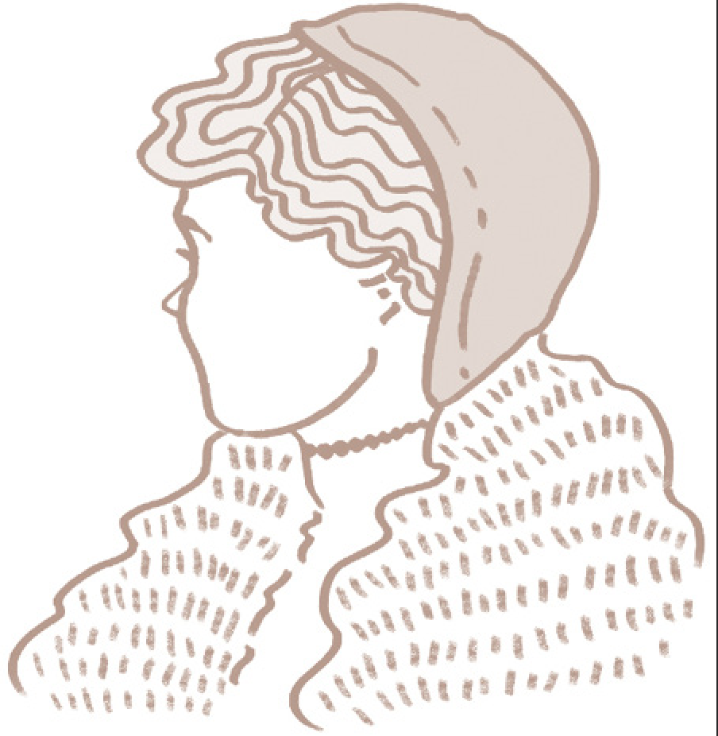
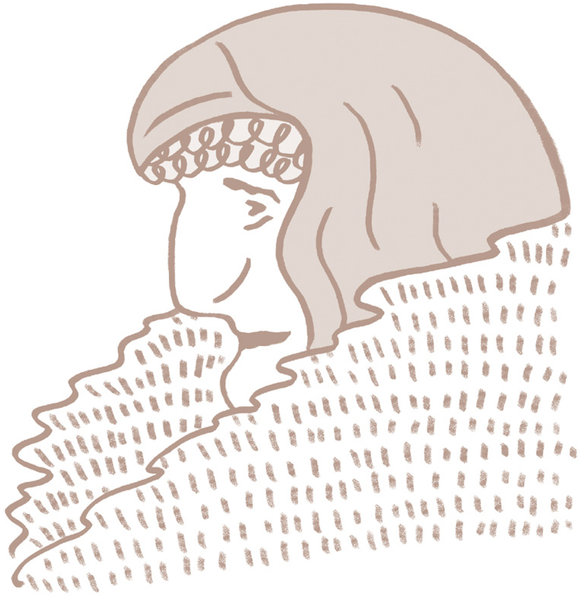
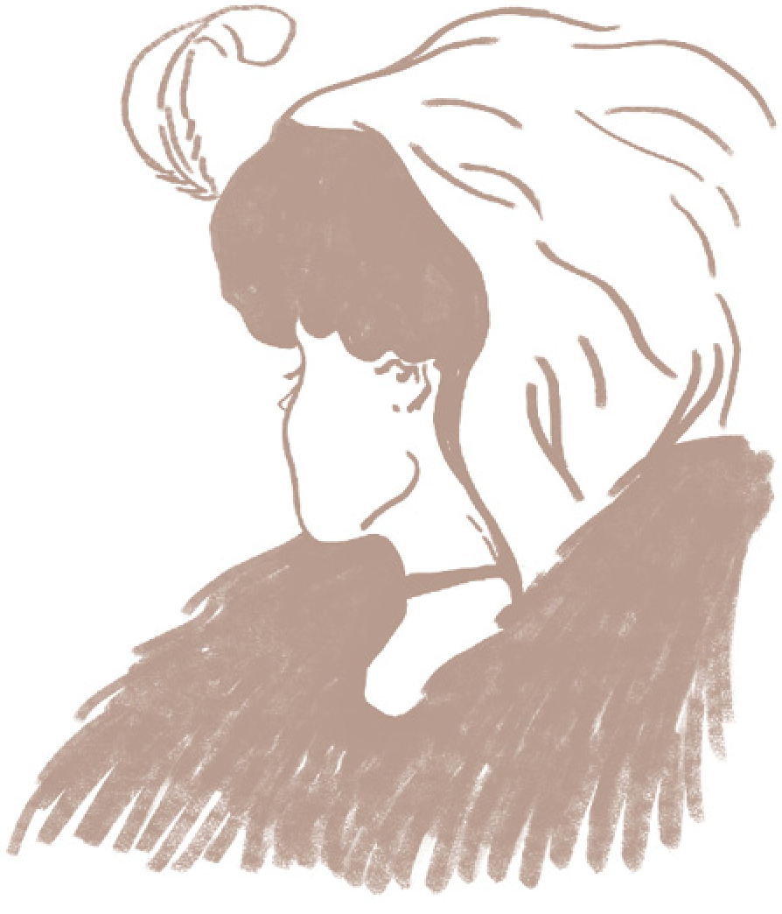
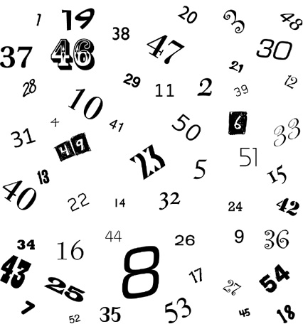
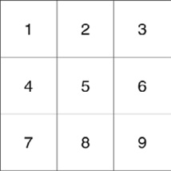
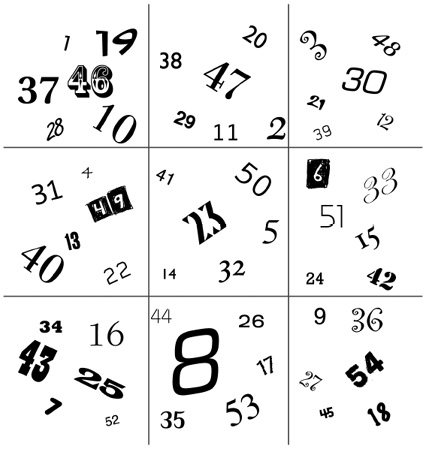

<!-- more -->

## 序言

强调“塑造性格”而不是“实现成功”
 
🌰 比尔·盖茨

  - 比尔·盖茨变得与众不同的原因，并不是在适当时候做决定的运气，而是他在适当时候的积极回应。（习惯一：积极主动）
  - 盖茨在2007年哈佛毕业典礼上的致辞中这样说：“对于马琳达和我来说，挑战是一样的：怎么用手上的资源让尽可能多的人受益。”（习惯二：以终为始）
  - 盖茨在一次晚宴上第一次见到沃伦·巴菲特，当主持人问餐桌上的客人，认为人生旅途中最重要的因素是什么，盖茨和巴菲特不约而同地给出了相同的答案：“重点”。（习惯三：要事第一）
  - 微软与英特尔、IBM的合作。（习惯四：双赢思维）
  - 向朋友请教结束时，他以一句幽默评论作为回报：“我确实需要再学学磷酸盐。”（习惯五：知彼解己）
  - 盖茨和巴尔默合作时的收获要比单打独斗大得多，1+1绝对大于2。（习惯六：统合综效）  
  - 他还养成看传记的爱好，一次他告诉《财富》杂志的布兰特·谢兰登：“一些人在生活中的发展实在令人称奇。”——这句话像咒语般在盖茨身上应验。（习惯七：不断更新）

柯维体系的中心原则：首先塑造性格，先战胜自己才能赢得工作上的胜利。

## 由内而外全面造就自己

> 🎤 没有正确的生活，就没有真正卓越的人生。—— 戴维·斯塔·乔(David Starr Jordan)

  - 期望理论(Expectancy Theory)
  - 自我实现预言(Self-fulfilling Prophecy)
  - 皮格马利翁效应(Pygmalion Effect)

要改变现状，首先要改变自己；要改变自己，先要改变我们对问题的看法。

赞美诗中唱得好：努力探寻你的心灵吧，因为生活源自于此。

> 🎤 “大声喧哗反而难以入耳。” —— 爱默生(Emerson)

> 🎤 “人性可善可恶，冥冥中影响着我们的一生，而且总是如实反映出真正的自我，那是伪装不来的。” —— 威廉姆·乔治·乔登(William George Jordan)

社会性思维：品德成功论 & 个人魅力论

“Paradigm（思维方式）”：这个词来自希腊文，最初是一个科学名词，现在多用来指某种理论、模型、认知、假说或参考框架。

人脑中的地图：

  - 依据世界面貌绘制的地图，反映现实情况。
  - 依据思维方式绘制的地图，反映个人价值观。

对事物的看法决定着我们的思想与行为。

> 小测试：一组人看图片1，另一组看图片2；然后两组人一起看图片3；最后说出自己看到的是什么？

::: details 图片1

:::

::: details 图片2

:::

::: details 图片3

:::

  实验让我们开始认识到，别人的观点虽然有差异，但也是清楚而客观的。“立场决定观点。”

  我们越是认识到思维方式以及经验在我们身上的影响力，就越是能够对自己的思维方式负责，懂得审视它，在现实中检验它，并乐于聆听和接受别人的看法，从而获得更广阔的视野和更客观的看法。

> 📚 “思维转换(Paradigm Shift)” —— 托马斯·库恩(Thomas Kuhn)《科学革命的结构》(The Structure of Scientific Revolutions)

  科学研究的每一项重大突破，几乎都是首先打破传统，打破旧思维、旧模式才得以成功。

  🌰 “地心说” —— 托勒密(古埃及天文学家) => “日心说” —— 尼古拉·哥白尼(1543年)
  
  🌰 牛顿的物理学原理 => 爱因斯坦的相对论理论
  
  🌰 细菌学的出现，才有了现代医学。
  
  > 🎤 “一棵邪恶的大树，砍它枝叶千斧，不如砍它根基一斧。” —— 梭罗(Thoreau)

  行为和态度就是枝叶，思维方式就是根基，抓住根本才能让生活出现实质性的进展。
  
- 以原则为中心的思维方式

  > 🌰 这是灯塔！

  原则如灯塔，是不容动摇的自然法则。
  
  > 🎬 “我们不可能打破法则，只能在违背法则的时候让自己头破血流。” —— 塞西尔·B.德米尔(Cecil B.deMille)《十诫》(The Ten Commandments)
  
  原则不是价值观。一群盗匪可以有相同的价值观，但却违背了良善的原则。如果说原则是地域，那么价值观就是地图。唯有尊重正确原则，才能认清真相。
  
- 成长和改变的原则

  承认自己的无知往往是求知的第一步。
  
  > 🎤 “如果我们时时忙着展现自己的知识，将从何忆起成长所需的无知？” —— 梭罗
  
  > 🌰 教育女儿的例子。=> “需要先经历拥有，然后才会付出。 ”
  
  在关系和气氛紧张的时候，教导会被视为一种评判与否定；关系融洽的时候，在私下里对孩子循循善诱效果会加倍。
  
  只有真正经历过拥有，才会真正懂得分享。
  
- 症结在于治标不治本

  人们越是依赖立竿见影的解决方法，越是加剧了问题潜在的隐患。
  
- 新的思想水平

  > 🎤 “重大问题发生时，依我们当时的思想水平往往无法解决。” —— 爱因斯坦(Albert Einstein)
  
  “由内而外”的意思是从自身做起，甚至更彻底一些，从自己的内心做起，包括自己的思维方式、品德操守和心理动机。
  
  > 🎤 “我们必不可停止探索，而一切探索的尽头，就是重回起点，并对起点有如初见般的了解。” —— 艾略特(T.S.Eliot)
  
  > 🎤 “我们的思维方式，无论正确与否，是我们的态度与行为的根本，归根到底，是我们的人际关系的根本。” —— 史蒂芬·柯维
  
> `PEQ` 效能测试 3.0
  
------

## 七个习惯

> 🎤 “人的行为总是一再重复。因此卓越不是一时的行为，而是习惯。” —— 亚里士多德(Aristotle)｜古希腊哲学家、文艺理论家

> 🎤 “思想决定行动，行动决定习惯，习惯决定品德，品德决定命运。”

- “习惯”的定义
    > “知识”、“技巧”与“意愿”相互交织的结果。
    
    * 知识是理论范畴，指点 “做什么” 及 “为何做”
    * 技巧告诉我们 “如何做”
    * 意愿促使 “想要做”

  > “成熟模式图”(Maturity Continuum)
  
    * 依赖期(Dependence)以“你”为核心
    * 独立期(Independence)以“我”为核心
    * 互赖期(Interdependence)以“我们”为核心
    
- “效能”的定义
    > 产出/产能平衡原则 (P/PC Balance Principle)

  🌰 “鹅生金蛋” —— 伊索寓言

  三类资产

    * 物资资产
    * 金融资产
    * 人力资产

  效能在于平衡。

> 🎤 “谁也无法说服他人改变，因为我们每个人都守着一扇只能从内开启的改变之门，不论动之以情或晓之以理，我们都不能替别人开门。” —— 弗格森(Marilyn Ferguson)

- 七个习惯

    * 习惯一：积极主动(Be Proactive)
    * 习惯二：以终为始(Begin With The End In Mind)
    * 习惯三：要事第一(Put First Things First)
    * 习惯四：双赢思维(Think Win-Win)
    * 习惯五：知彼解己(Seek First To Understand,Then To Be Understood)
    * 习惯六：统合综效(Synergize)
    * 习惯七：不断更新(Sharpen The Saw)

  个人领域的成功：从依赖到独立 (习惯一、二、三)
  公众领域的成功：从独立到互赖 (习惯四、五、六)

- 看到(思维) — 做到(行为) — 收获(结果)

  > 数字游戏：计时一分钟，从 1 数到 54
  
  

::: details 技巧

  按照 1 ~ 9 的格子区域进行顺序查找
  
  

  数字排列规律
  
  

:::

- 低效能人士的七个习惯

    * 习惯一：消极被动
    * 习惯二：漫无目的
    * 习惯三：要事最后
    * 习惯四：你输我赢思维
    * 习惯五：先谈论，再倾听
    * 习惯六：成为一座孤岛
    * 习惯七：耗尽一切

“哪个习惯最重要？” -—— 以终为始

> 🎤 “七个习惯是提高效能的习惯。真正的效能基于符合自然规律的永恒不变的原则。” ——史蒂芬·柯维

习惯是知识、技巧和意愿的交叉点。

------

## 习惯一：积极主动 (个人愿景的原则)

------

## 习惯二：以终为始 (自我领导的原则)

------

## 习惯三：要事第一 (自我管理的原则)

------

## 习惯四：双赢思维 (人际领导的原则)

------

## 习惯五：知彼解己 (移情沟通的原则)

------

## 习惯六：统合终效 (创造合作的原则)

------

## 习惯七：不断更新 (自我提升的原则)

------

## 后记