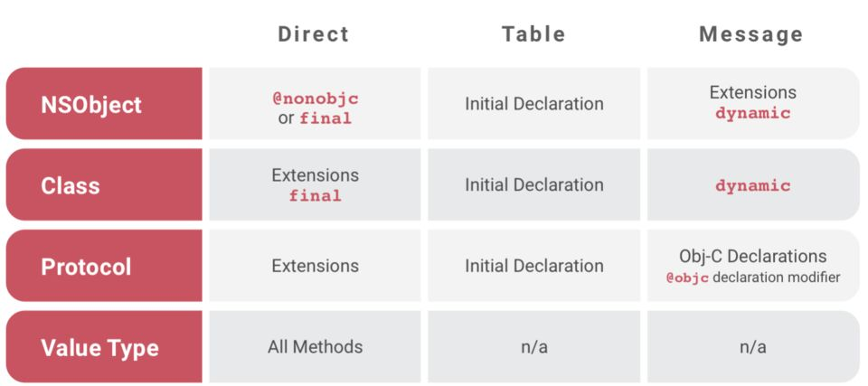

<!-- more -->
  
## reference

- [](✅)[2020-04-15 一文鉴定是 Swift 的王者，还是青铜](https://juejin.cn/post/6844904128188006413)
    > [](✅)[Answer - Swift 进阶黄金之路](https://juejin.cn/post/6844904152951193608)
- []()[2018-12-03 Swift 中的面向协议编程：是否优于面向对象编程？](https://swift.gg/2018/12/03/pop-vs-oop/)
- []()[2018-11-01 深入剖析 Swift 性能优化](https://mp.weixin.qq.com/s/U95QmOOjeXkk-yC23cuZCQ)
- []()[2018-10-08 Swift 的 Witness Table](https://www.jianshu.com/p/c93d7a7d6771)
- []()[2017-01-10 深入理解 Swift 派发机制](https://juejin.cn/post/6844903459863412750?from=search-suggest#heading-5)
- []()[2016-02-27 Swift 烧脑体操](https://blog.devtang.com/2016/02/27/swift-gym-1-nested-optional/)

------

## 设计理念

### ❓`Swift` 为什么是“面向协议”的语言

::: details 💡

:::

### ❓`Swift` 中的 `POP` 与 `OOP` 的区别

::: details 💡

> `OOP`（面向对象编程）和 `POP`（面向协议编程）是两种不同的编程范式。

主要区别：

  - 继承：
    * `OOP` 中，类（`Class`）是一种主要的构造，一个类可以继承另一个类的属性和方法。然而，继承可能引导进入“继承地狱”，即过度使用继承而导致的设计复杂性和代码冗余。
    * `POP` 中，通过协议（`Protocol`）定义一组行为，类型可以遵守协议并实现协议所规定的行为。协议可以被任何类型（如类、结构体、枚举等）遵守，可以使用协议来代替类的继承。

  - 多态：
    * `OOP` 中，多态是通过继承和方法重写实现的。
    * `POP` 中，多态是通过协议和扩展实现的。任何类型只要遵守同一个协议，就可以被视为同一种类型。通过协议扩展，可以提供默认实现或者添加新的功能。

  - 组合：
    * `OOP` 中，为了代码复用，可能需要设计复杂的类层次结构，而且 `Swift` 类不支持多继承，所以当功能跨多个类时可能会变得很麻烦。
    * `POP` 中，类型可以遵守多个协议，每个协议可以代表一种功能或者特性，这使得类型的组合更为灵活。

注：在 `Swift` 中 `POP` 被广泛使用。比如 `Swift` 标准库的许多功能，如集合类型(`Array`, `Dictionary` 等)、数值类型（`Int`, `Double` 等）、`Comparable`、`Equatable` 等都是通过 `POP` 设计的。

:::

### ❓`Swift` 对比 `OC` 的优点在哪里

::: details 💡

  - 简化的语法和语义：`Swift` 的语法更接近现代编程语言。
    > 比如使用 `let`声明常量，`var` 声明变量，可以省去 `;` 分号，同时它引入了元组和可选型概念，使代码更易读易写。
   
  - 安全性：`Swift` 有很多用于增加代码的稳定性和可读性的特性。
    > 例如，它的可选型系统可以清楚地处理 `nil` 值或者缺失值。

  - 易于维护：由于此语言淘汰了 `C` 语言的遗风，`Swift` 代码更易于理解和维护。另外，`Swift` 还取消了头文件的概念，代码更加紧凑。

  - 提高性能：`Swift` 在某些性能上，比如 `GEMM` 算法，快速傅里叶变换等，已经可以达到 `C++` 的水平，这点在 `Objective-C` 上是难以想象的。

  - 内存管理：`Swift` 使用 `ARC`，自动管理应用程序的内存，相对于 `OC` 更加便捷。

  - 具有函数式编程的特性：`Swift` 不仅可以像 `Objective-C` 那样进行面向对象式编程，而且它还混入了函数式编程的一些概念，例如 `map` 和 `filter` 这样的函数。

  - 交互性和可玩性：`Playgrounds` 是 `Swift` 的一项重要特性，它使得学习 `Swift` 更加有趣。

  - 未来发展：`Swift` 是 `Apple` 官方推出和主导的编程语言，未来将会获得更好的支持和发展。

总结：`Swift` 相比于 `Objective-C` 在语法的简洁性、代码的可读性、安全性、性能及未来的发展等多方面具有更大的优势。

:::

------
  
## 结构体与类

### ❓`Swift` 结构体与类的区别

::: details 💡

  - 值类型和引用类型：结构体是值类型；类是引用类型。
    
    一个结构体实例被赋值给一个新的变量或者作为一个函数的参数传递时，这个实例的拷贝会被创建出来，所以改变新变量中的值不会影响原来的实例。
    一个类实例赋值实际上是传递了一个引用，所以修改赋值后的实例也会影响到原来的实例。
    
  - 继承：结构体不能继承其他的结构体或者类；类可以继承其他的类。
  
  - 类型转化：结构体不能；类可以被强制类型转换，可以使用 `is` 和 `as` 操作符在运行时检查实例的类型。
  
  - 析构函数：结构体没有；类有析构函数，用来在类实例被销毁前执行特定的操作。
  
  - 引用计数：结构体没有；类通过引用计数进行内存管理。 
  
  - 协议：类和结构体都可以实现协议，但是类可以利用某些特定的协议提供的运行时特性。
  
:::

### 结构体

#### ❓`Swift` 中 `Array`、`Dictionary`、`Set` 为什么设计成值类型

::: details 💡

  - 语义清晰
    > 可以使赋值的语义更加清晰。当你把一个数组（或字典、集合）赋值给新的变量时，`Swift` 实际上会复制一份这个数组，这意味着新变量和旧变量之间不存在任何关联，对其中一个的改动不会影响到另一个。
  
  - 线程安全
    > 在涉及多线程操作的环境中，无需担心对数组（或字典、集合）的修改会潜在地影响到其他线程。有利于减少由竞态条件（race condition）导致的问题，并使得代码更加安全。
  
  - 性能优化
    > 虽然值类型在赋值时需要复制其数据，但 `Swift` 采用了一种被称为“写时复制”（copy-on-write）的优化策略。只有当数据真正需要被改动时，`Swift` 才会复制一份数据，避免了不必要的复制操作。

:::

#### ❓`cow` 设计说一下

::: details 💡

  `cow` (Copy on Write) : `Swift` 的写时拷贝，也就是说数据只有等到赋值修改时才进行拷贝，主要应用在系统设计的值类型(`String`、`Array`、`Dictionary`)

:::
  
#### ❓`isKnownUniquelyReferenced` 实现自定义结构体 `cow`
  
::: details 💡
  
  `isKnownUniquelyReferenced` 函数可以用来检测是被被多个变量引用
  
  ```swift
  // 数据包装类
  final class Wrapper<A> {
    var wrapper: A
    init(_ value: A) { 
        self.wrapper = value 
    }
  }
  struct MyArray {
    private var storage: Wrapper<[Int]>
    init() {
        storage = Box([1, 2, 3])
    }
    /// 添加数据
    mutating func append(_ item: Int) {
        // 判断是否为唯一的引用，如果不是，先创建副本对象，在进行添加修改
        if !isKnownUniquelyReferenced(&storage) {
            storage = Wrapper(storage.wrapper)
        }
        storage.wapper.append(item)
    }
  }
  ```
  
:::

### 类

#### ❓`Swift` 中的初始化方法

::: details 💡

> 初始化方法是用来确保类型实例中的所有存储属性都被赋予初始值的特殊方法。

`Swift` 的初始化过程中有两个阶段：

  - 第一阶段是为每个存储型属性设置初始值。当每个存储型属性的初始值被确定后
  - 第二阶段开始，它允许人们可以自定义他们的存储型属性。

`Swift` 的构造器分为两种：指定构造器和便利构造器。

  - 指定构造器：类中最主要的构造器，一个类必须拥有至少一个指定构造器。
  - 便利构造器：类中比较次要的，辅助型的构造器。它通常在为某个特定使用场景或者特定输入值提供构造方便。

```swift
class MyClass {
    var name: String

    // 指定构造器
    init(name: String) {
        self.name = name
    }
    
    // 便利构造器
    convenience init() {
        self.init(name: "[Unnamed]")
    }
}
```

:::

#### ❓`static` 和 `class` 的区别

::: details 💡

  `static` 和 `class` 都可以用来声明类型级别的方法或属性。

  - `static` 可以用于类、结构体和枚举，声明静态方法和静态属性。对于静态方法和属性，无论是在类还是在类的实例中，都是共享同一个存储空间。对于使用 `static` 声明的计算属性或方法，无法在子类中进行重写。这是因为 `static` 声明的属性和方法被绑定到了它们被声明的类型上。

    ```swift
    class MyClass {
        static var myStaticProperty: Int {
            return 1
        }
    }
    ```

  - `class` 关键字只能用于类，用于声明类方法和类属性。使用 `class` 关键字标记的计算属性或者方法可以在子类中进行重写。

    ```swift
    class MySuperClass {
        class var myClassProperty: Int {
            return 1
        }
    }
    
    class MySubClass: MySuperClass {
        override class var myClassProperty: Int {
            return 2
        }
    }
    ```

:::

#### ❓`Swift` 中的 `final` 作用

::: details 💡

> `final` 关键字用于防止一个类被继承，或者防止一个方法、属性或下标方法被一个子类重写。

```swift
// 1> 防止类被继承
// 如果一个类为 final，那么该类中所有的方法、属性以及下标方法都将被自动标记为 final。
final class SomeClass {
    // class definition here
}

class SomeClass {
    // 2> 防止方法被子类重写
    final func someMethod() {
        // method body here
    }
}
```

  `final` 的主要目的：一是提高性能（编译器可以优化 `final` 方法或类的调用），二是表达设计意图（不希望、也不需要子类去重写或者继承）。

:::

### 属性

#### ❓存储属性与计算属性区别

::: details 💡

  - **存储属性**：顾名思义，存储属性是某个特定类或结构体实例所存储的一个值，如 `Int、String、Double` 类型的常量或变量。这个值可能是定义时直接赋值的，也可能是在初始化时赋值。

    ```swift
    // Point 结构体有两个存储属性 x 和 y。
    struct Point {
        var x = 0.0
        var y = 0.0
    }
    var point = Point(x: 5.0, y: 5.0)
    ```

  - **计算属性**：计算属性并不直接存储值，而是提供一个 `getter` 和一个可选的 `setter` 来间接获取和设置其他属性或者变量的值。

    ```swift
    struct Rectangle {
        var width = 0.0
        var height = 0.0
    
        // Rectangle 结构体有一个计算属性 area
        var area: Double {
            get { // 通过 width 和 height 计算得来
                return width * height
            }
            set { // 可以通过设置 area 的值间接修改 width 和 height 的值
                width = sqrt(newValue)
                height = sqrt(newValue)
            }
        }
    }
    ```

  > 总结：存储属性是存储在特定类或结构体实例中的一个常量或变量；计算属性则是通过计算得到的一个值。

:::

#### ❓`Swift` 中的属性修饰符

::: details 💡

  - 访问权限修饰符：

    * `private`：私有属性，只能在属性所在的类或结构体中访问。
    * `fileprivate`：文件私有属性，只能在该属性所在的文件范围内访问。
    * `internal`：内部属性，可以在整个模块（例如一个 `App` 或者一个 `Framework`）内访问，这是默认的访问级别。
    * `public`：公开属性，可以被任何人访问，但在别的模块中不能被 `override` 和继承。
    * `open`：开放属性，可以被任何人使用，也可以在别的模块中被 `override` 和继承。
 
  - 内存管理修饰符
  
    * `weak`：用于解决循环引用的问题，被修饰的属性在引用的对象被销毁后将自动被设为 `nil`。
    * `unowned`：和 `weak` 类似，也用于解决循环引用的问题，但被修饰的属性在引用的对象被销毁后不会被设为 `nil`，因此在使用时需要确保该对象仍然存在，否则会出现运行时错误。

  - 功能修饰符
    
    * `lazy`：延迟加载的属性，它的值将在第一次访问时才被计算并存储。
    * `dynamic`：可以让该属性在运行时动态查找，主要用于 `Objective-C` 和 `Swift` 的互操作。
    
  - 特性修饰符
    * `@IBOutlet`：用于 `Interface Builder` 中的属性的连接。
    * `@propertyWrapper`：用于自定义属性包装器，通过包装器可以定义属性值的存储方式和逻辑。
    * `@Published`：用于自动为属性生成将会发送属性最新值的 `publisher`。

:::

#### ❓延迟存储属性

::: details 💡

  > 延迟存储属性（`Lazy Stored Properties`）是指当属性首次被调用时才计算其初始值的属性。在属性声明前添加 `lazy` 关键字来表示一个延迟存储属性。

使用场景：

  - 属性初始化消耗大，但又可能不会被用到。
  - 属性的值依赖于实例的其他属性，但是又需要在实例完全初始化以后才能获取。

```swift
class DataImporter {
    
    /*
    DataImporter 是一个负责将外部文件中的数据导入的类。
    这个类的初始化会消耗不少时间。
    */
    var fileName = "data.txt"
    // 导入数据的代码......
}

class DataManager {
    lazy var importer = DataImporter()
    var data = [String]()
    // 其他数据管理代码......
}

let manager = DataManager()
manager.data.append("Some data")
// 'importer' 属性尚未被创建
print(manager.importer.fileName)
// 'importer' 属性现在被创建了
// 输出 "data.txt”
```

:::
  
------

## 字符串

### ❓`Swift` 中的 `String` 的设计理念

::: details 💡
 
  > 设计理念：安全、简洁、现代、易用。
    
  - 安全性：字符串被设计为值类型；无法通过下标索引来访问字符，需要使用 `String.Index` 类型的索引进行字符串的访问和操作。
 
  - 简洁性：主要体现在内置的字符串相关 `API` 上，简化了 `OC` 遗留的接口名称冗长的问题。
 
  - 现地化：支持 `Unicode`，可以处理多样化的文本内容。这是因为在 `Swift` 中 `String` 类型以 `UTF-16` 的形式存储。

  - 易用性：可以跟一般的基本类型值一样，直接进行“+”、“+=”运算符的操作，还有各种内置的处理字符串的 `API`，如：大小写转化，去除前后空格等。

:::

### ❓为什么 `Swift` 将 `String` 设计为不能通过索引访问

::: details 💡

  因为 `Swift` 中的 `String` 兼容 `Unicode` 字符串的。

  在 `Unicode` 中，字符的长度可能是不一致的（例如，某些 `emoji` 表情字符由多个 `Unicode` 组成），所以采用整数索引可能会将字符串截断，导致字符不完整，甚至导致崩溃。

:::

### ❓如何评价 `String` 的索引设计

::: details 💡

  在 `Swift` 中 `String` 的索引设计是为了处理 `Unicode` 字符串的复杂性。

  字符串是由 `Unicode` 字符组成的，而 `Unicode` 字符的长度是不固定的。有的 `Unicode` 字符可能由一个 `Unicode` 标量（scalar）构成，而有的 `Unicode` 字符可能由多个 `Unicode` 标量构成。还有一种情况是，一个可视字符可能由多个 `Unicode` 字符构成，例如带重音的字母。

  因此在 `Swift` 中，`String` 的索引不能简单地用整数表示。如果用整数表示，会导致取字符的操作成为一个 `O(n)` 时间复杂度的操作，因为必须从头开始遍历字符串获得指定索引的字符。此外，由于 `Unicode` 字符长度的不固定性，如果用整数做索引还可能会造成索引越界的错误。

  为了解决这些问题，`Swift` 设计了 `String.Index` 来作为字符串的索引。`String.Index` 封装了对底层字符串存储的访问，可以高效且安全地进行字符的访问。只能通过特定的方法(比如`index(after:)`或者`index(before:)`等)来操作索引，这有助于保证字符串的访问安全性。

  虽然这种设计使得处理字符串的索引变得稍微有些繁琐，但是却能有效地处理 `Unicode` 字符串的复杂性，保证字符串操作的安全性和效率，避免了诸多常见的错误。所以，可以说 `String` 的索引设计是非常优秀和切实可行的。

:::
  
------

## 枚举

### ❓`Swift` 中的枚举和其它编程语言的区别

::: details 💡

  - 关联值：枚举成员可以与任意类型的值进行关联存储，叫做关联值（`Associated Values`）；每个枚举成员的关联值类型可以是不同的。
  
  - 方法：与结构体和类一样，枚举也可以定义方法，在枚举值实例上调用的方法功能；
  
  - 构造函数：可以提供构造函数，用以提供一个带有默认枚举值的实例。
  
  - 递归枚举：如果枚举的一种 `case` 持有该枚举类型的关联值，那么这个枚举就是递归枚举。
  
  - 模式匹配：枚举值和 `switch` 语句一起使用时，可以进行模式匹配，包括获取枚举值关联值，或者多个 `case` 值一起匹配。

:::

### ❓`Swift` 中的 `switch` 和其它编程语言有什么区别

::: details 💡

  - 模式匹配：可以进行复杂的模式匹配，包括元组、范围匹配以及关联枚举值等。
  
  - 无需 `break`：其他编程语言中，如`C`语言每个 `case` 后面都需要添加 `break` 关键字以退出 `switch` 否则将会发生贯穿现象。在 `Swift` 中每个 `case` 后面不需要添加 `break`，当遇到符合的 `case` 后程序会直接退出 `switch` 语句。
  
  - 绑定常量和变量：在一个 `case` 的语句中，可以用 `let` 或者 `var` 来绑定匹配到的值到临时的常量或变量中。

:::
    
### ❓模式匹配深入说一下

::: details 💡

  `Swift` 的模式匹配非常灵活且强大，它不仅可以使用在 `switch` 语句中，还可用在 `if、while、guard` 语句中，以及 `for-in` 循环和类型转换。

  - **通配符模式（Wildcard Pattern）**： 使用 `_` 表示，匹配任何值，但不绑定该值。

    ```swift
    let someValue: Int? = 42
    if let _ = someValue {
        print("This will always be true!")
    }
    ```

  - **标识符模式（Identifier Pattern）** 匹配任何值并赋值给一个常量或者变量。

    ```swift
    let someValue: Int? = 42
    if let value = someValue {
        print("Value is \(value)")  // "Value is 42"
    }
    ```

  - **值绑定模式（Value-Binding Pattern）：** 将匹配的值绑定给一个变量或常量。

    ```swift
    let point = (3, 2)
    switch point {
    case let (x, y):
        print("The point is at (\(x), \(y))")  // "The point is at (3, 2)"
    }
    ```

  - **元组模式（Tuple Pattern）：** 用来匹配元组。

    ```swift
    let points = [(0, 0), (0, 1), (1, 0), (1, 1)]
    for let (x, y) in points where x == y {
        print("Matched point (\(x), \(y))")  // "Matched point (0, 0)", "Matched point (1, 1)"
    }
    ```

  - **枚举用例模式（Enumeration Case Pattern）：** 匹配枚举的某个 `case`。

    ```swift
    enum Direction {
        case north, south, east, west
    }
    
    let heading: Direction = .north
    if .north = heading {
        print("We're heading north!")  // "We're heading north!"
    }
    ```

  - **类型转换模式：** 检查一个值是否为某个类型，如果是的话绑定为那个类型的常量或变量。

    ```swift
    let someValue: Any = 42
    if let value as Int = someValue {
        print("Value as an integer is \(value)")  // "Value as an integer is 42"
    }
    ```

  - **可选模式（Optional Pattern）：** 用来匹配可选值。

    ```swift
    let someOptional: Int? = 42
    if .some(let value) = someOptional {
        print("Value is \(value)")  // "Value is 42"
    }
    // 使用语法糖
    if let value = someOptional {
        print("Value is \(value)")  // "Value is 42"
    }
    ```

:::
  
### ❓`fallthrough` 的作用
  
::: details 💡

> `fallthrough` 在 `Swift` 中用于显式地允许在 `switch` 语句的一个 `case` 分支执行完毕后，直接连续地执行下一个 `case` 分支，而不管下一个 `case` 是否满足匹配条件。使用 `fallthrough` 就像破坏 `case` 的边界，使得代码的控制流能够“穿透”到下一个 `case` 中去。

  一般情况下，当 Swift 的 `switch` 语句匹配到某个 `case` 后，就会执行该 `case` 中的语句并退出 `switch` 语句。如果你希望在一个 `case` 执行完毕后还能继续执行下一个 `case`，可以使用 `fallthrough` 关键字。

```swift
let integerToDescribe = 5
var description = "The number \(integerToDescribe) is"

switch integerToDescribe {
case 2, 3, 5, 7, 11, 13, 17, 19:
    description += " a prime number, and also"
    fallthrough
default: // fallthrough 使得控制流连续地执行了 default 分支
    description += " an integer."
}

print(description)
// 输出 "The number 5 is a prime number, and also an integer."
```

:::
  
------

## 可选类型

### ❓`Swift` 可选类型 `Optional` 了解吗

::: details 💡

  `Optional` 是一个非常重要的特性，它指的是变量或常量可能完全没有值，或者说变量或常量的值可能为空。

  `Swift` 使用 `Optional` 来处理值可能为 `nil` 的情况。这与 `Objective-C` 不同，因为 `Objective-C` 中任何对象类型都可以被设定为 `nil`，而基本类型则不能。在 `Swift` 中，可选类型可以用于所有类型，包括基本类型和自定义类型。

声明一个 `Optional` 类型的语法是在类型后面加上一个问号 `?`。

解包有两种方式：
  
  - 强制解包，使用感叹号 `!`
  - 可选型绑定，使用 `if let` 或者 `guard let`。

```swift
// 声明可选字符串
var myString: String? = "Hello, Swift!"

if let actualString = myString {
    print("The string has - \(actualString)")
} else {
    print("The string does not have a value")
}
```

  > 使用 `Optional` 类型时，需要注意安全地解包，以避免出现 `nil` 值导致的运行时错误。而这恰恰是 `Swift` 使用 `Optional` 的一个关键理念，就是让潜在的 `nil` 更明显，从而提升程序的安全性。

:::

### ❓为什么 `Swift` 中要引入一个可选类型

::: details 💡


:::

### ❓`Optional` 可选类型的底层实现

::: details 💡

  与 `Objective-C` 中的 `nil` 略有不同，因为 `Swift` 中的 `nil` 不是一个指针，而是一个表示没有值的状态。

  ```swift
  public enum Optional<Wrapped>: ExpressibleByNilLiteral {
    case none           // 表示没有值 nil
    case some(Wrapped)  // 表示有值
  }
  ```

::: 

### ❓`Swift` 统一类型的变量可选值与非可选值内存有什么区别

::: details 💡

在 `Swift` 中，可选值（`Optional`）实际上是一个枚举类型

```swift
enum Optional<Wrapped> {
    case none           // 表示没有值
    case some(Wrapped)  // 表示有值
}
```

总结：可选值在内存上比非可选值多了一层枚举的信息，一般情况下，多出的这一层需要一些额外的内存来存储枚举的状态（`none`或`some`）。具体多出多少内存，取决于特定的枚举类型和编译器的优化。在可选值为 `none` 的状态下，也就是 `nil` 的情况下，可选值因为没有需要存储的值，所以在内存中一般只需要存储枚举的状态。

:::
  
------

## 闭包

### ❓`Swift` 中的闭包

::: details 💡

  - 非逃逸闭包
    > 闭包作为函数参数，在函数返回之前，这个闭包已经执行，则为非逃逸闭包。
  
    ```swift
    func someFunctionWithNonescapingClosure(closure: () -> Void) {
        closure()
    }
    ```
    
  - 逃逸闭包 
    > 闭包作为函数参数传入函数，如果这个闭包在函数返回之后再执行，则为逃逸闭包，闭包参数需要使用 `@escaping` 修饰。
  
    ```swift
    var completionHandlers: [() -> Void] = []
    func someFunctionWithEscapingClosure(completionHandler: @escaping () -> Void) {
        completionHandlers.append(completionHandler)
    }
    ```
    
  - 尾随闭包
    > 将闭包作为函数的最后一个参数，函数调用时，闭包参数就是一个写在尾随函数调用后面的一个闭包表达式。
  
    ```swift
    func someFunctionThatTakesAClosure(closure: () -> Void) {
        // 函数体部分
    }
    
    // 以下是不使用尾随闭包进行函数调用
    someFunctionThatTakesAClosure(closure: {
        // 闭包主体部分
    })
    
    // 以下是使用尾随闭包进行函数调用
    someFunctionThatTakesAClosure() {
        // 尾随闭包主体部分
    }
    ```
  
  - 自动闭包
    > 需要一个不接受参数的闭包作为函数参数，使用 `@autoclosure` 修饰。用作闭包表达式的延迟加载，只有当闭包表达式真正调用时才执行。
    
    ```swift
    var customersInLine = ["Chris", "Alex", "John", "Jessie"]
    let customerProvider = { customersInLine.remove(at: 0) }
    print("Now serving \(customerProvider())!")
    ```

:::

### ❓`@escaping` vs `@autoclosure`
  
::: details 💡

  - `@escaping`：用于指示一个闭包参数可以“逃逸”出函数。
    
    ```swift
    var completionHandlers: [() -> Void] = []
      
    func someFunctionWithEscapingClosure(completionHandler: @escaping () -> Void) {
        // 如果没有被标记为 @escaping，将无法将其存储在函数外部。
        completionHandlers.append(completionHandler)
    }
    ```

  - `@autoclosure`：用于自动创建一个闭包来封装传入的表达式。
    
    ```swift
    func logIfTrue(_ predicate: @autoclosure () -> Bool) {
        if predicate() {
            print("True")
        }
    }
    // 可以把一个表达式当作闭包来调用
    logIfTrue(2 > 1)  // 打印 "True"
    ```
    
:::
  
------
  
## 函数

### ❓`Swift` 函数派发机制

::: details 💡

派发方式 :
  - 静态派发
  - 动态派发
    * 函数表派发 : 基于 `VTable` (Virtual Method Table)
    * 消息派发 : 基于 `OC` 运行时机制      
   
派发效率 : `静态派发` > `函数表派发` > `消息派发`
   
  - 静态派发 : `swift` 中大多数类型被设计为值类型(`struct`、`enum`)，值类型的方法都是静态派发。如果是 `final` 修饰引用类型也是静态派发。`extension` 中的方法也是静态派发。
    > 通过 `function_ref` 指令调用方法。
  
  - 函数表派发 : 属于动态派发，对于引用类型，不是 `extension` 中的方法是通过 `VTable`(Virtual Method Table) 虚方法表进行派发。还存在一中 `WTable`(Witness Table) 见证者表，用于保存引用类型实现的协议方法。
    > 通过 `class_method` 指令调用方法。
  
  - 消息转发 : 属于动态派发，使用 `@objc` 和 `dynamic` 修饰的方法通过消息转发。仅通过 `@objc` 修饰的方法，不会改变派发方式，仅生成一个可供 `OC` 使用的方法。
    > 通过 `objc_method` 指令调用方法。 

| 类型 | 直接派发 | 函数表派发 | 消息派发
| --- | ---
| `struct`      | 所有方法 | 无 | 无
| `class`       | 扩展方法 | 初始化定义方法 | 无
| `protocol`    | 扩展方法 | 初始化定义方法 | `@objc`



:::

### ❓`inout` 关键字做了什么

::: details 💡

  `inout` 可以让函数、方法或者运算符可以改变传入参数的值。

  在 `Swift` 中，标量类型（如`Int`，`Double`，`Bool`，`String`等）和结构体，枚举都是值类型（value type）, 也就是在函数内部改变这些参数并不会影响到函数外部的值，因为传递的是值的拷贝。

  `inout` 关键字允许函数修改外部变量的值。本质上，它将值传递给函数，并将函数返回后的值复制回原始变量。

  ```swift
  func increment(_ value: inout Int) {
    value += 1
    print(value)
  }

  var value = 1
  print(value)      // 1
  increment(&value) // 2
  print(value)      // 2
  ```

:::

### ❓`mutating` 关键字的作用

::: details 💡

> `mutating` 是 `Swift` 中的一个关键字，只能用在结构体和枚举的方法中。它的作用是允许该方法修改结构体或枚举的 `variables` 或 `properties`。默认情况下，值类型的属性不能在其实例方法中被修改（因为值类型在传递和赋值时会被复制）。当在方法前面加了 `mutating` 关键字，那么就能在这个方法中修改它的属性，且这个改动会在方法结束后保持。

```swift
// 结构体使用 mutating
struct Point {
    var x = 0
    var y = 0

    // 移动点到另一个坐标
    mutating func moveBy(x deltaX: Int, y deltaY: Int) {
        x += deltaX
        y += deltaY
    }
}

var point = Point(x: 1, y: 1)
point.moveBy(x: 2, y: 3)
print(point) // Point(x: 3, y: 4)

// 枚举中使用 mutating
enum TrafficLight {
    case red, yellow, green
    
    // 下一个红绿灯
    mutating func next() {
        switch self {
        case .red:
            self = .green
        case .green:
            self = .yellow
        case .yellow:
            self = .red
        }
    }
}

var light = TrafficLight.red
light.next() // light 现在是 .green
```

:::

### ❓`infix operator` 了解吗

::: details 💡

  - `infix operator`: 中缀运算符，是一种特殊类型的运算符，它位于两个操作数之间，如 `+, -, *, /` 等。

    ```swift
    // 自定义的中缀运算符 %%
    infix operator %%
    func %%(left: Int, right: Int) -> Int {
        return (left + right) * 2
    }
    let result = 5 %% 3  // 结果为16
    ```

 - 可以在定义中缀运算符时添加优先级
    > 预定义的优先级组(`precedence`): `AdditionPrecedence`、`MultiplicationPrecedence`、`BitwiseShiftPrecedence` 等。

    ```swift
    // 可以在定义中缀运算符时添加优先级和结合性
    infix operator %%: AdditionPrecedence // + 优先级
    func %%(left: Int, right: Int) -> Int {
        return (left + right) * 2
    }
    let result = 5 %% 3 + 2  // 结果为18，而不是36，因为"%%"的优先级与"+"相同
    ```
    
  - 可以在定义中缀运算符时指定结合性(`associativity`): `left`(左结合)、`right`(右结合) 或 `none`(不结合)。
    > 例如，"+" 和 "*" 运算符是 `left-associative`，即它们从左向右结合。
    
    ```swift
    infix operator ^ : PowerPrecedence
    precedencegroup PowerPrecedence {
        higherThan: MultiplicationPrecedence
        associativity: left
    }
    func ^ (lhs: Double, rhs: Double) -> Double {
        return pow(lhs, rhs)
    }
    let result = 2.0 ^ 2.0 ^ 3.0  // 结果为64.0，因为操作符是左结合，所以首先计算2的平方，然后用4的立方计算结果。
    ```
    
:::

### ❓`Swift` 中的 `pwt`、`vwt`

::: details 💡

> `pwt` 和 `vwt` 是 `Swift` 的底层实现上文中的概念，分别是 `PropertyWitnessTable` 和 `ValueWitnessTable` 的简写。

  - `pwt`（`Property Witness Table`）：属性见证表
    > 属性见证表包含了属性的一些基础信息和操作函数，如 `destroy`、`initialize`、`get`等。`pwt` 在 `Swift` 中为协议扩展以及泛型编程提供了可能。
    
  - `vwt`（`Value Witness Table`）：值见证表
    > 值见证表是一个结构体的元信息的集合。它包含了描述对象如何复制、销毁的函数指针，以及对象的大小和对齐方式等信息。每个 `Swift` 可取值类型，比如 `struct，enum，tuple` 等，都有对应的值见证表。当需要进行一些内存操作时，如复制、销毁、移动内存等，便会调用它们对应的 `Value Witness Table` 中的函数来进行操作。
    
总结：这些表在编译时就会生成，并附着在每个类型的元数据上。在运行时，当类型需要对自身的属性或者值进行操作时，就会调用这些表中的函数。它们是 `Swift` 在泛型和协议上面做到类型安全和抽象的关键所在。

:::

### 函数式编程

#### ❓“`Swift` 中函数是第一等公民” 这句话怎么理解

::: details 💡

  > 一等公民：同其它基础数据类型一样。

  - 可以作为参数传递给其他函数(高阶函数)。
  - 可以作为其他函数的返回值。
  - 可以赋值给变量。
  - 可以存储在数据结构中。

:::

#### ❓`map`、`filter`、`reduce`

::: details 💡

> `map`、`filter`、`reduce` 是 `Swift` 中常用的三个高阶函数，主要用于对数组进行操作。

  - `map`：获取一个闭包表达式作为其唯一参数。数组中的每个元素调用一次该闭包函数，并返回一个包含有所有新值的数组。

    ```swift
    let numbers = [1, 2, 3, 4, 5]
    let doubled = numbers.map { $0 * 2 }   // 返回新的数组：[2, 4, 6, 8, 10]
    ```

  - `filter`：用于过滤数组，同样需要传入一个闭包表达式作为参数， 这个闭包函数需要返回一个布尔值用来确定是否过滤掉某一个元素。

    ```swift
    let numbers = [1, 2, 3, 4, 5]
    let evens = numbers.filter { $0 % 2 == 0 } // 返回新的数组：[2, 4]
    ```

  - `reduce`：将所有元素组合成一个值。它需要两个参数，第一个参数是初始值，第二个参数是一个闭包函数。闭包函数会被数组中的元素依此调用，并将结果连续组合起来。

    ```swift
    let numbers = [1, 2, 3, 4, 5]
    let sum = numbers.reduce(0, { $0 + $1 })   // 返回的结果是：15
    let sum = numbers.reduce(0, +) // 简化版本
    ```

:::

#### ❓`flatMap`、 `compactMap`

::: details 💡

> `flatMap` 在 `Swift 4.1` 之前，用来处理嵌套的集合以及可选值的情况。但由于这种使用方式存在引发混淆的情况，因此从 `Swift 4.1` 开始，处理可选值的 `flatMap` 方法被重命名为 `compactMap`，而 `flatMap` 只用来处理嵌套集合。

  - `flatMap`: 用来 "摊平" 嵌套集合

    ```swift
    let arrays = [[1, 2, 3], [4, 5, 6], [7, 8, 9]]
    // 将二维数组合并成一个新的一维数组
    let flatArray = arrays.flatMap { $0 }
    print(flatArray)  // 输出：[1, 2, 3, 4, 5, 6, 7, 8, 9]
    ```
    
  - `compactMap`: 用来过滤掉 `nil`

    ```swift
    let numbers = ["1", "2", "three", "4", "5"]
    // Int($0) 将字符串转化为 Int，可能返回 nil，compactMap 将过滤掉 nil 的元素
    let integers = numbers.compactMap { Int($0) }
    print(integers)  // 输出：[1, 2, 4, 5]
    ```

:::

#### ❓`Swift` 函数式编程 (函子、单子)

::: details 💡

> 函数式编程是一种编程范式，函子（`functor`）和单子（`monad`）是函数式编程中的术语。
  
  - 函子 : 是一种可以将所有的输入操作映射到输出操作的对象。在 `Swift` 中，最常见的函子就是 `Array`, `map` 方法就是一个典型的函子操作。
  
  - 单子 : 是函子的一个特例，满足一些额外条件。具体来说，它需要实现两个方法：一个是用来创建单子的方法，另一个是用来连接两个单子的方法。在 `Swift` 中，对于 `Array` 来说，创建单子的方法是初始化方法，连接两个单子的方法同样是 `flatMap`。

:::

#### ❓`Swift` 函数中的 `Currying`

::: details 💡

> `Currying`（柯里化）是一种将具有多个参数的函数转换成一系列使用一个参数的函数的技术。

```swift
// 接受两个参数的函数
func add(a: Int, b: Int) -> Int {
    return a + b
}
let result = add(a: 3, b: 2) // 返回 5

// 柯里化为一个接受一个参数并返回一个函数的函数，返回的函数同样接受一个参数并返回加法结果
func add(a: Int) -> ((Int) -> Int) {
    return { b in return a + b }
}
let addThree = add(a: 3)  // 返回一个新的函数
let result = addThree(2)  // 返回 5
```

通过柯里化，可以方便地创建具有特定行为的新函数，这在函数式编程中很常见。当我们需要生成大量类似的函数时，这种技术会非常有用。

:::

-----

## 协议

### ❓`Swift` 中的协议与 `OC` 中协议的特点和区别

::: details 💡

  - 相同点 : 协议在 `Swift` 和 `Objective-C` 中都是定义一组特定的方法、属性或者其它要求的工具。其他类、结构体或者枚举都可以遵守这些协议，并提供这些要求的具体实现。

  - 不同点
    * `Objective-C` 中，协议往往用于实现“委托”模式，尤其是在 `UI` 编程中经常使用。协议中只能包含方法的声明。
    * `Swift` 中的协议更加强大。

> `Swift` 协议：

  - 要求遵循协议的类型提供特定名称和类型的实例属性或者类型属性
  - 要求遵循协议的类型提供特定名称和类型的方法、初始化方法、下标操作符
  - 要求遵循协议的类型提供特定的操作符方法
  - 为遵循协议的类型提供默认的方法或者属性的实现
  - 可以定义类型别名
  - 可以继承其它协议
  - 可以在协议中使用关联类型等

:::

### ❓“面向协议编程” 说说你的理解

::: details 💡

  - 核心思想 : 先定义出需要的行为和特性，然后再根据这些要求来编写具体的实现，而不是先写具体的类型然后再去考虑它们之间的关系。
  
  - 优点：使得我们的代码更加灵活和可复用。由于协议的默认实现和多协议继承等特性，能够轻松地定义出行为复杂的类型，并且能够通过协议的组合来实现更为强大的功能。也使得代码解耦性更强，更容易进行单元测试。

:::

### 非透明类型

#### ❓`some` 的作用

::: details 💡

> 在 `Swift 5.1` 中引入了 `some` 关键字来支持 `Opaque Types`（不透明类型）的特性。这个特性允许函数或方法隐藏具体的返回类型，只暴露它遵循的协议，从而增强代码的封装性和灵活性。它在某些场景下解决了使用协议作为类型带来的问题。

  `Opaque Type`（不透明类型）就意味着这是一种特定的类型，尽管具体的类型被隐藏了。换句话说，就是使用 `some` 关键字声明一个返回值的类型，而不具体说明是什么样的类型，只懈说明它遵守了哪个协议。只有返回的类型是统一的，你无法使用 `some` 声明的函数同时返回不同的类型。

```swift
protocol Animal {
  func makeNoise() -> String
}

struct Dog: Animal {
  func makeNoise() -> String {
    return "Woof!"
  }
}

struct Cat: Animal {
  func makeNoise() -> String {
    return "Meow!"
  }
}

// 这个函数返回了 some Animal，意思就是返回了一个遵守 Animal 协议的类型，具体是什么类型，调用者无法知道
func getPet() -> some Animal {
  return Dog()
}

let pet = getPet()
print(pet.makeNoise())  // 输出 "Woof!"
```
:::


### 标准库协议

#### ❓`CustomStringConvertible` & `CustomDebugStringConvertible`

::: details 💡

  - `CustomStringConvertible` 是一个协议，如果自定义的类型实现了 `CustomStringConvertible` 协议，那么能够自定义表示实例的字符串。
    > `Swift` 的许多基础类型都实现了这个协议，包括 `String, Int, Double` 等。

    ```swift
    struct Point: CustomStringConvertible {
        var x: Int, y: Int
    
        // 实现 CustomStringConvertible 提供一个 description 属性
        var description: String {
            return "(\(x), \(y))"
        }
    }
    let p = Point(x: 5, y: 5)
    print(p)  // Prints "(5, 5)"
    ```

  - `CustomDebugStringConvertible` 是 `Swift` 标准库中的一个协议，它提供了自定义类型在调试打印时的描述。
    > 当使用 `debugPrint` 函数或 `po` 命令（在调试器中）打印对象时，`debugDescription` 属性的字符串将被使用。

    ```swift
    struct Person {
        var name: String
        var age: Int
    }
    // 遵循 CustomDebugStringConvertible 并且实现 debugDescription 属性
    extension Person: CustomDebugStringConvertible {
        var debugDescription: String {
            return "Person(name: \(name), age: \(age))"
        }
    }
    let person = Person(name: "Alice", age: 30)
    print(person)
    // 输出：Person(name: Alice, age: 30)
    ```

  注：通常 `debugDescription` 提供的信息比默认的 `description` 更详细，以帮助我们更好地理解对象的状态。

:::

#### ❓`Equatable` & `Comparable` & `Hashable`

::: details 💡

  - `Equatable` 是 `Swift` 标准库中的一个协议，它定义了一种方式来检查两个实例是否相等。
    > 对于遵循该协议的类型，可以使用 `==` 或 `!=` 运算符来比较它们的实例。

    ```swift
    struct Person {
        var name: String
        var age: Int
    }
    
    // 遵循 Equatable 协议，并实现 == 运算符
    extension Person: Equatable {
        static func == (lhs: Person, rhs: Person) -> Bool {
            return lhs.name == rhs.name && lhs.age == rhs.age
        }
    }
    
    // 可以直接比较这些类型的实例
    let alice = Person(name: "Alice", age: 25)
    let anotherAlice = Person(name: "Alice", age: 25)
    print(alice == anotherAlice)  // 打印 "true"
    ```

  - `Comparable` 是 `Swift` 的一个协议，继承于 `Equatable` 协议。
    > 遵循该协议的类型可以进行比较操作。这意味着可以使用 `<`、`<=`、`>=`、`>` 这样的比较运算符来比较这些类型的实例。
    
    * 该类型与自身的比较运算符（如 `<`、`<=`、`>=`、`>`）必须进行实现。
    * 必须实现等于 `==` 操作符，因为 `Comparable` 协议继承自 `Equatable`。

    ```swift
    struct Person: Comparable {
        var name: String
        
        static func < (lhs: Person, rhs: Person) -> Bool {
            return lhs.name < rhs.name
        }
        
        static func == (lhs: Person, rhs: Person) -> Bool {
            return lhs.name == rhs.name
        }
    }
    
    // 对实例进行比较
    let alice = Person(name: "Alice")
    let bob = Person(name: "Bob")
    print(alice < bob)  // 打印 "true"
    ```

  - `Hashable` 是 `Swift` 的一个协议，继承于 `Equatable` 协议。
    > 用于定义那些可以将它们的实例转化为一个可以代表它们的唯一整数值（即散列值）的类型，这使得它们能够诸如存储在 `Set` 中或作为 `Dictionary` 的键等操作。

    * 实现 `hash(into:)` 函数来提供一个散列值。
    * 必须实现等于 `==` 操作符，因为 `Hashable` 协议继承自 `Equatable`。

    ```swift
    // Hashable 协议定义
    public protocol Hashable : Equatable {
        // 散列值
        var hashValue: Int { get }
        // 哈希函数
        func hash(into hasher: inout Hasher)
    }
    ```
    
    ```swift
    struct Person: Hashable {
        var name: String
        var age: Int
    
        static func == (lhs: Person, rhs: Person) -> Bool {
            return lhs.name == rhs.name && lhs.age == rhs.age
        }
        // 散列函数
        func hash(into hasher: inout Hasher) {
            hasher.combine(name)
            hasher.combine(age)
        }
    }
    
    let alice = Person(name: "Alice", age: 20)
    let bob = Person(name: "Bob", age: 21)
    // 存入 Set 中的数据，需要知道如何检查其中的元素是否重复
    let people: Set<Person> = [alice, bob]
    ```

:::

#### ❓`Sequence` & `Collection` & `RangeReplaceableCollection`

::: details 💡

  - `Sequence` 是 `Swift` 标准库中的一个基础协议。它表示一个元素有顺序并可遍历的组合。
    
    * 遵循 `Sequence` 协议的类型（如数组 `Array`、字典 `Dictionary` 或者集合 `Set` 等）需要实现一个 `makeIterator()` 方法。
    * 作为 `Sequence` 也可以使用几种函数来操作和查询你的序列，比如 `map()`、`filter()`、`dropFirst()`、`prefix()` 等。

    ```swift
    // Sequence 协议定义
    public protocol Sequence {
        associatedtype Element where Self.Element == Self.Iterator.Element
        associatedtype Iterator : IteratorProtocol
        // 返回一个 `Iterator` 类型的实例，通过该实例可以遍历序列(`for-in`)的元素。
        func makeIterator() -> Self.Iterator
    }
    ```

    ```swift
    // numbers 就是一个 Sequence
    // 使用 for-in 来遍历数组
    let numbers = [1,2,3,4,5]
    for number in numbers {
        print(number)
    }
    
    // 使用 map 函数来将数组中的每一个元素乘以 2
    let doubled = numbers.map { $0 * 2 }
    print(doubled)  // 打印 [2, 4, 6, 8, 10]
    ```

  - `Collection` 是 `Swift` 中的一个协议，继承自 `Sequence` 协议。
    > 表示可以遍历且元素有顺序的数据类型，比如数组、字典和集合等，并提供了一些额外的功能，比如可以通过索引访问元素。

    * `startIndex` 和 `endIndex` 属性，表示集合的开始和结束索引。
    * `index(after:)` 方法，表示获取给定索引的下一个索引。
    * 使用下标访问元素的能力。
    
    ```swift
    // Collection 协议定义
    public protocol Collection : Sequence {
        associatedtype Index : Comparable where ...
        // 集合开始索引
        var startIndex: Self.Index { get }
        // 集合结束索引
        var endIndex: Self.Index { get }
        
        // 下标访问元素
        subscript(position: Self.Index) -> Self.Element { get }
        subscript(bounds: Range<Self.Index>) -> Self.SubSequence { get }
        
        var count: Int { get }
        func index(after i: Self.Index) -> Self.Index
        // ...
    }
    ```
    
    ```swift
    let array = ["a", "b", "c"]
    for i in array.indices {
        print(array[i])
    }
    ```

  - `RangeReplaceableCollection` 是 `Swift` 的一个集合协议，继承于了 `Collection` 协议。
    > 它为能对集合的一个范围进行插入和删除操作的类型声明了一组方法。如 `removeSubrange(_:)` 等。
    
    * `init()`，用于创建一个新的空集合。
    * `replaceSubrange(_:with:)`，用于替换集合中的一段范围为一组新的元素。
    
    ```swift
    public protocol RangeReplaceableCollection : Collection where Self.SubSequence : RangeReplaceableCollection {
        associatedtype SubSequence
        init()
        // 替换集合中指定范围元素
        mutating func replaceSubrange<C>(_ subrange: Range<Self.Index>, with newElements: C) where C : Collection, Self.Element == C.Element
    }
    ```
    
    ```swift
    var numbers = [10, 20, 30, 40, 50]
    numbers.removeSubrange(1...3)
    print(numbers) // 输出 [10, 50]
    ```

:::

#### ❓ `ExpressibleByStringLiteral` & `ExpressibleByArrayLiteral` & `ExpressibleByDictionaryLiteral`

::: details 💡

  - `ExpressibleByStringLiteral` 是 `Swift` 中的一个协议，它表示一个类型可以通过字符串字面量进行初始化。
    > 要遵循该协议，类型需要实现 `init(stringLiteral value: StringLiteralType)` 初始化方法。在初始化方法中，将字符串字面量转化为该类型的一个实例。
    
    ```swift
    struct HTMLComponent: ExpressibleByStringLiteral {
        var html: String
        
        init(stringLiteral value: String) {
            html = "<p>\(value)</p>"
        }
    }
    // 将字符串自动包装为 HTML 段落标签
    let component: HTMLComponent = "Hello, world!"
    print(component.html)  // 输出 "<p>Hello, world!</p>"
    ```
    
  - `ExpressibleByArrayLiteral` 是 `Swift` 中的一个协议，允许使用数组字面量来初始化遵循此协议的类型。
    > 要使得类型遵循 `ExpressibleByArrayLiteral`，需要提供一个 `init(arrayLiteral elements:)` 的初始化方法。这个方法接收一个或多个同一类型的值，这些值与数组字面量中的元素一一对应。

    ```swift
    struct Vector: ExpressibleByArrayLiteral {
        var x, y, z: Double
        
        init(arrayLiteral elements: Double...) {
            assert(elements.count == 3)
            x = elements[0]
            y = elements[1]
            z = elements[2]
        }
    }
    
    let vector: Vector = [1.0, 2.0, 3.0]
    print(vector.x, vector.y, vector.z)  // 打印 "1.0 2.0 3.0"
    ```
    
  - `ExpressibleByDictionaryLiteral` 是 `Swift` 的一个协议。遵循此协议的类型可以使用字典字面量进行初始化。这意味着可以直接使用 `{key: value, ...}` 的格式来创建这种类型的实例。
    > 为了遵循 `ExpressibleByDictionaryLiteral` 协议你需要定义一个 `init(dictionaryLiteral elements: (Key, Value)...)` 初始化方法。`Key` 和 `Value` 是你需要的字典的键和值的类型。

    ```swift
    struct MyDictionary: ExpressibleByDictionaryLiteral {
        var value: [String : Int]
    
        init(dictionaryLiteral elements: (String, Int)...) {
            value = Dictionary(uniqueKeysWithValues: elements)
        }
    }
    // 使用字典字面量来创建一个 MyDictionary 实例
    let myDict: MyDictionary = ["one": 1, "two": 2, "three": 3]
    print(myDict.value)  // Prints:  ["one": 1, "two": 2, "three": 3]
    ```
    
> `Swift` 中的字面量协议

  - `ExpressibleByNilLiteral`        : `nil` 字面量协议
  - `ExpressibleByBooleanLiteral`    : 布尔值字面量协议
  - `ExpressibleByIntegerLiteral`    : 整数字面量协议
  - `ExpressibleByFloatLiteral`      : 浮点数字面量协议
  - `ExpressibleByStringLiteral`     : 字符串字面量协议
  - `ExpressibleByArrayLiteral`      : 数组字面量协议
  - `ExpressibleByDictionaryLiteral` : 字典字面量协议
    
:::

### Codable

::: details 💡

> `Codable` 是 `Swift` 标准库中的一个类型别名，表示可以编码和解码的数据类型。它是 `Encodable` 和 `Decodable` 两个协议的组合。

```swift
struct Person: Codable {
    var name: String
    var age: Int
}

let person = Person(name: "Alice", age: 30)

// 转为 JSON 数据
let encoder = JSONEncoder()
if let data = try? encoder.encode(person) {
    // 转回 Person 实例
    let decoder = JSONDecoder()
    if let decodedPerson = try? decoder.decode(Person.self, from: data) {
        print(decodedPerson.name)  // 打印 "Alice"
    }
}
```

:::

#### ❓`Codable` 如何实现 `key` 映射

::: details 💡

> `Codable` 是 `Swift` 中处理数据序列化和反序列化的协议。当 `JSON` 字段名称和模型属性名称不一致时，可以使用这个协议中的一个关键特性 —— 键映射 (key mapping)。在模型中定义一个枚举，遵守 `CodingKey` 协议，用于映射 `JSON` 字段和模型属性。

```swift
struct User: Codable {
    var id: Int
    var name: String
    var registrationDate: Date

    // 定义键映射的枚举
    enum CodingKeys: String, CodingKey {
        case id
        case name
        case registrationDate = "registration_date"  // 进行键映射
    }
}
```

注意：如果型类型中所有的键都和 `JSON` 的键一一对应，那么不需要手动提供 `CodingKeys`。`Swift` 的编译器会自动提供一个`String`类型的，名为`CodingKeys`的枚举，里面包含了每个属性对应的键。但一旦在模型中自定义了 `CodingKeys`，那么编译器就会停止自动合成，需要为模型中的每个属性都提供对应的键。

:::

#### ❓`Codable` 实现原理

::: details 💡

  在标准库中，定义了一个 `Decoder` 协议，一般解码器（比如 `JSONDecoder`）都会遵循这个协议。相应地，还有一个 `Encoder` 协议，编码器（如 `JSONEncoder`）会遵循这个协议。

  对于每个数据类型，只要它遵循了 `Decodable` 协议，就可以解码；遵循了 `Encodable` 协议，就可以编码。通过协议默认实现编码解码任务。

```swift
// 解码方法
init(from decoder: Decoder) throws
// 编码方法
func encode(to encoder: Encoder) throws
```

:::

------

## 泛型

### ❓关联类型

::: details 💡

  在 `Swift` 中，关联类型是用在协议中的一种类型。关联类型提供了一种方式来使协议中的方法、属性或下标脚本的类型保持灵活性。它给协议添加了一个需要在实现协议的时候才确定的类型占位符。

  关联类型是通过 `associatedtype` 关键字声明的。一旦一个协议拥有了关联类型，它就不能被当做一个独立的类型使用。

```swift
// 容器协议
protocol Container {
    associatedtype Item // 关联类型
    mutating func append(_ item: Item)  // 添加元素
    var count: Int { get }              // 获取元素数量
    subscript(i: Int) -> Item { get }   // 通过索引获取元素
}

struct IntArray: Container { // 实现 Int 类型的容器协议
    var items = [Int]()
    typealias Item = Int

    mutating func append(_ item: Int) {
        items.append(item)
    }

    var count: Int {
        return items.count
    }

    subscript(i: Int) -> Int {
        return items[i]
    }
}
```

:::

### ❓`Any` 与 `AnyObject` 区别

::: details 💡

> `Any` 和 `AnyObject` 是 `Swift` 中两种特殊的类型，它们都可以表示 "任何类型"。

区别：

  - `AnyObject` 可以表示任何类类型的实例，也就是说，非类类型（比如结构体、枚举）的实例不能赋值给 `AnyObject`。这与 `Objective-C` 中的 `id` 类型比较相似。`AnyObject` 一般在 `Swift` 与 `Objective-C` 交互的时候使用。
    
    ```swift
    class MyClass {}
    struct MyStruct {}
    
    let myClass: AnyObject = MyClass()
    let myStruct: AnyObject = MyStruct()  // 编译错误，结构体不能被赋值给 AnyObject
    ```

  - `Any` 则可以表示 `Swift` 中的任何类型的实例，包括类、结构体、枚举、基本数据类型、函数、数组、字典等等，甚至还包括可选类型。
    
    ```swift
    let myClass: Any = MyClass()
    let myStruct: Any = MyStruct()  // 编译通过，结构体可以被赋值给 Any
    let myInt: Any = 123
    let myArray: Any = [1, 2, 3]
    let myOptional: Any = Optional.none
    ```
    
:::

### ❓泛型 `T` 与 `Any` 有什么区别

::: details 💡

  - 泛型 `T` 是在编译时就确定的具体类型。在函数或类型定义中，`T` 只是一个占位符，代表任意类型。然而，当函数被调用或类型被实例化时，`T` 将被具体的类型替换。因此，使用泛型可以确保类型的一致性和安全性。
    
    ```swift
    // 交换两个元素值的函数
    func swapTwoValues<T>(a: inout T, b: inout T) {
        let temporaryA = a
        a = b
        b = temporaryA
    }
    
    var num1 = 100
    var num2 = 200
    // T 在函数调用时被确定为 Int 类型
    swapTwoValues(a: &num1, b: &num2)
    // 现在 num1 是 200, num2 是 100
    ```
    
  - `Any` 是一个可以表示 `Swift` 中任何类型的特殊类型，包括类、结构体、枚举、函数类型等等。可以把 `Any` 看作是一个 “类型的黑箱”，可以将任何类型的实例赋值给 `Any`，但使用这个值时，需要将其转换回原来的类型。
    
    ```swift
    var items: [Any] = []
    items.append(42)
    items.append("Hello World")
    items.append((3.14159, "Pi"))
    ```
    
:::

### ❓`AnyIterator` 了解吗

::: details 💡

  > `AnyIterator` 是一种类型擦除的迭代器，它提供了一种方法来创建符合 `IteratorProtocol` 的类型，而不需要创建新的，自定义的类型。

```swift
var num = 1
// 创建一个迭代器来迭代这个序列
let iterator = AnyIterator { () -> Int? in
    let nextNum = num
    num *= 2
    return nextNum
}

for _ in 0..<10 {
    print(iterator.next() ?? "")
}
```

:::

### ❓泛型类型擦除如何实现

::: details 💡

  > 泛型类型擦除 : 将具有特定泛型类型约束的对象转化为一个不再具有特定泛型类型的对象，但仍然保持相似的行为。
  
  泛型类型擦除处理，一般是通过将泛型类型或函数包装在一个非泛型类型中来达成的。
  
```swift 
// 协议
protocol MyProtocol {}
// 实现 MyProtocol 的泛型类
class MyGenericClass<T: MyProtocol> {}
// 将泛型类 MyGenericClass 进行类型擦除，同事具备 MyProtocol 的行为
class AnyMyGenericClass {
    private var _myClass: AnyObject
    init<T: MyProtocol>(_ myClass: MyGenericClass<T>) {
        _myClass = myClass
    }
}
```

:::
  
------
  
## 异步编程

### ❓`Swift` 如何实现自己的 `Promise` 

::: details 💡

实现自己的 `Promise` 实质上是要创建一个可以包装异步操作，并能够在之后获取其结果的对象。

```swift
// 一种简单的 Promise 实现
class Promise<Value> {
    private var value: Value?
    private var error: Error?
    private var callbacks = [(Result<Value, Error>) -> Void]()

    func fulfill(_ value: Value) {
        self.value = value
        executeCallbacksIfNeeded()
    }

    func reject(_ error: Error) {
        self.error = error
        executeCallbacksIfNeeded()
    }

    // then 方法被调用来添加一个将在 Promise 解决时调用的回调
    func then(_ callback: @escaping (Result<Value, Error>) -> Void) {
        callbacks.append(callback)
        executeCallbacksIfNeeded()
    }

    // 一旦 Promise 被解决(fulfilled 或 rejected)，它就会执行所有回调函数，并清空回调队列
    private func executeCallbacksIfNeeded() {
        if let value = value {
            callbacks.forEach { $0(.success(value)) }
            callbacks = []
        } else if let error = error {
            callbacks.forEach { $0(.failure(error)) }
            callbacks = []
        }
    }
}

// 使用 Promise
let promise = Promise<Int>()

promise.then { result in
    switch result {
    case .success(let value):
        print("Value: \(value)")
    case .failure(let error):
        print("Error: \(error)")
    }
}

// 在全局队列上模拟一个异步操作，2秒后，`fulfill` 方法将 `Promise` 状态更改为已解决，并打印“Value: 5”。
DispatchQueue.global().async {
    sleep(2) // simulate async operation
    promise.fulfill(5)
}
```

:::

### ❓`async/await`

::: details 💡

  > `Swift 5.5` 新引入的两个关键字，主要用于简化、美化 `Swift` 中的异步任务的编码和阅读。

  `async/await` 带来了更清晰、更简洁的异步编程模型。解决了过去处理多异步任务回调地狱的问题，可以和同步代码一样顺序编写，大大提高了代码的可读性和可维护性。

  - `async`：表示一个函数为异步函数。异步函数是一个可以在后台进程运行而不会阻塞当前的运行进程。
  
  - `await`：通常在异步函数中调用另一个异步函数时使用，以表示等待这个异步函数的执行结果。

  ```swift
  func fetchDataFromServer() async -> Data {
    ...
  }
  func processData() async {
    let data = await fetchDataFromServer() 
    ...
  }
  ```
  
:::

### Sendable

#### ❓`Sendable` 

::: details 💡

  > `Swift 5.5` 中与并发相关的新特性之一，是一个标记性的协议。用于表示遵循该协议的类型是能安全地发送到和接收自别的并发上下文（例如，异步任务、actor）。
  
  类型可以标记 `Sendable` 协议的两个条件：
  
  - 值类型（例如，枚举、结构体）
  - 所有的存储属性（包括递归地）都是 `Sendable`
  
  ```swift
  // 直接遵循 Sendable 协议
  struct Point: Sendable {
    let x: Double
    let y: Double
  }

  // 扩展遵循 Sendable 协议
  struct Point {
    let x = Double
    let y = Double
  }
  extension Point: Sendable {}
  ```

:::

#### ❓`class` 类型可以标记为 `Sendable` 吗

::: details 💡

  `class` 并不是值类型，因此不能直接让 `class` 遵从 `Sendable` 协议。但是可以通过 `@unchecked Sendable` 属性强制表明 `class` 是 `Sendable`。必须保证这个类型是 `class`，在传递这个类的实例时仍旧能保证线程安全。

  `class`遵从 `Sendable` 协议时必须小心，因为 `Sendable` 要求遵循该协议的类型是线程安全的。如果不能保证线程安全，使用 `@unchecked Sendable` 可能引发难以调试的线程问题。
  
:::

------

## 异常处理

### ❓`rethrows` 和 `throws` 的区别

::: details 💡

在 Swift 中，`throws` 和 `rethrows` 都与错误处理有关。

  - `throws` 关键字用于标识一个函数或方法可能会抛出错误。这意味着在调用这个函数或方法时，必须处理可能抛出的错误。
    > 例如，使用 `do-catch` 语句，或者让包含此调用的函数同样标记为 `throws`。

    ```swift
    func performOperation() throws {
        // 在函数体中，可能会抛出一个错误
        throw MyError.someError // 抛出一个错误
    }
    
    do {
        try performOperation()
    } catch {
        // 处理错误
    }
    ```

  - `rethrows` 关键字用于标识一个函数或方法接受一个可能抛出错误的函数作为参数，并且它将可能抛出此类函数可能抛出的错误。如果传入的函数不抛出错误，那么调用 `rethrows` 函数的代码不需要进行错误处理。
    
    ```swift
    func performClosureOperation(on operation: () throws -> Void) rethrows {
        // 这个函数体将转发从 operation 参数中抛出的任何错误
        try operation()
    }
    
    // 使用一个不抛出错误的闭包调用函数
    performClosureOperation(on: { /* 这里没有错误抛出，所以我们不需要处理错误 */ })
    
    do {
        // 使用一个可能抛出错误的闭包调用函数
        try performClosureOperation(on: { throw MyError.someError }) // 必须处理错误
    } catch {
        // 处理错误
    }
    ```

总结：`rethrows` 表示函数或方法将转发作为参数传入的函数可能抛出的错误，而 `throws` 则表示函数或方法本身可能抛出错误。

:::

------

## 混编

### ❓`Swift` 与 `OC` 混编相互调用

::: details 💡

  - `Swift` 调用 `Objective-C`：
    > 在为 `Swift` 工程导入 `OC` 类后，`Xcode` 会自动生成一个名为 `项目名称-Swift.h` 的头文件，只需要在需要使用 `OC` 中对象的 `Swift` 文件中，导入这个文件即可实现 `OC` 的类、方法的调用。（注意是在 `OC` 文件中引入）。

  - `Objective-C` 调用 `Swift`：
    > 项目需添加桥接头文件（即创建一个 `Swift` 文件时系统自动生成的 `项目名称-Bridging-Header.h` 文件），然后在该头文件中，引入要用到的 `OC` 类的头文件，这样就可以在 `Swift` 中正常使用 `OC` 类和方法。在 `Swift` 代码实现后，`OC` 就可以通过在 `OC` 中引入 `TargetName-Swift.h` 文件来调用 `Swift` 代码了。

:::

### ❓`dynamic` 在 `Swift` 与 `OC` 中的作用
  
::: details 💡

  - 在 `Objective-C` 中，`dynamic` 关键字用于告知编译器，方法的实现将在运行时动态绑定，即不在编译时进行绑定。这允许在运行时替换、添加或者修改方法实现。
    > 通常会在定义了属性的 `getter` 和 `setter` 方法后，使用 `@dynamic` 关键字来避免编译器自动生成方法实现，然后在运行时手动提供这些方法的实现。
    
  - 在 `Swift` 中，`dynamic` 关键字用于在类或者类的成员前，表示该类或者类的成员可以被 `Objective-C` 动态调度。也就是说，被`dynamic`修饰的成员方法、属性或下标脚本的调用会变成一个 `Objective-C` 的消息发送。
    > `Swift` 中的 `dynamic` 不仅仅告诉编译器在运行时查找方法实现，而且还确保了被修饰的元素可以被 `Objective-C` 访问，因此它们可以被 `Objective-C` 的运行时特性（如 `Key-Value Observing`、`Key-Value Coding`）使用。

  注意：在 `Swift` 中，`dynamic` 只能用于修饰类的实例成员，不能用于修饰静态成员或者全局函数。同时，只有继承自 `NSObject` 的类可以使用 `dynamic` 修饰方法或者属性。

:::

### `Swift` 指针了解吗

::: details 💡

> `Swift` 中的指针相对于 `C/C++` 提供的原始指针类型进行了封装和规范，以提供更安全的使用方式。主要使用 `UnsafePointer<T>` 和 `UnsafeMutablePointer<T>` 类型来表示不可变和可变的指针。

  在使用时对原始内存进行了引用，而非直接操作内存。当完成所有的读、写或者想要释放某个内存片段时，使用 `deinitialize` 和 `deallocate` 方法来完成。

```swift
func usePointer() {
    // 为 Int 创建不可变和可变指针
    let num = 10
    let numPointer: UnsafePointer<Int> = UnsafePointer(&num)
    print(numPointer.pointee) // 10
    let nums = UnsafeMutablePointer<Int>.allocate(capacity: 1)
    nums.initialize(to: 20)
    print(nums.pointee) // 20
    ...
    nums.deallocate() // 使用完毕后记得释放
}
```

:::

------

## 特性

### ❓`@available` & `@inlinable`

### ❓`@discardableResult` & 

### ❓`@objc` & `@objcMembers`

### ❓`@testable`

### @propertyWrapper

#### ❓`@propertyWrapper` 是什么

::: details 💡

  > `Swift 5.1` 引入了一项新特性：属性包装器（property wrappers）。属性包装器提供了一种将特性添加到属性上的新方法，例如线程安全，懒加载，键值观察，存储在数据库中等，从而使这些属性更易于复用。简单来说，属性包装器就是一个定义了特殊访问策略的结构或类，我们可以将这个访问策略附加到属性上，而不是重新实现相同的访问策略。

```swift
// 定义属性包装器
@propertyWrapper
struct HundredOrLess {
    private var score = 0
    var wrappedValue: Int {
        get { return score }
        set { score = min(newValue, 100) }
    }
}
// 使用属性包装器
struct Grade {
    /// 数学成绩
    @HundredOrLess var math: Int
    /// 体育成绩
    @HundredOrLess var gym: Int
}
```

:::

#### ❓`@propertyWrapper` 的常见用法

::: details 💡

> `@propertyWrapper` 使得定义可复用的属性行为成为可能，使得任务像添加线程安全性、字符清理、内部值转换等转化为一个简易操作。

常见用法：

  - 存储属性的转换。

    ```swift
    @propertyWrapper
    struct Capitalized {
        var wrappedValue: String {
            didSet { self.wrappedValue = wrappedValue.capitalized }
        }
        
        init(wrappedValue: String) {
            self.wrappedValue = wrappedValue.capitalized
        }
    }
    
    struct User {
        // 使用了 @Capitalized 修饰符，使得这两个属性的值自动被转换为首字母大写。
        @Capitalized var firstName: String
        @Capitalized var lastName: String
    }
    ```

  - 线程安全。

    ```swift
    @propertyWrapper
    class Atomic<Value> {
        // 串行队列
        private let queue = DispatchQueue(label: "Atomic serial queue")
        private var _value: Value
    
        // 使用一个串行队列保护，确保读取和写入操作的原子性。
        var wrappedValue: Value {
          get { return queue.sync { _value } }
          set { queue.sync { _value = newValue } }
       }
    
       init(wrappedValue value: Value) {
         _value = value
       }
    }
    
    struct AtomicCounter {
        @Atomic var value: Int
    }
    ```

  - 用户默认值。
  
    ```swift
    @propertyWrapper
    struct UserDefault<T> {
        // UserDefaults 存储键
        let key: String
        /// 默认值
        let defaultValue: T
    
        var wrappedValue: T {
            // 使用 UserDefaults 存储和检索值。
            get { UserDefaults.standard.object(forKey: key) as? T ?? defaultValue }
            set { UserDefaults.standard.set(newValue, forKey: key) }
        }
    }
    
    struct Settings {
        @UserDefault(key: "ShowOnboarding", defaultValue: true) var showOnboarding: Bool
    }
    ```

:::

### ❓`@dynamicMemberLookup` & `@dynamicCallable`
  
::: details 💡
  
  - `@dynamicMemberLookup`: 动态成员查找，`Swift 4.2` 引入的新特性。
    > 允许创建被动态调用的类型，它的属性和方法在编译时是未知的，只有在运行时才会确定。

    ```swift
    @dynamicMemberLookup
    struct DynamicMember {
        let dictionary = ["dynamicMember": 110, "otherMember": 119]
        subscript(dynamicMember member: String) -> Int {
            return dictionary[member] ?? 114
        }
    }
    let member = DynamicMember()
    print(member.dynamicMember) // 110
    print(member.otherMember)   // 119
    ```

  - `@dynamicCallable`: 动态调用，`Swift 5` 提供的一个新特性。
    > 允许实现自定义的“可调用”行为。实质上，它是为了 `Swift` 能更好地与其他的动态语言交互而设计的，比如 `Python`。

    `@dynamicCallable` 类型必须实现以下方法之一（或两个都实现）：
    
    * `func dynamicallyCall(withArguments args: [T]) -> U` : 接受一个未命名参数数组
    * `func dynamicallyCall(withKeywordArguments args: KeyValuePairs<N, T>) -> U` : 接受一个键-值对数组作为参数（也即标签和值的数组）

    ```swift
    @dynamicCallable
    struct Repeater {
        func dynamicallyCall(withKeywordArguments arguments: KeyValuePairs<String, Int>) -> String {
            return String(repeating: "Hello", count: arguments.first?.value ?? 1)
        }
    }
    
    let repeatTask = Repeater()
    // 实例可以像函数一样被调用
    print(repeatTask(count: 5)) // HelloHelloHelloHelloHello
    ```

注：这些特性在调用 `Python`、`JavaScript`、`Ruby` 和其他一些动态脚本语言的 `API` 时非常有用，因为它能让你写出更加直观和更加接近这些语言的 `Swift` 代码。

:::

### 私有

#### ❓`@_specialize`

::: details 💡

  > `@_specialize` 是 `Swift` 中的一个私有特性，在正式的 `Swift` 版本中不推荐使用，因为它可能在未来的版本中被移除或者修改。

  `@_specialize` 属性用来告诉 `Swift` 的编译器，尽可能地为特定的类型参数生成专门的代码。这意味着当一个使用特定类型参数的函数被调用时，编译器不再使用通用版本，而是使用为这些特定类型生成的专门代码。

  优点：性能优化，因为不再需要类型检查和解包，也不再需要动态派发。

```swift
// 比较两个 Comparable 的元素并返回最小的一个
func min<T: Comparable>(_ x: T, _ y: T) -> T {
    return y < x ? y : x
}

// @_specialize 优化，生成一个专门处理 Int 的版本
@_specialize(where T == Int)
func min<T: Comparable>(_ x: T, _ y: T) -> T {
    return y < x ? y : x
}
```

:::

#### ❓`@_functionBuilder`

::: details 💡

  > `Swift 5.1` 引入了函数建构器特性，目前还处于私有阶段，故以 `_` 开头。函数建构器功能主要用于简化大量样板代码。
  
```swift
// SwiftUI 
VStack(content: { 
    return Group { 
        Text("Hello") 
        Text("World") 
    } 
})
// @_functionBuilder 可以简化为如下写法
VStack { 
    Text("Hello") 
    Text("World") 
}
```

:::