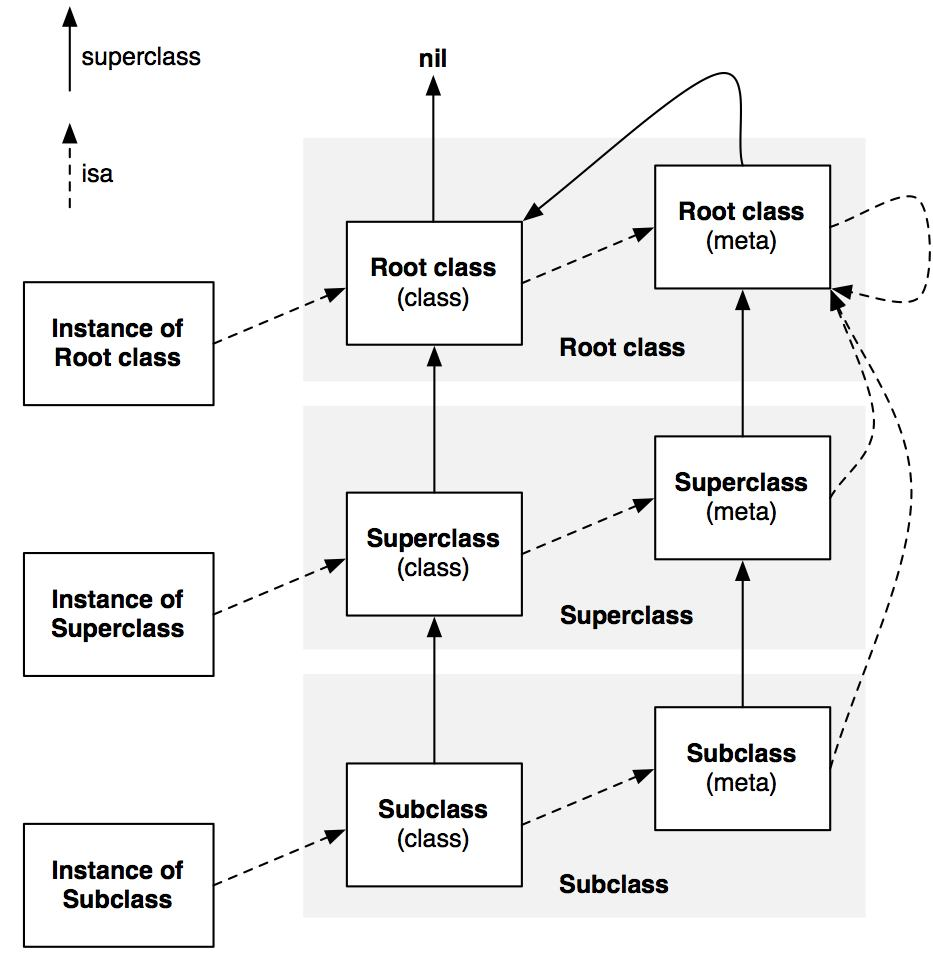
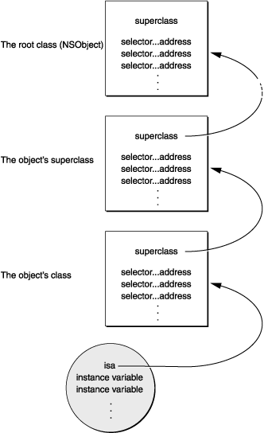

  > 运行时

<!-- more -->

## 对象模型

### ❓`OC` 的对象模型

::: details 💡

> Objective-C 类图




:::

### ❓`isa` 是什么？

::: details 💡

  > `isa`： `OC` 对象的一个指针，它是每个 `OC` 对象的第一个成员变量，用于指向该对象的类对象。
    
  `Objective-C` 的对象模型中，对象分为实例对象、类对象、元类对象，这三种对象都含有 `isa` 指针。

  - 实例对象: 实例对象的`isa`指向它的类对象；实例对象主要存储实例变量的值。

  - 类对象: 类对象的`isa`指向元类对象；类对象主要存储实例方法、属性、以及遵守的协议等信息。

  - 元类对象: 元类对象的`isa`指向自身；元类对象主要存储类方法等信息。

  当发送消息给一个对象时，`runtime` 通过这个对象的 `isa` 指针找到它的类对象，然后在类对象的方法列表中查找对应的方法进行调用。

:::

### ❓类结构体的组成，`isa` 指针指向了什么？

::: details 💡

  先给出答案 `isa` 指针是指向类对象，每一个对象都包含 `isa` 指针，通过这个指针可以找到类对象。
  
  当一个对象调用某个方法时(消息发送)，运行时先在当前方法列表中查找，如果不存在，通过 `isa` 指针查找类对象中是否存在方法，如果还不存在会通过父类指针进一步往上查找，最后还是找不到就会抛出未找到异常。
  
  ```objc
  // id 就是 objc_object
  struct objc_object {
    Class _Nonnull isa;         // 指向对象所属的类
  };
  // Class 就是 objc_class
  struct objc_class {
    Class _Nonnull isa;         // 指向元类
    Class _Nullable superclass; // 指向父类
    cache_t cache;              // 方法缓存
    class_data_bits_t bits;     // 包含方法列表和其他信息
  };
  ```

:::

### ❓`isa` 指针里面都存了什么，32和64位分别讲一下?

::: details 💡

`isa` 指针是 Objective-C 对象的第一个成员变量，它决定了对象的类型。`isa` 指针在 32 位和 64 位系统下有不同的存储方式：

在 32 位系统下，这个 `isa` 指针是一个普通的指针，存储着对象（或者说是类实例）的类（Class）的信息，一般占据 4 个字节。通过这个指针可以找到对象所属的类（也就是对象的元类（Metaclass）），以此来调用对象的类方法。通过对象的 `isa` 指针可以找到对象所属类的信息，这样就可以根据类的具体信息找到该对象能响应的所有方法，所以我们在向一个 Objective-C 对象发消息时，就是通过查找 `isa` 指针来完成的。

在 64 位系统下（仅针对优化过的 iOS 系统, iOS 9.0 以后），为了节约内存， `isa` 的存储结构做了改变，添加了一种叫做 `isa` 混用（ISA Masking）的技术。`isa` 指针除了存储了类的信息外，还会存储对象是否正在被 `dealloc`，以及是否有关联对象(Associated Object)等信息。如果我们像在 32 位系统下那样直接访问 `isa` 就可能取到错误的信息，所以在 64 位系统下，我们需要通过一些特定的方式来获取具体的 `isa`值，例如使用对象提供的 `object_getClass()` 方法来获取。

总的来说，不同系统下的 `isa` 指针含有的信息是不同的，32 位只存储了类的信息，而 64 位则同时存储了类的信息和对象的其他一些状态。

:::

### ❓讲一下对象，类对象，元类，跟元类结构体的组成以及他们是如何相关联的？

::: details 💡

Objective-C 中的一个对象（实例）是由 `isa` 指针和其他实例变量（Instance Variables）组成的。对象的 `isa` 指针指向对象的类（也就是类对象）。

类对象（也就是 Class），包含了类的方法列表，属性列表，协议列表以及一个 `isa` 指针和一个指向父类对象的 `superclass` 指针。类对象的 `isa` 指针指向元类 (Meta-class)。这样当你给一个实例发送消息时，会在类对象的方法列表中查找；而当你给一个类发送消息时，实际上会在元类的方法列表中查找。

元类也是一个类对象，它的实例是类对象。元类包含了类方法列表，同时也有一个 `isa` 指针和 `superclass` 指针。元类的 `isa` 指针指向根元类，根元类的 `superclass` 指针又指向类对象，形成一个封闭的循环。而根元类的 `isa` 指针最终又指向自己，形成了 Objective-C 中类和对象的关系网。

简单来说，这就是对象，类对象（Class）和元类（Metaclass）之间的关系。在 Objective-C 中，万物皆对象，这一切都是基于这种结构，使得 Objective-C 有很高的动态性。

:::

### ❓为什么要设计 `metaclass`？

::: details 💡

`metaclass`（元类）的设计是为了支持类方法。

在 Objective-C 中，每个对象都有一个对应的类，这个类包含了该对象的所有实例方法。这些实例方法是存储在其对应的类对象中的。那么问题是，类方法应该存储在哪儿呢？答案就是元类（`metaclass`）。

每个类对象，除了包含实例方法以外，还有一个指向元类的 `isa` 指针。元类就像是类对象的“类”，它包含了类方法的列表，因此，当你发送一个类方法给类对象时，实际上是在元类中查找该方法。

没有 `metaclass` 的话，类方法就没有地方存储，Objective-C 就无法支持类方法的功能，这就是 Objective-C 需要 `metaclass` 的原因。

更进一步说，`metaclass` 的存在，让我们无论是操作实例还是类，在代码层面上都有统一的行为（发送消息），实际上简化了语言使用上的复杂度。在 Objective-C 中，万物皆对象，无论是实例对象还是类对象，甚至元类对象，这都得益于 `metaclass` 的存在。

:::

### ❓`supperclass` 了解吗？

::: details 💡




:::

### ❓`super` 是什么？

::: details 💡

  `super` 并不是一个指针，在 `OC` 进行消息调用时，其实是有两个隐藏参数的，一个是接收者(receiver)，一个是方法选择器(selector)。
  
  常见的 `self` 表示的是接收者。而 `super` 其实是一个编译器标示符，当发送给 `super` 一个消息时，调用者仍然是 `self` ，但是运行时会从当前类的父类开始查找方法。
  
> 以下代码输出？

  ```objc
  @interface Animal
  @end
  @interface Dog : Animal
  @end
  @implementation Dog
  - (instancetype)init {
    self = [super init];
    if (self) {
        NSLog(@"%@", NSStringFromClass([self class]));
        NSLog(@"%@", NSStringFromClass([super class]));
    }
    return self;
  }
  @end
  ```
  
  也就是说 `super` 并不会改变消息的接收者，所以当我们调用 `[super class]` 时，虽然是从父类开始查找 `class` 方法，但是方法的接收者依然是 `self` 本身，其类别自然是当前类本身。这也是为什么我们再调用 `[super class]` 时还会返回 `Dog` 类的原因。

:::

  > ❓`super` 的底层实现

::: details 💡

  `OC` 中 `super` 的实现是通过 `runtime` 的 `objc_msgSendSuper` 和 `objc_msgSendSuper_stret` 两个函数来完成的。具体来说，当编译器遇到 `[super method]` 这种形式的调用时，会转化为 `objc_msgSendSuper(super_cls, sel)` 的形式。

  ```c
  // super 结构体
  struct objc_super {
    __unsafe_unretained id receiver;        // 消息的接收者
    __unsafe_unretained Class super_class;  // 父类(开始查找的类)
  };
  // objc_msgSendSuper
  void objc_msgSendSuper(struct objc_super *super, SEL op, ...)
  ```

:::

------

## 属性

### ❓为什么对象方法没有保存的对象结构体里，而是保存在类对象的结构体里？

::: details 💡

这主要是因为Objective-C语言的对象模型设计。

在Objective-C中，每个类的实例对象（Instance）都有一个isa指针，这个指针指向它的类对象（Class），类对象中保存了这个类的所有对象方法（instance methods）。当我们在一个对象上调用方法时，Objective-C运行时系统会通过这个对象的isa指针找到类对象，进而找到对应的方法并执行。这样就实现了一个类的所有实例对象共享同一份方法的设计。

这种设计下，无论一个类有多少个实例对象，这个类的方法都只需要在内存中保存一份，这样可以有效地节省内存。

而对于类方法（class methods），它们则被保存在元类对象（Meta-class）中。每个类对象同样有一个isa指针指向其对应的元类对象，这样在调用类方法时就可以通过类对象找到元类对象，进而找到对应的类方法并执行。

:::

### ❓`class_copyIvarList` vs `class_copyPropertyList`

::: details 💡

`class_copyIvarList` 和 `class_copyPropertyList` 都是用于获取相关信息的函数，但它们获取到的信息并不完全相同。

`class_copyIvarList` 用于返回一个指向类实例变量列表的指针。 这个列表包括了类中声明的所有实例变量，包括属性生成的实例变量。所以这意味着，即使一个实例变量是由@property声明的，你也可以通过`class_copyIvarList`获取到这个变量。

相反， `class_copyPropertyList` 只能获取到类中用@property声明的属性列表。如果类中有非@property声明的实例变量， `class_copyPropertyList` 是无法获取到这些实例变量的。

因此，按照获取到的信息的多少排序， `class_copyIvarList` > `class_copyPropertyList`。

最后需要说明的是，这两个函数都会返回一个数组，并且需要手动释放这个数组（使用free函数），以防止内存泄漏。

:::

### ❓`class_ro_t` vs `class_rw_t`

::: details 💡

`class_ro_t` 和 `class_rw_t` 是 Objective-C Runtime 内部用来存储类的信息的结构体。

- `class_ro_t` 主要存储了类的只读信息，包括类名，基类名，实例变量列表和类的属性列表等只读信息。而且其中的所有指针都是只读的。

- `class_rw_t` 主要存储了类的可写信息，包括类的方法列表，协议列表和分类列表等可变信息。其中的各个指针是可变的，可以动态添加和删除方法等信息。

在类初始化时，编译器会生成对应的 `class_ro_t` 结构体，并通过`class_rw_t` 结构体获取。而在运行时，如果对类的方法，协议等进行添加或者删除操作，这些信息都会保存在 `class_rw_t` 中。

因此，简单来说，`class_ro_t` 存储的是编译时期的类信息，`class_rw_t` 存储的是运行时期的类信息。

:::

### ❓能否向编译后得到的类中增加实例变量

::: details 💡

不可以。在Objective-C中，一旦一个类被编译和运行，就不能再向这个类添加实例变量。

这是因为在Objective-C中，每个对象在内存中所占用的空间是固定的，这个空间取决于这个类的实例变量的总大小。如果允许在运行时添加实例变量，就会导致已经存在的对象需要更多的内存空间，这是不可能实现的。所以，Objective-C规定，只能在编译阶段添加实例变量。

不过，在Objective-C中，你可以向类添加方法（通过class_addMethod函数）和协议（通过class_addProtocol函数）。但请注意，这些修改只会影响到添加操作之后创建的对象，已经存在的对象不会受到影响。

:::

### ❓能否向运行时创建的类中添加实例变量

::: details 💡

在 Objective-C 中，可以在运行时动态的添加一个类，并且向这个类中添加实例变量。

但这个操作只能在注册类之前完成。 因为一旦类被注册到运行时环境中，类的实例变量布局就已经确定，objc runtime 系统不允许再修改，包括添加实例变量。这是因为实例变量涉及到对象的内存布局，一旦类被注册，对象的内存布局已经固定，不能再进行改变。

下面就是一个向运行时创建的类中添加实例变量的示例：

```objc
// 创建一个新类
Class MyClass = objc_allocateClassPair([NSObject class], "MyClass", 0);

// 添加实例变量
class_addIvar(MyClass, "_myVar", sizeof(id), log2(sizeof(id)), "@");

// 注册该类
objc_registerClassPair(MyClass);

// 使用新类
id obj = [[MyClass alloc] init];
```

以上代码先创建一个新的类，在注册类前添加实例变量，然后注册类，并创建一个该类的实例。但如果尝试在 `objc_registerClassPair` 后面再添加实例变量，将会失败。

:::

### ❓在运行时创建类的方法 `objc_allocateClassPair` 的方法名尾部为什么是 `pair`（成对的意思）

::: details 💡

`objc_allocateClassPair` 这个名称中的 "Pair" 指的是它在运行时创建类时，一次会创建两个相关的类，而不只是一个。一个是你想要创建的类，另一个是元类（meta-class）。

在 Objective-C 中，每个类都有一个对应的元类。一个类储存了所有的实例方法（在对象实例上调用的方法），相对应的元类则保存了所有的类方法（在类本身上调用的方法）。

所以当你用 `objc_allocateClassPair` 创建一个新类的时候，Cocoa 为你同时创建了额外的一个元类。因此此方法创建的是一个 "类对" 或 "类配对"，包含了一个类和此类的元类。这也就是方法名中 "Pair" 一词的含义。

:::

------

## 关联对象

### ❓关联对象如何进行内存管理

::: details 💡

在Objective-C中，关联对象的内存管理是由运行时系统来处理的，主要通过提供的API（`objc_setAssociatedObject`和`objc_getAssociatedObject`）来进行。同时，`objc_setAssociatedObject`这个函数需要一个关联策略参数，它决定了在运行时如何管理和处理这个关联对象。

下面是一些常用的关联策略：

1. `OBJC_ASSOCIATION_ASSIGN`：这是一个弱引用的关联关系。关联对象在被释放时不会被保留。如果关联对象被释放了，getter方法可能会返回一个无效的值。

2. `OBJC_ASSOCIATION_RETAIN_NONATOMIC`：类似于 `nonatomic`, `strong` 的属性。运行时系统在设置关联对象时会保留它并且在释放原始对象时释放它。

3. `OBJC_ASSOCIATION_COPY_NONATOMIC`：类似于 `nonatomic`, `copy` 的属性。运行时系统在设置关联对象时会复制它并且在释放原始对象时释放它。

4. `OBJC_ASSOCIATION_RETAIN`：类似于 `atomic`, `strong` 的属性。它与 `OBJC_ASSOCIATION_RETAIN_NONATOMIC` 的区别是它在设置和获取关联对象时是线程安全的。

5. `OBJC_ASSOCIATION_COPY`：类似于 `atomic`, `copy` 的属性。与 `OBJC_ASSOCIATION_COPY_NONATOMIC` 的区别是它在设置和获取关联对象时是线程安全的。

所以，关联对象的内存管理方式主要取决于我们选择的关联策略。当原对象被dealloc时，运行时系统会按照我们设定的策略以适当的方式来处理关联对象。例如，如果我们采用 `OBJC_ASSOCIATION_COPY` 策略，那么在原对象被dealloc时，系统会释放掉关联的对象的副本；如果采用 `OBJC_ASSOCIATION_ASSIGN` 策略，那么系统则不会释放关联对象。

:::

### ❓关联对象如何实现 `weak` 属性

::: details 💡

Objective-C关联对象API并未直接提供类似于`weak`属性的关联策略。但是我们可以通过一些技巧来模拟实现`weak`关联属性。

我们知道，`weak`属性的特点是当对象被释放时，引用该对象的`weak`引用会自动被设为nil。所以我们可以使用自定义的`setter`和`getter`方法，并结合`objc_setAssociatedObject`和`objc_getAssociatedObject`函数来实现。

这里是一个用`NSValue`来封装`weak`对象并与关联对象进行关联的例子：

```Objective-C
- (void)setWeakAssociatedObject:(id)object {
    NSValue *weakBox = [NSValue valueWithNonretainedObject:object];
    objc_setAssociatedObject(self, @selector(weakAssociatedObject), weakBox, OBJC_ASSOCIATION_RETAIN_NONATOMIC);
}

- (id)weakAssociatedObject {
    NSValue *weakBox = objc_getAssociatedObject(self, @selector(weakAssociatedObject));
    return [weakBox nonretainedObjectValue];
}
```

在这个例子中，我们使用 `NSValue` 的 `valueWithNonretainedObject:` 方法来创建一个弱引用盒子，并将这个盒子与对象进行关联。注意我们在调用 `objc_setAssociatedObject` 时使用的是 `OBJC_ASSOCIATION_RETAIN_NONATOMIC` 策略。因为`OBJC_ASSOCIATION_ASSIGN` 策略并不会在关联对象被释放时将指针设为nil，而 `OBJC_ASSOCIATION_RETAIN_NONATOMIC` 会。

在 `setter` 方法中，我们将对象封装到 `NSValue` 中，并以 `OBJC_ASSOCIATION_RETAIN_NONATOMIC` 策略将其与原对象进行关联。

在 `getter` 方法中，我们从关联对象中获取 `NSValue`，然后调用 `nonretainedObjectValue` 方法来获取弱引用对象。

这种方法可以模拟实现`weak`关联属性，但这并不是真的`weak`属性，我们必须手动保证在对象被释放时进行正确的处理。

:::

### ❓关联对象的底层实现

::: details 💡

在Objective-C的runtime中，每个对象都有一个对应的isa指针，这个isa指针指向了对象的类（Class），而类里面就包含了我们的方法，属性，实例变量等信息。每一种类（包括系统的类和自定义的类），在内存中都有唯一的一个类对象的实例。

对于关联对象来说，它实际上存储在一个单独的hash表里。这个表的key是对象的内存地址，value是另一个以“关联键”的哈希值为key的表（key是关联键的哈希值，value是关联的对象及其策略信息）。这样就都可以通过对象本身查询到其关联对象的信息。

当你调用`objc_setAssociatedObject`，运行时系统会将关联对象，关联键，和关联策略存到关联对象的哈希表中。如果你使用相同的对象和关联键来调用了两次`objc_setAssociatedObject`，那么后一次的调用会替换掉哈希表中先前的值。

当你调用`objc_getAssociatedObject`，运行时系统会根据对象和关联键从哈希表中获取关联的对象。

当你调用`objc_removeAssociatedObjects`，运行时系统会移除哈希表中所有的键值对。

当一个对象调用了dealloc方法且开始析构时，在清理类实例并最终释放内存之前，Objective-C的runtime会检查并清理该对象的所有关联对象。然后根据关联策略来处理关联的对象，比如，如果策略是`OBJC_ASSOCIATION_RETAIN`，那么在析构原对象之前就会在主线程中释放该关联对象。

:::

### ❓关联对象需要在主对象 `dealloc` 的时候手动释放吗

::: details 💡

不需要。在 Objective-C 对象的生命周期结束，即调用 `dealloc` 方法时，系统会自动释放该对象的所有关联对象。无论关联策略是 `retain` 还是 `copy`，关联对象都会被自动释放。

这是由 Objective-C 的 runtime 系统自动处理的。当一个对象被销毁时，runtime 会查找所有赋予该对象的关联对象，并根据赋予它们的关联策略来释放这些对象。

因此，我们无需担心关联对象在主对象 `dealloc` 的时候需要手动释放。但我们必须要确保关联对象不会造成循环引用，否则可能会导致内存泄漏。

:::

### ❓关联对象有什么应用，系统如何管理关联对象

::: details 💡

关联对象是Objective-C的一项重要特性，它可以让你在运行时为一个对象动态地添加属性和方法。这为动态缓存、关联数据、实现类别（Category）添加属性等提供了可能。

关联对象的管理基本依赖于以下三个运行时函数：

- `objc_setAssociatedObject`：用于赋值
- `objc_getAssociatedObject`：用于取值
- `objc_removeAssociatedObjects`：用于移除所有关联对象

系统采用一个哈希表来管理所有的关联对象。哈希表的每个键是一个对象的内存地址，对应的值是另一个哈希表，里面存储着所有与该对象关联的对象。

在内存管理上，系统会根据赋给 `objc_setAssociatedObject` 函数的关联策略，来决定如何管理这个关联对象。存在以下几种关联策略：

- `OBJC_ASSOCIATION_ASSIGN`：弱引用关联对象
- `OBJC_ASSOCIATION_RETAIN_NONATOMIC`：强引用关联对象，并且关联对象在被销毁时会被自动释放（这个过程是非原子性的，也就是说不是线程安全的）
- `OBJC_ASSOCIATION_COPY_NONATOMIC` ：复制关联对象，并且关联对象在被销毁时会自动释放（非原子性）
- `OBJC_ASSOCIATION_RETAIN`：强引用关联对象，并且关联对象在被销毁时会被自动释放（原子性，线程安全）
- `OBJC_ASSOCIATION_COPY`：复制关联对象，并且关联对象在被销毁时会被自动释放（原子性）

当一个对象被释放时，系统会自动清空与该对象有关的所有关联对象，根据各自的关联策略来决定是释放（`retain`策略）还是不释放（`assign`策略）关联对象。

:::

------

## 方法

### ❓`OC` 底层方法列表的数据结构是什么？

::: details 💡

  底层是通过结构体来实现了，结构里面的通过数组来存储方法列表
    
  ```objc
  // 方法列表结构体
  struct method_list_t {
    uint32_t entsize;        // 结构体的大小
    uint32_t method_count;   // 方法的数量
    method_t method_list[1]; // 方法列表
  };
  // 方法结构体
  struct method_t {
    SEL sel;                // 方法的名称
    const char *types;      // 方法的类型
    IMP imp;                // 对应的实现（函数指针）
  };
  ```

在Objective-C底层，方法列表的数据结构是由 `method_list_t` 结构体组成的。

每一个 `method_list_t` 包含了方法的数量和一个 `method_t` 类型的数组。 `method_t` 类型的数组包含了每个方法的SEL（方法选择器）、类型编码和对应的IMP（方法实现）。 因此，方法列表的结构其实可以看作是一个二维的集合。

这个数据结构是在Objective-C Runtime库中定义的，你不能直接在普通Objective-C代码中使用它。然而，你可以通过Objective-C的动态特性，使用类似 `class_copyMethodList` 的函数来获取一个类的所有方法，并使用 `method_getName` 和 `method_getImplementation` 类似的函数来获取方法的详细信息。

代码示例：
```objc
unsigned int outCount;
Method *methods = class_copyMethodList([self class], &outCount);
for (int i = 0; i < outCount; i++) {
    Method method = methods[i];
    SEL selector = method_getName(method);
    NSLog(@"Method name: %@", NSStringFromSelector(selector));
}
free(methods);
```
这段代码获取一个类的所有方法并打印出每个方法的名字。

:::

### ❓`method_t` 里包含什么？

::: details 💡

`method_t` 是Objective-C运行时的一个结构，用来表示类中的一个方法。它里面包含三个主要的成员：

- `SEL name`：这是一个指向方法名的指针，也叫做方法选择器（selector）。方法选择器是一个C字符串，代表了方法的名字。

- `const char *types`：这是一个指向方法类型的指针。方法类型是一个C字符串，用特定的编码代表了方法的返回值类型和参数类型。

- `IMP imp`：这是一个指向方法实现的指针。方法实现是一个函数指针，指向了具体实现这个方法的函数。在Objective-C中，你可以通过改变这个指针来动态地改变方法的实现。

除此之外，有一点需要注意，`method_t` 及其成员并不会直接暴露给开发者使用，通常我们会通过Objective-C提供的API，如 `method_getName`（获取方法名）、 `method_getTypeEncoding`（获取方法类型）、 `method_getImplementation`（获取方法实现）等来操作 `method_t`。

:::

### ❓对象方法 与 类方法存放在哪？

::: details 💡

在 Objective-C 中，对象方法（实例方法）存放在类对象（class object）中，类方法（class method）存放在元类对象（metaclass object）中。

当我们给一个对象发送消息时，运行时系统会在对象的类对象的方法列表中查找这个方法。类对象包含了一个指向父类的指针和一个实例方法列表。

当我们给一个类发送消息时，运行时系统会在类的元类对象的方法列表中查找这个方法。元类对象包含了类方法列表，类方法列表存放的是所有的类方法。

总的来说，对象方法存放在类对象中，类方法存放在元类对象中。这也是为什么我们可以用类名来调用类方法，但不能用实例对象来调用类方法的原因。因为在查找方法时，运行时系统会去不同的地方查找。

:::

### ❓`class`、`objc_getClass`、`object_getClass` 三个方法的区别？

::: details 💡

`class`、`objc_getClass`、`object_getClass` 这三个方法都用于获取一个对象的类，但是它们之间是有区别的：

1. `class`：`class` 是一个实例方法。当你通过一个实例对象调用这个方法时，它会返回这个对象所属的类。当你通过一个类对象调用这个方法时，会返回这个类本身。

2. `objc_getClass`：`objc_getClass` 是一个函数，参数是一个类名字符串，返回值是这个类的类对象。如果找不到这个类，`objc_getClass` 会抛出一个异常。

3. `object_getClass`：`object_getClass` 也是一个函数，参数是一个实例对象或者类对象。如果参数是一个实例对象，`object_getClass` 返回这个实例对象的类对象；如果参数是个类对象，`object_getClass` 返回这个类的元类对象。

总的来说，`class`、`objc_getClass` 和 `object_getClass` 都是用于获取类对象的，但它们的使用场景和具体行为是有区别的。

:::

------

## Method Swizzling

### ❓`Method Swizzling` 原理

::: details 💡

Method Swizzling 是 Objective-C 的动态特性的一个应用，它允许在运行时更改类的一个方法的实现。这个技术常常用在 Objective-C 的分类（Category）和扩展（Extension）中，通过 Method Swizzling 可以覆盖和扩展原有类的方法。

Method Swizzling 的原理是修改类的方法列表，将指向某个方法名称（SEL）的函数指针（IMP）指向另外一个实现。这就类似于在运行时改变了方法的实现。

Method Swizzling 通常通过 Objective-C 的运行时函数 `method_exchangeImplementations` 或者 `class_replaceMethod` 实现，前者交换两个方法的实现，后者替换一个方法的实现。

以 `method_exchangeImplementations` 为例，如果想要交换 `NSString` 的 `lowercaseString` 方法和 `uppercaseString` 方法的实现，可以使用如下的代码：

```objc
Method lowercaseMethod = class_getInstanceMethod([NSString class], @selector(lowercaseString));
Method uppercaseMethod = class_getInstanceMethod([NSString class], @selector(uppercaseString));
method_exchangeImplementations(lowercaseMethod, uppercaseMethod);
```
以上代码首先通过 `class_getInstanceMethod` 获取了两个方法的 `Method`，然后使用 `method_exchangeImplementations` 将这两个方法的实现交换。完成上述操作后，对 NSString 对象调用 `lowercaseString` 实际上会执行 `uppercaseString` 的实现，反之亦然。

虽然 Method Swizzling 是一种强大的技术，但如果使用得不当，可能会引入难以调试的问题，因此在使用时需要特别谨慎。

:::

### ❓`Method Swizzling` 时，不替换父类，只替换子类，怎么处理

::: details 💡

`Method Swizzling`只在子类且不影响父类的操作，可以通过创建子类的分类（Category）来实现。父类的方法不会被改变，只有子类中的方法才会被替换。

这里是一个简单的例子。假设我们有一个名为`MySubClass`的子类，这个子类继承自`MySuperClass`。我们想要替换`MySubClass`中的`foo`方法，但不影响`MySuperClass`中的`foo`方法：

```objc
#import "MySubClass+Swizzling.h"
#import <objc/runtime.h>

@implementation MySubClass (Swizzling)

+ (void)load {
    static dispatch_once_t onceToken;
    dispatch_once(&onceToken, ^{
        Class class = [self class];

        SEL originalSelector = @selector(foo);
        SEL swizzledSelector = @selector(swizzled_foo);

        Method originalMethod = class_getInstanceMethod(class, originalSelector);
        Method swizzledMethod = class_getInstanceMethod(class, swizzledSelector);

        BOOL didAddMethod = class_addMethod(class,
                                            originalSelector,
                                            method_getImplementation(swizzledMethod),
                                            method_getTypeEncoding(swizzledMethod));

        if (didAddMethod) {
            class_replaceMethod(class,
                                swizzledSelector,
                                method_getImplementation(originalMethod),
                                method_getTypeEncoding(originalMethod));
        } else {
            method_exchangeImplementations(originalMethod, swizzledMethod);
        }
    });
}

//这是新的方法实现
- (void)swizzled_foo {
    //在这里执行你自己的逻辑...
    [self swizzled_foo];
}
@end
```

在上述代码中，我们首先通过`load`方法在类被加载的时候替换了原来的`foo`方法。使用`dispatch_once`确保替换操作只会执行一次。在替换方法时，我们首先尝试调用`class_addMethod`将新的实现添加到类上。如果原来的方法在父类中实现，那么这会创建一个新的方法，方法的名字是原来的方法，实现则是我们新的`swizzled_foo`方法。然后我们使用`class_replaceMethod`将旧的方法实现替换为新的方法。如果`class_addMethod`没有创建新的实现，那么我们就会通过`method_exchangeImplementations`交换两个方法的实现。

这样就实现了只在子类中替换方法，不影响父类的方法。

:::

### ❓`Method Swizzling` 的优缺点，缺点会导致什么问题

::: details 💡

Method Swizzling 是 Objective-C 的动态特性之一，它主要用于在运行时更改某个方法的实现。这种技术对于某些情况非常有用，比如 Debug、注入代码、改变现有方法的行为等。然而，任何强大的工具如果使用不当，都可能导致不可预见的结果。以下是 Method Swizzling 的优缺点：

优点：
1. 强大且灵活：Swizzling 可以改变现存的方法，无需修改源代码。这种特性非常有用于调试、改进现有的方法等。
2. 针对库函数或者系统函数：我们可以 Swizzling 系统函数或库函数，进而解决某些bug或提高性能。

缺点：
1. 难以调试和理解：由于方法的实现在运行时被改变，导致调试变得困难。此外，阅读并理解 Swizzling 的代码也需要一定的经验和技巧。
2. 破坏封装性：Swizzling 会破坏类的封装性和隐藏实现细节的原则，不利于代码的维护和理解。
3. 命名冲突：如果有多个分类使用了 swizzling 方法，那么很可能出现命名冲突，导致程序运行出错。
4. 不兼容性问题：由于 Swizzling 对象变更底层的运行机制，如果被 Swizzling 的对象升级或者被其他对象替换，可能会引发难以预料的问题。

为了避免以上缺点，我们应该谨慎地使用 Method Swizzling，应尽可能地减少它的使用，并且任何使用 Swizzling 的代码都应该清楚地注释其目标和目的，以便其他开发者理解。

:::

### ❓如何安全的进行方法替换

::: details 💡

以下是一些要点可以帮助在 Objective-C 程序里安全地进行方法替换，也叫做 Method Swizzling：

1. 在统一的地方执行 Method Swizzling：通常我们选择在 `+load` 方法中执行 Method Swizzling，因为 `+load` 方法是在类被加载时只被调用一次，从而保证了 Method Swizzling 也只会执行一次。

2. 注意方法的调用方：Method Swizzling 了一个方法后，原来的方法调用方可能会受到影响。为了避免这个问题，我们通常会在新的方法中调用一次原来的方法。因此在 Swizzling 方法时，要小心并确保原来的方法在新的实现中被正确地执行了。

3. 注意线程安全：尽管 `+load` 方法是线程安全的，但如果你在其他地方进行 Method Swizzling，你同时需要确保这个过程是线程安全的。你可以使用 `dispatch_once` 和锁等手段来保证线程安全。

4. 小心命名冲突：假如多个分类都去 Swizzling 同一个方法，那么就可能会存在命名冲突。所以在给新的方法命名时，应保证其唯一性，例如可以加上项目的前缀等。

5. 验证原方法与新方法确实存在：替换一个不存在的方法，或者用一个不存在的方法去替换，都会导致程序错误。在进行 Method Swizzling 前，应该先用 `class_getInstanceMethod` 确认这两个方法确实存在。

6. 尽量不使用 Method Swizzling：由于 Method Swizzling 会改变代码的行为，增加了代码理解的复杂性，除非必须，否则应尽量避免使用。

在遵循了以上几点之后，你就可以比较安全地使用 Method Swizzling 了。但这并不代表就可以随意使用，任何使用 Method Swizzling 的地方都应该有明确的理由和目标，同时通过注释让其他开发者知道你为什么要使用 Method Swizzling。

:::

### ❓方法交换和分类同时去 `hook` 一个方法，结果会怎么样，具体交换的是什么，交换时是如何处理传参数

::: details 💡

如果分类和方法交换（Method Swizzling）同时尝试 `hook` 同一个方法，最终的结果取决于这两者加载到运行时的先后顺序。

在 Objective-C 中，分类和 Method Swizzling 在运行时加载的顺序并非固定。一般来说，分类的`load`方法会在类的`load`方法之前调用，因此，如果分类和 Method Swizzling 都尝试去 hook 同一个方法，那么一般情况下，分类会首先替换掉原方法的实现，然后 Method Swizzling 再把分类替换后的实现与自己的实现进行交换。

具体来说，如果分类和 Method Swizzling 都尝试 hook 同一个方法，例如`doSomething`，我们先假设加载分类的时间早于 Method Swizzling ，这种情况下：

1. 分类首先会替换掉`doSomething`的原始实现，把它替换成分类中`doSomething`的实现。
2. 然后，Method Swizzling 会把这个被分类替换后的实现，再与 Swizzling 中的新实现进行交换。

至于参数传递，Method Swizzling 是在运行时替换方法的实现，因此参数传递是不会变的。原始方法的参数会在调用时传给新的方法实现。当你在新的实现里调用原始实现时，需要将接收到的参数再传递给原始实现。

注意，由于分类和 Swizzling 的加载顺序并不是固定的，因此，同样的代码在不同的环境下或者不同的运行时版本下可能会有不同的行为。因此，这种将分类和 Swizzling 混用的做法是不稳定且不可预测的，建议在开发中避免使用。

:::

  > ❓如果使用 `NSInvocation` 的话，是否能处理方法有返回值的场景，具体怎么处理的
  
::: details 💡

`NSInvocation` 是一个强大的工具，它可以处理带有返回值的方法调用，甚至包括那些返回 struct 的复杂情况。具体处理方式如下：

1. 创建一个方法签名（`NSMethodSignature`）对象，通常可以通过类的 `methodSignatureForSelector:` 方法来创建。

    ```objc
    NSMethodSignature *signature = [clazz instanceMethodSignatureForSelector:selector];
    ```

2. 使用签名对象创建一个 `NSInvocation` 对象。

    ```objc
    NSInvocation *invocation = [NSInvocation invocationWithMethodSignature:signature];
    ```

3. 设定 `NSInvocation` 对象的 `target` 和 `selector`。

    ```objc
    [invocation setTarget:self];
    [invocation setSelector:selector];
    ```

4. 设置参数。注意，`NSInvocation` 的参数 0 是 `self`，参数 1 是 `_cmd`，因此实际参数序号应该从 2 开始。

    ```objc
    [invocation setArgument:&arg atIndex:2];
    ```

5. 调用 `NSInvocation` 对象的 `invoke` 方法。

    ```objc
    [invocation invoke];
    ```

6. 获取返回值。你需要先创建一个临时变量，然后通过 `getReturnValue:` 方法来获取。

    ```objc
    returnType returnValue;
    [invocation getReturnValue:&returnValue];
    ```

需要注意的是，使用 `NSInvocation` 需要对被调用方法有充分的了解，包括它的参数类型、参数个数、返回值类型等。否则如果参数或返回值设置不正确，有可能会导致程序崩溃。所以，在使用 `NSInvocation` 时要特别小心。

:::
  
------

## 其它知识点

### ❓`runtime` 中的 `SideTables` 了解吗

::: details 💡

Objective-C的 runtime 库的 "SideTables" 结构是用来保存一些与对象有关但无法直接保存在对象内存布局中的信息。这些信息包括：

- 关联对象（Associated Object）：这是 Objective-C 的一个特性，允许开发者为一个对象关联任意的其他对象或值。由于这个特性的动态并且无法预测的性质，这些关联的对象或值无法被直接保存在对象内部，因此需要 SideTables 来保存。

- 弱引用（Weak Reference）：当一个对象被赋值给一个 weak 变量时，这个 weak 变量的地址和对应的对象需要被记录下来，以便在这个对象被销毁时，可以遍历所有对它的弱引用并将它们设置为 nil。同理，由于弱引用的动态性，这些信息也需要 SideTables 来保存。

"SideTables" 是一种散列表（Hash Table）的结构，每一个表项其实是一个 "SideTable" 结构，包含了一个互斥锁（Mutex）和对应的散列表。SideTables 之所以设计成这个样子，主要原因是出于线程安全和性能的考虑。它可以将关联对象和弱引用的信息保存在不同的表项里，做到锁的粒度最小化，从而提升多线程环境下的性能。

:::

### ❓`runtime` 中的 `fastpath`、`slowpath` 是什么

::: details 💡

在计算机科学中，`fastpath` 和 `slowpath` 是用来描述代码执行路径的术语，这两个术语主要用于注释和优化代码。

- `fastpath`：这个路径用来处理最常见，最频繁的，计算成本最低的场景或任务，为了加速整体的处理时间，会使得这部分代码尽可能的进行优化。一般会将这部分代码放在函数或者一段代码的前面。

- `slowpath`：这个路径用来处理那些不常见，复杂度较高或者可能导致错误的场景或任务，处理这部分场景的代码放在slowpath。这部分代码一般在fastpath代码之后，很多时候需要进行一些错误处理或者复杂计算。

在 iOS 系统源码中，你可能经常看到 `__builtin_expect` 方法，它用来指示编译器对一个条件的预判。这就是 fastpath 和 slowpath 的实现方式，通过这个函数，可以将更可能执行的代码（fastpath）放到 CPU 预取缓存中，提高程序运行效率。

例如，Apple 在 Objective-C 的内存管理中，就使用到了 fastpath 和 slowpath 的概念，像 `objc_retain`、`objc_release` 这样的函数，都先处理常见的 fastpath（例如直接返回非空指针或者归还 autoreleasepool 的对象等），稍微复杂或者出错的情况会借助 slowpath （例如调用了 `dealloc`等）来处理。

在 `Objective-C runtime` 中，你会在源码中看到 `FASTPATH` 和 `SLOWPATH` 这两个宏定义。它们其实是基于 `__builtin_expect` 函数的封装。

`__builtin_expect` 是一个 GCC 和 Clang 的内建函数，它的作用是提供代码分支预测的建议给编译器。通过这个函数，可以将更可能执行的代码放到 CPU 预取缓存中，进而提高程序运行效率。

例如，定义如下：

```c
#define FASTPATH(x) (__builtin_expect(bool(x), 1))
#define SLOWPATH(x) (__builtin_expect(bool(x), 0))
```

`FASTPATH(x)` 表示 `x` 这个条件最可能为 `true`，`SLOWPATH(x)` 表示 `x` 这个条件最可能为 `false`。

在 `Objective-C runtime` 中，`FASTPATH` 和 `SLOWPATH` 主要用来优化代码路径。比如在处理 `retain` 和 `release` 时，runtime 会优先处理最常见、最频繁的情况，即对非空对象进行 `retain` 和 `release`，这种情况就显式地标记为 `FASTPATH`。而对空对象进行 `retain` 和 `release` 或者对象释放后调用 `dealloc` 等情况则被标记为 `SLOWPATH`。

这样的设计可以显著地提高常见路径的性能，对于性能有要求的代码可以进行参考。
:::

### ❓`OC` 运行时在工程中的有过实践运用吗？

::: details 💡

是的，Objective-C 的运行时系统在很多工程中都有应用。以下是几个具体的例子：

1. 关联对象（Associated Object）：我们可以使用关联对象为现有的类增加一些属性，而不需要修改类的源代码。例如，我们可以为 `UIButton` 添加一个 `indexPath` 属性，用于在 TableView 中定位这个按钮在哪个单元行。

2. 方法交换（Method Swizzling）：通过运行时系统，我们可以在类别中添加新的方法，并将新的方法与原有的方法进行交换。例如，我们可以在类别中为 `UIViewController` 添加一个新的 `viewWillAppear:` 方法，然后将这个新方法与系统原有的方法进行交换。这样我们就可以在新的方法中添加一些跟踪代码，以便追踪到每个视图控制器的出现。

3. 懒加载：在Objective-C中，经常使用runtime实现属性的懒加载，例如，我们可以在 "getter" 方法中检查对象是否已经被初始化，如果没有，那么可以初始化该对象并把它缓存起来，以便下次使用。

4. 序列化和反序列化：我们可以通过遍历一个对象的所有属性，然后通过 `KVC`（键值编码）来得到所有属性的值，之后就可以将这些值序列化为 JSON 或者 XML。反序列化也同样，我们可以将一个 JSON 或者 XML 数据转化为一个字典，然后通过遍历字典，将字典的值通过 `KVC` 设置到对象的属性上。

总的来说，Objective-C 的运行时系统提供了很多强大的特性，使得我们可以做一些在静态语言中做不到的事。


:::