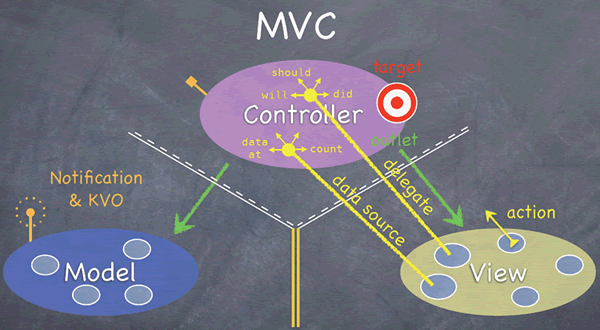

> Architecture: 架构设计

<!-- more -->

## reference

### 架构方案

- [2018.05.29 Trip-to-iOS-Design-Patterns](https://github.com/skyming/Trip-to-iOS-Design-Patterns)
- [2018.02.04 iOS 架构之 View 层的架构方案](https://mp.weixin.qq.com/s/t_IBkCClPBZFBPmtZT0WsQ)

<!-- MVVM -->

- [2017.09.04 - [译] MVVM, Coordinators 和 RxSwift 的抽丝剥茧](https://juejin.cn/post/6844903494013435918)
- [2017.04.13 - [译] MVVM-C 与 Swift](https://juejin.cn/post/6844903473897537549)
- [2016.08.07 - iOS 开发中的 ViewModel](https://www.jianshu.com/p/823297d8c386)
- [2013.05.00 - MVVM - Commands, RelayCommands and EventToCommand](https://docs.microsoft.com/en-us/archive/msdn-magazine/2013/may/mvvm-commands-relaycommands-and-eventtocommand)

<!-- Coordinator -->

- [2021-07-13 iOS Coordinator 实战](https://nemocdz.github.io/post/ios-coordinator-%E5%AE%9E%E6%88%98/)
- [How to use the coordinator pattern in iOS apps](https://www.hackingwithswift.com/articles/71/how-to-use-the-coordinator-pattern-in-ios-apps)
- [Advanced coordinators in iOS](https://www.hackingwithswift.com/articles/175/advanced-coordinator-pattern-tutorial-ios)

<!-- Clean -->

- [CleanArchitectureRxSwift](https://github.com/sergdort/CleanArchitectureRxSwift)
    > Example of Clean Architecture of iOS app using RxSwift

<!-- 设计模式 -->

- [2020-06-17 iOS 设计模式](https://juejin.cn/post/6844904200564916237)
- [2016-11-16 设计模式系列](https://juejin.cn/post/6844903453622288397)

### 组件化

<!-- 缘起 -->

- [2016-03-10 蘑菇街 App 的组件化之路](http://limboy.me/tech/2016/03/10/mgj-components.html)
- [2016-03-13 iOS应用架构谈 组件化方案](https://casatwy.com/iOS-Modulization.html)
- [2016-03-14 蘑菇街 App 的组件化之路·续](http://limboy.me/tech/2016/03/14/mgj-components-continued.html)

<!-- 百花齐放 -->

- [2021-02-25 (美团) 从预编译的角度理解Swift与Objective-C及混编机制](https://tech.meituan.com/2021/02/25/swift-objective-c.html)
- [2021-02-08 京东App Swift 混编及组件化落地](https://developer.jdcloud.com/article/1965)
- [2020-08-30 如何在模块化/组件化项目中实现 ObjC-Swift 混编？](https://github.com/ShannonChenCHN/ASwiftTour/tree/master/Presentation/ObjC-Swift%20%E6%B7%B7%E7%BC%96%E5%9C%A8%E6%A8%A1%E5%9D%97%E5%8C%96:%E7%BB%84%E4%BB%B6%E5%8C%96%E9%A1%B9%E7%9B%AE%E4%B8%AD%E7%9A%84%E5%AE%9E%E8%B7%B5)
- [2019-10-29 iOS 中的库与框架](https://kingcos.me/posts/2019/libraries_in_ios/)
- [2019-06-22 组件化架构漫谈](https://juejin.cn/post/6844903873023311886)
- [2019-08-01 iOS 组件二进制](https://www.weichao.ren/ios/2019/08/01/cocoapods-binary/)
- [2019-07-15 打造完备的iOS组件化方案：如何面向接口进行模块解耦](https://zuikyo.github.io/2019/07/15/iOS_inrerface_orientation_modularization/)
- [2019-07-08 百度App组件化之路](https://mp.weixin.qq.com/s?__biz=MzUxMzk2ODI1NQ==&mid=2247483830&idx=1&sn=a158b07ca3fe6a4ef8ff89d4f5b682aa&scene=21#wechat_redirect)
- [2018-08-23 CTMediator的Swift应用](https://casatwy.com/CTMediator_in_Swift.html)
- [2018-10-01 驴妈妈客户端频道页模块化设计思路](https://mp.weixin.qq.com/s/J5YhTk5gyTt7Ie5803PeQg)
- [2018-01-20 蜂鸟商家版 iOS 组件化 / 模块化实践总结](https://juejin.im/post/5a620cf5f265da3e36415764)
- [2017-11-24 iOS 混编 模块化/组件化 经验指北](http://zhoulingyu.com/2017/11/24/iOS-Modularization/)
- [2017-04-24 (链家网)](https://www.valiantcat.cn/index.php/2017/04/24/45.html)
- [2017-02-25 iOS 组件化 —— 路由设计思路分析](https://halfrost.com/ios_router)
- [2016-11-29 手机天猫解耦之路](https://mp.weixin.qq.com/s?__biz=MzUxMzcxMzE5Ng==&mid=2247488349&idx=1&sn=8e3234789a5de4db24f7a30c126d3894&source=41#wechat_redirect)
- [2016-10-16 豆瓣App的模块化实践](http://lincode.github.io/Modularity)

<!-- 资源管理 -->

- [2020-05-14 组件化资源文件管理方案](http://gonghonglou.com/2020/05/14/pod-resource/)
- [2019-10-22  CocoaPods的资源管理和Asset Catalog优化](https://dreampiggy.com/2018/11/26/CocoaPods%E7%9A%84%E8%B5%84%E6%BA%90%E7%AE%A1%E7%90%86%E5%92%8CAsset%20Catalog%E4%BC%98%E5%8C%96/)

------

## 设计模式

### ❓`iOS` 中常用设计模式实践有哪些

::: details 💡

  - `Delegate`: 委托模式
    > 一个简单的行为抽象模式，允许一个对象将某些决策权和行为放在其它对象上。这个模式被广泛应用于 `UIKit` 中。

  - `Singleton`: 单例模式
    > 保证一个类只有一个实例在任何时候都是可访问的，这在 `iOS` 开发中适用于那些提供全局访问点或重用某个资源的场景，比如 `UIApplication`，`UserDefaults` 等。

  - `Observer`: 观察者模式
    > 一个对象的状态发生变化时通知所有依赖于它的对象。在 `iOS` 开发中，这个模式经常以 `NotificationCenter` 或 `KVO` (Key-Value Observing) 的形式出现。

  - `Builder`: 创建者模式
    > 用于以步骤方式创建复杂对象。它将一个复杂对象的创建步骤封装到一个单一的对象中，这样只需要提供必要的信息，而无需了解内部实现细节。

  - `Prototype`: 原型模式
    > 通过复制或克隆已存在的实例来创建新的对象。在 `iOS` 开发中，这常常用于复制 `UIView` 子类的实例，比如 `UILabel`、`UIButton` 等。

  - `Factory Method`: 工厂方法模式
    > 定义了一种创建对象的接口，将对象的实例化推迟到子类。在 `iOS` 框架中，可以在需要产生一系列相关的对象时，经常会使用这种模式，比如 `UIAlertController` 的创建。
    
:::

### ❓`iOS` 为什么没有类似于 `Java` 的 `Builder` 的构造模式

::: details 💡

  `Swift` 的某些特性，如 可选类型 和 默认参数，也使得一些 `Builder` 模式的需要变得不太明显，因为可以创建部分实例变量未赋值的对象，也可以在 `init` 函数中为一些参数设置默认值。

  简单工厂、抽象工厂或协议都可以在某种程度上实现类似 `Builder` 模式的效果。
    
  `Swift` 也可以创建一个 `Builder` 类来创建和配置对象。

```swift
class Person {
    let name: String
    let age: Int
    //...
}

class PersonBuilder {
    var name: String = ""
    var age: Int = 0
    //...
    
    func build() -> Person {
        return Person(name: name, age: age)
    }
}
```

:::

### 单例模式

#### ❓`iOS` 中的的单例实现

::: details 💡

::: code-tabs

@tab swift
```swift
class Singleton {
    static let shared = Singleton()
    private init() {} // 私有化构造方法，防止其他地方产生实例
}
```

@tab objc
```objc
+ (instancetype)sharedInstance {
    static dispatch_once_t onceToken;
    static YourClass *sharedInstance = nil;
    // dispatch_once 确保其内的代码块在整个应用生命周期中只被执行一次
    dispatch_once(&onceToken, ^{
        sharedInstance = [[YourClass alloc] init];
    });
    
    return sharedInstance;
}
```

:::

#### ❓`OC` 不用 `dipatch_once` 怎么来写单例

::: details 💡

```objc

+ (instancetype)sharedInstance {
    static YourClass *singleton;
    // 使用 @synchronized 替代 dispatch_once
    // 在多线程环境中，即使多个线程同时调用，也能保证实例只被创建一次
    @synchronized(self) {
        if (!singleton) {
            singleton = [[YourClass alloc] init];
        }
    }
    return singleton;
}

```

:::

#### ❓说说单例模式优缺点

::: details 💡

单例模式是一种设计模式，它确保一个类只有一个实例，并提供一个全局的访问点。

  - 优点：

    * 全局访问点：单例模式提供了一个全局访问点，可以方便地在代码的任何位置访问这个实例。
    * 资源节省：由于只创建一个实例，所以可以节省比较多的系统资源。
    * 保证数据同步：全局只有一个访问点且全局只能访问这个实例时，可以确保数据的一致性。

  - 缺点：

    * 不利于系统扩展：由于单例模式对资源的控制过严格，可能在某些情况下阻碍系统的扩展和优化。
    * 违背单一职责原则：单例模式的类既要负责业务需求，又要负责保证是单一的实例，这违反了单一职责原则。
    * 测试困难：由于单例模式的实例是全局的，可能会在其他测试时引入不可控的状态，导致测试困难。
    
:::

#### ❓苹果设计的类对象 `[MyClass class]` 是不是单例模式

::: details 💡

  `[MyClass class]` 返回的是 `MyClass` 的类对象，这个类对象在程序运行期间是唯一的，所以可以被看作是单例模式。

  在一个运行中的 `Objective-C` 程序中，每一个类只有一个类对象。而这个类对象包含了类的元数据，比如实例变量的布局、定义的方法，还有它的父类等等信息。

  注意：这并不是单例模式的典型应用。单例模式的主要用途是确保某个类只有一个实例，用于那些全应用需要统一访问的场景。这些类的例子通常包括配置管理类、网络请求类等。

  `[MyClass class]` 是 `Objective-C `的内置机制，是为了支持 `Objective-C` 动态特性特别设计的。所以虽然它是唯一的，但它不是单例模式的应用实例。

:::

## 项目架构

### ❓从 0 开始做一个项目，你是如何架构思考的

::: details 💡

  - 理解需求
    > 先要完全理解项目的需求，包括用户的需求和技术需求。确认项目的目标，在多少时间内需要完成哪些功能，以及预期的长期目标。

  - 定义架构
    > 在明确需求的基础上，开始选择或定义项目的架构。可以考虑 `MVC、MVVM、MVP、VIPER、RIBs` 等。每种架构模式有其优缺点，需要根据项目需求和团队熟悉度进行选择。

  - 选择技术栈
    > 确定项目的技术栈，如使用 `Objective-C` 还是 `Swift` 进行开发、使用 `RxSwift` 还是 `Combine` 进行响应式编程、使用哪种第三方库等。

  - 设计数据流
    > 设计应用的数据流是非常重要的一步，尤其是多人开发的项目。理想的情况下，数据流应该是单向的，可预测的。

  - 定义目录结构
    > 确定代码的文件和目录结构，使之清晰易读，便于协作。`UIViewController、UIView、Model、ViewModel` 应该具有明确的目录划分。

  - 设定编码规范
    > 为团队设定一致的编码规范和最佳实践，如命名规则、缩进样式、注释规则等，以减少代码审查的难度和改进代码质量。

  - 预留扩展点
    > 预留一些扩展点，使得之后可以容易添加新功能或者改变现有的实现。

  - 测试计划
    > 为每个模块编写单元测试和集成测试，确保软件的正确性和可靠性。

  - 自动化和持续集成
    > 搭建自动化测试、持续集成和持续部署流程，使得开发流程更为便捷高效。

:::

### ❓在项目进行开发时，如何进行技术选型和技术确定，以及每一步的分工

::: details 💡

  - **1. 需求分析：** 初步收集项目需求，明确产品需求和项目目标，结合现有的技术条件（比如开发者团队的技术栈、历史代码库等），制定初步的开发方案。

  - **2. 技术选型：** 根据项目需求和开发目标，选择合适的技术体系。这包括开发语言（比如`Objective-C`、`Swift` 或者是 `React Native` 等）、开发环境（比如 `Xcode` 版本）、第三方库（比如网络库、图片加载库、数据库库等），以及项目管理工具（比如 `git`、`svn` 等）。

  - **3. 项目架构设计：** 设计项目的架构，比如 `MVC`、`MVVM` 或者是 `Viper` 等，确定项目的模块划分。
    
  - **4. 团队分工：** 根据团队成员的技能和经验，以及项目的需求，确定每个成员的分工，比如哪些人负责哪些模块的开发，哪些人负责代码的审查，哪些人负责测试等。

  - **5. 编写技术文档：** 编写技术文档，详细列出项目的技术选型、架构设计和团队分工等信息。

  - **6. 代码开发：** 按照既定的方案开始进行代码开发。在开发过程中如果遇到未能预见的技术难题，可能需要重新进行技术选型。
    
  - **7. 项目评审：** 在项目开发过程中定期进行项目评审，以确认项目是否仍然在预定的方向上进行，如果需要修改技术选型或者架构设计，可以在项目评审时进行。

注：以上步骤并不是一次性的，可能会在项目进行过程中反复进行，以适应不断变化的项目需求和技术条件。

:::

### 资源管理

#### ❓`iOS` 是如何进行资源管理的

::: details 💡

在 `iOS` 上资源管理的关键是高效地使用和保存内存，以及优化应用的性能。

  - **Assets Catalogs：** 是 `iOS` 的资源管理工具，允许开发者以结构化的方式存储和访问图像，图标和颜色。它使得对于不同设备和屏幕尺寸的资源管理变得十分简单。

  - **数据持久化：** 一些重要的用户数据，如用户设置，登录信息等，需要进行持久化处理。
    > 这些数据可以存储在 `UserDefaults`，`CoreData`，数据库，或者磁盘文件中。

  - **图像和音频数据：** 图像和音频文件通常会占用大量的内存和磁盘空间。对于这些资源，建议进行适当的压缩和优化。
    > 例如，对于大图像，可以使用缩略图以减少内存的使用。

  - **网络请求和缓存：** 对于获取的网络数据，通常会做一些缓存操作，用于提升应用的响应速度，以及节省用户的流量。

  - **磁盘空间管理：** `iOS` 设备的磁盘空间有限，开发者需要谨慎地管理应用使用的空间。
    > 比如，对于不需要备份的文件，可以把它们存储在.tmp或者.Caches文件夹，这样当空间不足时，系统会自动清理这两个文件夹的内容。

  - **App Thinning：** 这是一种特殊的资源优化方式，使得用户下载的应用包只包含用到的资源，从而减小了应用的体积。

:::

### MVC

#### ❓`MVC`、`MVP`、`MVVM`、`Coordinator`

::: details 💡

  - `MVC (Model-View-Controller)`： 一种将业务逻辑、数据以及界面显示分离的设计模式。
    * `Model` (模型) 负责处理数据和业务逻辑。
    * `View` (视图) 负责显示数据，即用户界面。
    * `Controller` (控制器) 是 Model 和 View 的桥梁，负责更新 View 以及处理用户事件。

  - `MVP (Model-View-Presenter)`： 对 `MVC` 的一种改进。
    > 在 `MVP` 中，`Presenter` 取代了 `Controller` 的部分职责，`View` 与 `Model` 不再直接通信，所有的通信都通过 `Presenter` 来进行。这样更好的分离了 `View` 和 `Model`。

  - `MVVM (Model-View-ViewModel)`：一种改良型的 `MVP` 设计模式。
    > 它引入了 `ViewModel`，`ViewModel` 主要负责 `View` 中的状态以及处理一部分业务逻辑，并且 `ViewModel` 不包含对 `View` 的引用，所以在 `MVVM` 中，`View`，`ViewModel` 和 `Model` 是完全解耦的。

  - `Coordinator`：一种行为和导航流程管理的模式。
    > 主要目的是将这些从 `MVC`、`MVP` 或 `MVVM` 中抽离出来，使其职责更加清晰。`Coordinator` 可以管理应用的导航流程，控制其它 `MVC`、`MVP` 或 `MVVM` 模块，协调这些模块间的工作。

:::

#### ❓`MVC` 介绍一下，会有什么问题

::: details 💡

`MVC`

  - 模型（`Model`）：用于存储和管理应用程序的数据。它在数据库中读取或写入数据，并在需要时更新其状态。模型并不直接与控制器或视图交互。
  - 视图（`View`）：用于构建用户界面和展示数据。视图不知道模型的存在，视图并不直接与模型通信。视图只是根据控制器提供的数据生成输出。
  - 控制器（`Controller`）：中介者，负责处理模型和视图之间的所有通信。控制器接收来自视图的用户输入，并根据输入指示模型进行更改，然后根据模型的状态更新视图。

存在的问题：

  - `Massive View Controller`：`ViewController` 通常成为大而复杂的类，负责了许多职责，比如网络请求、数据处理、`UI` 更新等。这常常违反了单一职责原则（`Single Responsibility Principle`），使得 `ViewController` 难以维护和测试。

  - 视图和模型可能过于依赖控制器：尽管模型和视图之间的通信必须通过控制器进行，但有时候控制器会负担太多的责任，比如在某些场景下，模型和视图之间若能进行直接通信，可能会更加直接和高效。

  - 为保持视图和模型的隔离，可能需要追加额外的代码：为了保持视图和模型彼此独立，有时候需要编写额外的代码来更新和同步数据，这可能成为一个负担。

  - 测试困难：由于控制器中包含了大量的业务逻辑，因此单元测试可能变得比较困难。

:::

#### ❓`MVC` 相互通讯规则都有哪些

::: details 💡



通信方式：

  - 控制器(`Controller`)与模型(`Model`)：控制器可以直接与模型进行通信。
    > 例如 `XML` 或 `JSON` 解析，数据库 `CRUD` 操作等，将获取的数据转化为模型，或者将模型持久化为数据。
  - 控制器(`Controller`)与视图(`View`)：控制器也可以与视图进行直接通信。
    > 例如，控制器可以设置视图的显示，处理用户输入，以及更新视图上的数据。
  - 视图(`View`)和模型(`Model`)：在传统的 `MVC` 框架中，一般不建议视图和模型直接通信，所有的通信都应该通过控制器来进行。
    > 苹果提供的一些 `UIKit` 组件（比如 `UITableView` 和 `UICollectionView`）会由于性能和效率的需要，需要允许视图和模型进行直接交互。这种交互也是在控制器的管理下进行的。

为了处理视图和模型的交互，通常会借助于一些设计模式：

  - `Delegate`（委托）：例如 `UITableView` 和 `UICollectionView` 的 `delegate` 和 `dataSource`。
  - `Notification`（通知）：使用 `NSNotificationCenter` 进行对象之间的通信，它允许一个对象广播事件，而其它对象可以选择接收这个事件。
  - `KVO`（Key Value Observing）：一个对象可以观察另一个对象的某个属性，当这个属性的值发生改变时，观察者对象会得到通知。
  - `Block`（闭包）：一个对象可以把一段代码（即闭包）传递给另一个对象执行。

:::

#### ❓`Model` 会持有 `View` 吗

::: details 💡

`Model`（模型）不应该持有 `View`（视图）。这种分离使得 `Model` 和 `View` 可以各自独立地改变和复用，而不需要关心其它组件的实现，使得代码更加清晰，易于理解和维护。

:::

#### ❓如何改进 `MVC` 的缺点

::: details 💡

> `MVC`(`Model-View-Controller`)模式是软件工程中的一种设计模式，常被用于构建用户接口。然而， `MVC` 模式也存在一些问题，特别是在大型应用程序中，`Controller` 可能会变得过于复杂，因此难以维护和扩展。

  - 使用模块化开发：你可以将应用程序划分为多个模块，每个模块都有自己的 `MVC`。这样，每个控制器的复杂性都可以被限制在一个相对小的范围内，从而提高可维护性。

  - 引入服务层：在模型与控制器之间添加一个服务层(`Service Layer`)。通过在服务层封装业务逻辑，控制器就只需处理用户输入与视图之间的交互，而不需直接处理业务逻辑。这样可以减少控制器的职责，降低其复杂度。

  - 采用其他设计模式：例如 `MVP`(`Model-View-Presenter`) 或 `MVVM`(`Model-View-ViewModel`)。这两种模式都是 `MVC` 模式的演化，通过将界面逻辑从控制器中抽离，可以进一步简化控制器的职责。
   
  - 使用事件驱动：引入事件驱动可以帮助降低控制器中的业务逻辑复杂度。通过监听模型的变化并触发相应的视图更新，控制器将更关注于协调模型和视图之间的交互，而不是处理具体的业务逻辑。

  - 持续重构：对项目进行定期的重构，对代码进行抽象化，合理划分职责，使得代码结构更加清晰，有助于改进MVC的缺点。
    
:::

> ❓如果需要引入 `MVVM` 改进，那为什么不在 `MVC` 中让 `Model` 引用 `View`，或者 `View` 引用 `Model` 从而进行优化

::: details 💡

  - 会破坏 `MVC` 模式的设计原则，即模型-视图-控制器的职责分离。在 `MVC` 中，`Model` 负责管理数据、业务逻辑和状态，`View` 负责显示 `Model` 的状态，而 `Controller` 则起到 `Model` 和 `View` 之间的协调和交互的作用。
    > 如果让 `Model` 直接引用 `View` 或者 `View` 直接引用 `Model`，那么就破坏了这种职责分离的设计。`Model` 和 `View` 都不应该知道对方的存在，否则会导致它们之间产生耦合，降低代码的可读性和可维护性。

  - 会增加 `Model` 或 `View` 的复杂性。如果 `Model` 引用了 `View`，那么就需要在 `Model` 中处理一些视图更新的逻辑，同样，如果 `View` 引用了 `Model`，那么也需要在 `View` 中处理一些数据获取和处理的逻辑。这样无疑会增加 `Model` 和 `View` 的复杂性，并举高它们的职责，使得代码更难维护。

  - 违反了“单一责任原则”。`Model` 应当只关心数据和业务逻辑，而 `View` 只应关心如何展示数据。如果让 `Model` 引用 `View` 或者 `View` 引用 `Model`，就意味着它们需要关心超出本职工作范围外的事情，违反了“单一责任原则”。
    
:::

### MVVM

#### ❓`MVVM` 和 `MVC` 的各自使用场景

::: details 💡

> `MVC`（Model-View-Controller）和`MVVM`（Model-View-ViewModel）是两种常用的架构模式。在选择架构模式时，主要取决于项目的复杂性、开发时间、团队熟悉程度等因素。

  - `MVC` 使用场景：

    * 快速开发小型项目：`MVC` 强调快速开发，节省时间和成本，对于小型项目，采用 `MVC` 模式能够很快的完成开发和上线。
    * 多人协作开发：由于 `MVC` 的模型、视图、控制器三者之间的职责清晰明确，适合多人同时开发，提高团队的协作效率。
    * 个人或小团队开发：`MVC` 模式相对简单，易于理解和实践，适合个人或者技术基础薄弱的团队使用。
    * `iOS` 常规开发：苹果自家的 `Cocoa` 和 `Cocoa Touch` 框架也是基于 `MVC` 模式设计的，对于 `iOS` 开发而言，与系统框架紧密结合，减少开发难度。

  - `MVVM` 使用场景：
  
    * 开发复杂、交互频繁的项目：`MVVM` 模式更关注业务逻辑的处理，减少控制器的业务厚度。对于复杂、交互频繁的项目来说，`MVVM` 模式更加合适，比如电商、社交等类型的项目。
    * 追求高内聚低耦合设计：`MVVM` 模式提高代码的可复用性和可维护性，使各个模块之间耦合度降低，有利于代码的优化和重构。
    * 测试驱动开发：`MVVM` 模式更适合进行单元测试，可以很方便地对 `ViewModel` 进行测试，确保程序的稳定性。
    
:::

#### ❓`MVVM` 如何实现绑定

::: details 💡

  - `KVO`(Key-Value Observing)：可以使用 `KVO` 来观察 `ViewModel` 中属性的变化，当属性变化时，更新对应的 `UI`。

  - `Delegate`：通过定义协议和代理，`ViewModel` 可以把状态变化通知给 `View`。

  - 通知和事件：当 `ViewModel` 的状态改变时，它可以发送一个通知或者触发一个事件，`View` 可以监听这些通知或事件，然后作出响应。

  - `Reactive Programming`：比如使用 `ReactiveCocoa`(在 `Objective-C` 中)或者 `RxSwift` (在 `Swift` 中)，这些库提供了一种响应式编程的方式，可以方便的创建数据流并响应值的变化。

  - `Data Binding` 框架：在一些平台上，如 `Windows` 或 `Android`，框架层提供了数据绑定的支持。只需要在布局文件中声明绑定关系，框架会自动在 `ViewModel` 和 `View` 之间同步数据。

:::

#### ❓`RAC` 信号的理解

::: details 💡

> `RAC` （`ReactiveCocoa`） 是一个用于 `iOS/OSX` 平台上的函数响应式编程（`FRP`）框架，基于 `Cocoa` 和 `Objective-C` 设计。

  在 `RAC` 中，最核心的部分是信号（`Signal`）。信号可以看作值随时间变化的抽象，你可以在信号中发送值，也可以处理值。

`RAC` 的信号通常包含三种事件类型：

  - `Next`：信号中有新的数据可用。比如订阅了一个网路请求的信号，当请求返回数据后，会触发一个 `Next` 事件。处理这个事件，即可以获取并使用这个新的数据。

  - `Error`：信号在处理过程中发生错误。比如网络请求失败，那么就会触发一个 `Error` 事件。可以在处理这个事件时，做一些错误处理操作，比如弹出一个错误提示。

  - `Completed`：信号完成了所有的事件发送。比如网络请求成功，并且已处理完返回的所有数据，那么就会触发一个 `Completed` 事件。这个事件通常用来做一些清理和收尾的工作。

:::

### 单向数据流

#### ❓`Redux` vs `ReSwift` vs `RxFeedback`

::: details 💡

> 单向数据流：数据在应用中流动的方式，其中数据只能按照预定的路径流动，不会出现数据流混乱的情况。经常会被用于解决状态管理的问题，它能够让数据流的走向变得更清晰，有利于调试和维护。

  - `Redux` : `JavaScript` 环境下的一个状态管理库，所有的状态更新都遵循单向数据流，流程为：`Action` -> `Reducer` -> `Store` -> `View` -> `Action`。

  - `ReSwift` : `Redux` 在 `Swift` 环境中的移植版本，其处理流程同样是单向的：`Action` -> `Reducer` -> `Store` -> `View` -> `Action`。

  - `RxFeedback` : 基于 `RxSwift` 的一个无状态框架，它使用系统循环（`System Loop`）的概念来描述单向数据流，处理流程为：`System` -> `Mutation` -> `State` -> `View` -> `Event` -> `System`。
    
:::

------

## 组件化

### ❓组件化设计思路

::: details 💡

> 组件化：有时也称为“模块化”。将一个大的业务功能，按照不同的功能模块进行拆分。

拆分原则：类似 `SOLID` 原则。
  
  - 单一职责原则 : 拆分的功能模块应该尽量做到功能单一。
  - 接口隔离原则 : 功能模块尽量做到对外暴露接口的最小化。

分层原则：借用经典四象限法则来划分(以 **业务相关**、**UI 相关** 作为两个轴线，来进行组件化分层)
  
  - 业务功能层 : 业务有关 & `UI` 有关。用户看到的主要功能页面。
  - 业务逻辑层 : 业务有关 & `UI` 无关。在用户使用业务功能时，背后的处理逻辑。
  - `UI` 层 : 业务无关 & `UI` 有关。通用的 `UI` 页面，不关联具体的业务逻辑。
  - 基础层 : 业务无关 & `UI` 无关。通用的基础功能。

单向依赖原则：组件之间的依赖关系，应该做到上层依赖下层，下层不要依赖上层。

:::

### ❓组件之间如何解耦

::: details 💡

良好的代码设计应该尽可能地减少各部分间的耦合性，以便在修改或增加新功能时增强代码的灵活性。解耦的目的是使系统各部分模块化，使之能够更加独立地开发、修改、替换、测试和复用。

解耦方案：

  - 采用面向接口编程，而不是面向实现编程。模块之间只通过接口进行交互，只依赖接口，而不依赖具体的实现类，这样就可以降低耦合性。

  - 使用依赖注入。不在模块内部创建所依赖的对象，而是通过外部方式注入。这样就避免了模块和依赖对象之间的紧密耦合关系。

  - 如果组件需要交互，可以使用消息总线或者事件驱动的方式进行解耦。例如，利用 `Observer` 模式或者 `Event Bus`，让订阅者和发布者解耦。

  - 利用中间层或者 `Facade` (外观)模式提供统一的接口。极端情况下，如果解耦困难，也可以设置一个“胶水”模块专门负责协调。

  - 减少全局变量的使用，全局变量会让各个模块产生耦合。

  - 利用设计模式和原则，如单一职责原则，开闭原则，里氏替换原则等，以减少不必要的耦合。

  - `MVC`、`MVVM` 等设计模式，分离视图和数据，减少它们之间的直接关系。

  - 模块职责尽可能单一，只做好自己的事情，不涉及到其它模块的业务。

  - 代码审查，定期进行代码审查，避免不合理的设计和实现。

:::

### ❓下层组件需要调用上层组件怎样处理

::: details 💡

  方案一：依赖注入方式。下层组件定义好钩子函数，注册时，将上层组件注入下层组件定义好的钩子函数。
  
  方案二：间接访问。通过底层的路由组件，将上层组件注册到路由表中，这样下层组件就可以通过路由间接访问到上层组件。

:::

### ❓假如 A 业务模块和 B 业务模块都要引用同一张图片，怎么处理的

::: details 💡

  - **共享资源库**：可以创建一个专门的资源库（比如叫 `CommonResource`），把这种多个模块都需要引用的图片等资源都放在这个库中。这样任何一个模块需要用到这张图片，都可以引用这个库，这样就避免了资源重复的问题。

  - **公共基础模块**：在业务模块之下，可以设计一个包含公共资源（包括图片资源、基础类库、工具类等）的基础模块。A、B模块等业务模块可根据需要引用这个基础模块中的资源或者代码。

  - **动态加载**：把图片资源存放在网络服务器上，通过 `URL` 来动态加载图片。这样 A 业务模块和 B 业务模块只需要保存同样的 `URL`，图片并不需要保存在本地。这种做法的优点是节省了存储空间，缺点是可能会增加网络请求，对网络质量有一定的要求。

  - **Asset Catalogs**：对于 `Xcode` 项目中的资源，可以使用 `Asset Catalogs` 来管理。在 `Asset Catalogs` 中，可以创建 `Image.xcassets` 来存储不同的图片版本（比如`@1x, @2x, @3x`），然后通过图片的名字来访问，这样就可以避免资源冲突的问题。
    
:::

### ❓`url-router` 和 `target-action` 这两个方案的优缺点

::: details 💡

`url-router`和`target-action`是两种常用的模块化通信方案。都可以用于解耦合，降低模块之间的依赖。

> `url-router`:

  - 优点:
    * 使用简单直观，类似于 `Web` 中的 `url` 跳转，易于理解。
    * 可以进行跨模块，甚至跨应用之间的通信交互，有更好的通用性。
    * 可以通过 `url` 来带参数，非常灵活。
    * 能方便地接入或兼容 `H5` 页面的链接跳转。

  - 缺点:
    * 路由丢失,跳转失败等问题需有好的异常处理机制。
    * 参数只能以字符串的形式传递，可能在一些复杂的场景不够用，需要进行类型转换。
    * 需要维护一份路由表，不易管理。

> `target-action`:

  - 优点:
    * 简洁明了，符合 `iOS` 开发风格。
    * 可以传递任何类型的参数，更有利于开发复杂场景。
    * 无需配置路由表，维护较为轻松。

  - 缺点:
    * 只支持本应用内的模块通信，无法跨应用。
    * 不够直观，错误信息难以定位，比如 `target` 或 `action` 不存在时，可能需要调试才能找到错误所在。

:::

### CTMediator

#### ❓`CTMediator` vs `MGJRouter`

::: details 💡

> `CTMediator`

  - 优点：

    * 采用 `Target-Action` 模式进行解耦，使各个组件之间无需直接引用，只需要知道 `Target` 和 `Action` 即可。
    * 采用 `runtime` 动态调用，开发者可以根据需要自由添加新的 `Target` 和 `Action`。
    * 提供了一种非常灵活的方式进行组件之间的数据传递和调用。

  - 缺点：

    * 所有的 `Target` 和 `Action` 都需要通过字符串来调用，字符串的管理和维护工作量较大，且编译器无法给出错误提示。
    * 不存在一个统一的 `URL` 规则，不利于通过 `URL` 进行页面跳转。需要额外实现一套映射规则。

> `MGJRouter`

  - 优点：
   
    * 采用 `URL-Handler` 的方式进行组件解耦，可以通过注册 `URL` 的方式来实现页面的跳转和数据传递。
    * 支持了 `URL Scheme`，方便 `App` 之间调用或者完成一些特定功能。
    * 接口设计更加合理，调用起来也十分方便，路由器跳转页面也比较方便。
    
  - 缺点：
    
    * 对于复杂页面的传值比较麻烦，只能通过 `URL` 参数进行简单的传值，不能直接传递复杂对象。
    * 动态性较差，只能在编译时确定 `URL` 路由关系。
    
:::

#### ❓为什么 `CTMediator` 方案优于其它路由的方案

::: details 💡

  - 易于解耦：采用了 `Target-Action` 模式，为组件之间提供了通信接口，各组件之间不需要互相引用，只需要知道对方的 `Target` 和 `Action`，这种模式有利于提高代码的维护性和可读性。

  - 灵活性：通过 `runtime` 实现动态调用，能方便地添加新的功能和服务。

  - 组件化支持：设计原则是 “依赖请求而非依赖接口”，通过中间人角色提供通信通道，尽可能减少模块间的耦合性，使得各个模块都可以独立开发和更新。

  - 本地和远程一致性：对于本地组件和远程服务，采用了统一的接口进行调用，使得开发者不需要关心调用的具体实现，提高了开发效率。

  - 参数传递方便：允许开发者灵活地传递各种类型的参数而无需进行类型转化。

:::

#### ❓基于 `CTMediator` 的组件化方案，有哪些核心组成

::: details 💡

  - `CTMediator`：作为中介者在各个模块或组件之间进行通信。主要的方式是根据提供的 `Target` 字符串获得目标对象，然后根据 `Action` 字符串获得目标对象的方法，最后调用该方法来完成各个模块或组件之间的交互。

  - `Target`：继承自 `NSObject` 的类，用于处理需要执行的具体业务逻辑。一般来说，每个模块或组件都会有一个对应的 `Target` 类。

  - `Action`：`Target` 类中的方法，负责执行具体的操作。每个操作都会对应一个 `Action`。

  - `Category`：`CTMediator` 的分类，用于提供一个更便于调用的接口。一般来说，每一个模块或组件都会有一个对应的 `Category`，这个 `Category` 会提供一些方法，通过这些方法可以更方便地调用该模块或组件所对应的 `Target-Action`。

  - `URLRouter`：提供了一个 `URL` 到 `Target-Action` 的映射，使得通过 `URL` 能够方便地调用 `Target-Action`。主要用于处理外部调用、跳转等情况。

  - `Params`: 传递给 `Target` 的一组参数，比如用户数据或者其他项目级别的一些配置信息等。

:::

### Cocoapods

#### ❓`pod` 对应的产物是什么

::: details 💡

> `CocoaPods` 是一个用于管理 `iOS` 和 `macOS` 应用中的依赖库的工具。

主要产物：

  - 项目的 `Podfile.lock `文件：这个文件记录了项目的所有 `Pod` 依赖以及它们的版本信息。它确保了不同开发者在同一个项目中使用同样版本的依赖库，保持了库版本的一致性。

  - `Pods` 文件夹：所有的 `Pod` 依赖库的源代码都会被保存在这个文件夹中。包括在 `Podfile` 中直接声明的依赖以及它们的子依赖。

  - `.xcworkspace` 文件：`Pod` 会生成一个 `.xcworkspace` 文件，可以通过打开这个文件来使用 `Xcode` 访问项目以及所有的 `Pod` 依赖。

  - `libXXX.a` 或者 `XXX.framework` 文件：这是 `Pod` 依赖库编译后的产物，它包含了库中所有的编译代码。这个文件会被链接到应用中，可以在应用中调用库中的函数或者类。

:::

#### ❓`pod update`和 `pod install` 的区别

::: details 💡

> `pod install` 和 `pod update` 都是 `CocoaPods` 的命令，它们的区别主要体现在处理 `Podfile.lock` 文件的方式上。

  - `pod install`: 这个命令主要用于首次安装 `Podfile` 定义的依赖库，或者是在 `Podfile.lock` 文件存在的情况下，根据 `Podfile.lock` 文件中的定版本安装依赖库。
    > 如果对 `Podfile` 文件做了修改，例如增加了一个新库，然后执行 `pod install` 命令，那么 `CocoaPods` 只会安装那个新增的库，已经存在并且版本号没有改变的库不会重新安装。

  - `pod update`: 这个命令用来更新 `Podfile` 中定义的库。
    > 假设 `Podfile` 中有一些库没有指定版本，那么 `pod update` 就会获取这些库的最新版本。如果指定了版本号或者版本范围，则 `CocoaPods` 会在该范围内获取最新的版本。执行完 `pod update` 后，`CocoaPods` 会更新 `Podfile.lock`文件为每个安装的库指定新版本。

:::

#### ❓`pod install` 的内部怎么实现的

::: details 💡

  - **解析Podfile**: 解析 `Podfile` 文件，获取里面定义的各种依赖库及版本信息。

  - **分析锁文件**: 检查是否存在 `Podfile.lock` 文件，如果有的话，它会解析这个文件获取已经安装过的库和对应版本。接着会比较 `Podfile` 和 `Podfile.lock` 对应的库，看有无增加或者减少库的情况。

  - **获取依赖库**: 获取 `Podfile` 中新增的库，它会从本地或者远程 `Spec Repo` 中查找对应的 `podspec` 文件，根据 `podspec` 文件中的配置信息，下载实际的库文件。如果之前已经安装过，那么就会直接跳过。

  - **解析依赖库**: 解析每个库的依赖关系，并处理库和库之间的依赖关系，确保所有依赖库都已经下载完毕。

  - **生成Targets**: 获取到的每个库生成一个 `Pod target`，同时会生成对应的 `.xcconfig` 文件，以及名为 `Pods` 的 `Xcode` 工程文件。

  - **生成Pods工程**: 每个 `Pod target` 都会被链接到 `Pods` 项目中，同时在 `Pods` 项目中还会生成一个名为 `Pods` 的 `target`，这个 `target` 会链接上所有的 `Pod target`。

  - **生成Podfile.lock文件和Manifest.lock文件**: 所有库都安装好并完成了配置后，`CocoaPods` 会生成新的 `Podfile.lock` 和 `Manifest.lock` 文件，它会在里面记录当前所有库的版本信息。

  - **集成到用户项目**: 最后会把生成的 `Pods` 项目集成到用户的项目中，做好必要的配置，让用户的项目可以使用这些库。
    
:::

------

## 模块设计

### 缓存方案

#### ❓内存缓存策略有哪些，`NSCache` 使用什么缓存策略

::: details 💡

缓存策略

  - `LRU` (Least Recently Used) 最近最少使用：缓存满时，淘汰最久没被使用的数据。

  - `FIFO` (First In First Out) 先进先出：缓存满时，淘汰最早进入缓存的数据。

  - `LFU` (Least Frequently Used) 最不经常使用：缓存满时，淘汰使用频率最少的数据。
   
  - `RR` (Random Replacement) 随机替换：缓存满时，随机淘汰一个数据。

`NSCache` 缓存策略采用的是 `LRU`。`NSCache`是一个容量限制的集合，用来存储键值对，并且当内存紧张的时候自动回收。

`NSCache` 特点：

  - 线程安全的，在多线程环境下，不必加锁就可以使用它。
  - 自动根据系统内存情况来缩减缓存，当系统内存紧张时，系统会自动移除部分缓存数据，以释放内存。
  - 设置 `totalCostLimit` 参数来标识缓存的成本，比如可以代表体积，消耗的内存，IO，通常的使用场景是图片的缓存。
  - 存储的数据都是强引用，但是不会造成循环引用。即当缓存某个对象后，程序会保留此对象，并且不会将此对象释放。

:::

#### ❓设计实现一个数据缓存模块

::: details 💡

设计思路：

  - 定义一个缓存键-值对的数据结构：可以使用集合，且必须可以根据键轻松查找到值。

    ```swift
    var cache: NSCache<NSString, AnyObject> = NSCache<NSString, AnyObject>()
    ```

  - 定义一个方法来添加数据到缓存：这个方法应接受一个键和一个值，并把值关联到键。然后，把这个键-值对添加到缓存。

    ```swift
    func set(key: NSString, value: AnyObject) {
        cache.setObject(value, forKey: key)
    }
    ```

  - 定义一个方法从缓存获取数据：这个方法应接受一个键，并返回与该键关联的值。

    ```swift
    func get(key: NSString) -> AnyObject? {
        return cache.object(forKey: key)
    }
    ```

  - 定义一个方法来清除缓存：这个方法应清除缓存中的所有数据。

    ```swift
    func clear() {
        cache.removeAllObjects()
    }
    ```

  - 为缓存定义一个大小限制：这将防止缓存无限制地增大，并确保在达到限制时清除一些旧的缓存数据。

    ```swift
    var cache: NSCache<NSString, AnyObject> = {
        let cache = NSCache<NSString, AnyObject>()
        cache.countLimit = 200 // 限制200个对象
        return cache
    }()
    ```

  - 失效策略：根据使用情况，制定缓存失效策略，比如最长缓存时间、LRU(Least Recently Used)最近最少使用淘汰策略等

  对于更复杂的使用场景，比如网络缓存、图片缓存等，设计会更为复杂，需要根据实际情况定制。

> 一个简易的数据缓存模块：

```swift
class DataCacheManager {
    // 初始化一个 NSCache 对象
    private let cache = NSCache<NSString, AnyObject>()
    
    // 单例模式，全局访问点
    static let shared = DataCacheManager()
    
    // 添加数据到缓存中
    func setData(_ data: AnyObject, for key: NSString) {
        cache.setObject(data, forKey: key)
    }
    
    // 获取缓存数据
    func getData(for key: NSString) -> AnyObject? {
        return cache.object(forKey: key)
    }
    
    // 清除所有缓存数据
    func removeAllData() {
        cache.removeAllObjects()
    }
    
    // 清除某一缓存数据
    func removeData(for key: NSString) {
        cache.removeObject(forKey: key)
    }
    
    // 可以根据需要添加更多的接口，比如缓存过期时间、缓存大小限制等。
    // ...
}
```

:::

### 埋点方案

#### ❓手动埋点、自动化埋点、可视化埋点

::: details 💡

埋点是数据分析中的一个重要概念，主要用于收集用户在产品中的行为数据。

  - 手动埋点：就是开发者在需要统计的地方手动插入统计代码。这种方式能够精确控制要统计的数据，同时也可以获取到丰富的数据信息。但这种方式的缺点是工作量较大，一旦业务有变更，可能需要修改大量代码。

  - 自动埋点：自动埋点一般是通过 `hook` 相关的系统方法来实现的。例如手机应用中，可以通过 `hook` 用户点击事件，自动的记录用户的行为。这种方式的优点是工作量小，一次设置好就可以全局生效。但缺点是无法获取到具体的业务数据，只能统计到用户的行为。

  - 可视化埋点：可视化埋点是一种新的埋点方式，可以通过可视化的操作界面，进行埋点的设置和配置，无需编写代码。这种方式有利于非开发人员进行数据统计，提高了工作效率。易于操作且无需修改代码。但是可能存在稳定性问题和对复杂源操作无法识别的情况。

:::

#### ❓无痕埋点如何实现，你认为理想的无痕埋点应该具备哪些特点

::: details 💡

无痕埋点：又称为自动埋点，它通过动态的方式，进行用户行为和交互事件的数据收集。
  > 基本思路：通过 `hook` 事件或消息机制，比如 `iOS` 中的 `method swizzling`、`Android` 中的 `AOP`，动态地捕获到用户行为事件，然后记录下来。

无痕埋点的实现：

  - 合理利用系统提供的 `runtime` 机制。例如在 `iOS` 中，可以使用 `Objective-C` 的动态性质，使用 `Method Swizzling` 改变方法的实现，或利用 `KVO` 进行监听；在 `Android` 中，利用字节码技术，如 `AspectJ` 进行 `AOP` 编程。

  - 利用反射技术或者动态代理进行数据收集。可以直接改变或者拦截函数调用，从而进行埋点。

  - 利用系统底层的消息机制进行事件收集。例如在 `iOS` 中，利用 `Responder Chain` 进行事件传递；在 `Android` 中，利用 `EventBus` 或者系统自定义的广播进行事件传递。

理想的无痕埋点应该具备的特点：

  - 精确捕获：能准确捕获到用户所有行为和交互事件，不遗漏，不重复。
  - 高性能，低消耗：尽量减少对性能的影响，不会因为埋点逻辑而增加`CPU`、内存消耗，或者导致崩溃。
  - 易扩展：可以根据不同的需求，方便地增加或者减少埋点事件。
  - 健壮性：即使在恶劣的网络环境下，也能保证数据的准确性和完整性。
  - 应用透明：对应用层完全透明，不改变任何业务逻辑。
  - 数据安全：保证收集的数据在传输和存储过程中的安全。

无痕埋点的最大好处：降低了对业务代码的侵入性，使程序员可以专注于业务逻辑的实现，而不用在每一个需要追踪的点上插入埋点代码，既提高了开发效率，又减少了出错概率，非常适合大规模并且业务频繁变化的项目。

:::

#### ❓设计实现一个埋点统计模块

::: details 💡

设计步骤：

  - 定义事件：根据你的应用逻辑，定义出你想要跟踪和统计的事件。
    > 比如“用户登陆”，“添加购物车”，“支付成功”等。

  - 设计数据结构：每一个事件都应该有一定的数据结构支持它。数据结构应清晰直观，可维护。
    > 如事件名称，触发时间，附带参数等。

  - 捕捉事件：在应用的适当位置埋点。
    > 如在按钮点击事件中、视图加载、接口回调等地方调用埋点方法，记录事件。
    
  - 缓存与上传策略：将捕捉到的事件先进行本地缓存，然后在合适的时间上传到服务器。
    > 比如可以选择在每次有新的事件时马上上传，或每隔一段时间上传一次，或者在应用切换到后台时进行上传。

```swift
class AnalyticsData {
    var eventName: String
    var timestamp: TimeInterval
    var parameters: [String: Any]
    init(event: String, parameters: [String: Any]) {
        self.eventName = event
        self.timestamp = Date().timeIntervalSince1970
        self.parameters = parameters
    }
}

class AnalyticsEngine {
    private var events = [AnalyticsData]()

    func logEvent(event: String, parameters: [String: Any] = [:]) {
        let data = AnalyticsData(event: event, parameters: parameters)
        events.append(data)
        sendEventsIfNeeded()
    }

    private func sendEventsIfNeeded() {
        // 这里可以按照策略确定是否发送事件
        // 比如每累计十个事件进行一次发送
        if events.count >= 10 {
            sendEvents()
        }
    }

    private func sendEvents() {
        // 将事件发送到服务器
        // 在发送完成后清除已发送的事件
        events.removeAll()
    }
}

// 在需要的地方进行埋点
let analytics = AnalyticsEngine()
analytics.logEvent(event: "UserLogin", parameters: ["userId": "12345"])
```

:::

### ❓设计实现一个时长统计模块

::: details 💡

设计思路：

  - 定义需求：首先需要明确时间统计模块需要统计的具体内容。可能是`App`使用时长、某个功能或者页面的停留时长，或者某个过程的运行时长。
  
  - 数据收集：设计合适的方法去收集这些时间数据。如开始/结束时间的记录，可能需要相应的触发条件(比如 `App` 启动/关闭，进入/离开页面，开始/结束某个过程等)。

  - 数据存储：定义合适的数据结构来存储这些数据，可能结合日期进行存储，为后续的数据分析做准备。可以使用数据库或者文件形式存储。
    
  - 数据处理及分析：对收集到的时长数据进行处理及分析。这可能涉及到算法的设计，在内存限制及计算性能允许的情况下，高效地进行数据计算，并在需要的时候提供统计数据。

  - 数据呈现：设计合适的方式来呈现这些时间统计的结果。可能是简单的列表形式，或者和历史数据对比的图表形式。


> 一个简易的 `App` 使用时长统计模块：

  - 定义数据结构：定义一个结构体或类来存储统计的数据，例如开始使用的时间、结束使用的时间，这些应该作为数据的一部分。

    ```swift
    // 定义一个结构体或类来存储统计的数据
    struct UsageInfo {
        let startTime: Date // 开始使用的时间
        var endTime: Date?  // 结束使用的时间
    }
    ```

  - 记录开始时间：当 `App` 启动时，我们需要在适当的位置(可能是应用的生命周期方法 `applicationDidBecomeActive`)构造一个 `UsageInfo`，记录下当前的开始时间。
    
    ```swift
    var currentUsage: UsageInfo = UsageInfo(startTime: Date(), endTime: nil)
    ```

  - 记录结束时间：当 `App` 结束运行时（可能是应用生命周期方法 `applicationWillResignActive`），需要记下结束时间。

    ```swift
    currentUsage.endTime = Date()
    ```

  - 计算使用时间：有了开始时间和结束时间，可以简单地通过减法计算出总计使用时间。

    ```swift
    if let end = currentUsage.endTime {
        let duration = end.timeIntervalSince(currentUsage.startTime)
        //保存或使用 duration
    }
    ```

  - 存储数据：可能需要某种方式来存储这些统计数据，例如使用 `UserDefaults`、文件或是数据库等，以供后续分析或显示。

  - 数据展示：需要提供一个方法或接口从存储数据的地方取出数据，并以合适的方式进行展示，可能是列表，图表或其他形式。

  实际工程中时可能需要考虑更多的因素，例如时区问题、`App` 崩溃导致无法记录结束时间时如何处理、数据的安全性等等。

:::

### ❓设计实现一个日志记录模块

::: details 💡

设计思路：

  - 定义日志级别：定义不同的日志级别，比如 `Error、Warning、Info、Debug、Verbose` 等，以便能够根据需要记录和查看不同级别的日志。

  - 设计日志接口：设计一个统一的日志记录接口，让所有的日志都通过这个接口进行记录。

    ```swift
    func log(level: LogLevel, message: String, file: String, function: String, line: Int)
    ```

  - 日志格式：定义每条日志信息的格式。一条完整的日志信息应包含但不限于：时间戳、日志级别、文件名、函数名、行数以及实际的日志信息。

  - 日志存储：日志可以输出到控制台，也可以存储到本地文件或者上传到服务器。如果存储到本地文件，需要做好日志文件的管理，比如日志文件的生成和删除策略。

  - 日志过滤：提供日志过滤的功能，可以根据日志级别过滤出想要查看的日志。

  - 多环境支持：考虑到项目多个环境下(比如开发环境、测试环境、生产环境)的日志记录需求不一样，需要设计成可配置的形式。


> 一个简易的日志记录模块：

```swift
// 日志级别
enum LogLevel {
    case Error
    case Warning
    case Info
    case Debug
    case Verbose
}
// 日志类
class Logger {
    static func log(level: LogLevel, message: String, file: String = #file, function: String = #function, line: Int = #line) {
        print("[\(level)] \((file as NSString).lastPathComponent)[\(line)], \(function): \(message)")
    }
}
// 记录日志
Logger.log(level: .Info, message: "This is an info log.")
```

:::

### ❓设计实现一个网络请求模块

::: details 💡

设计思路：

  - 功能设计: 分析目前的应用需求、技术栈、预期目标等进行全面的分析，定义网络库的功能（如，数据请求、上传、下载、缓存、安全策略、错误处理等）。

  - 接口设计: 设计易于使用并清晰明了的 `API`。
    > 例如设计一个主类，用于处理 `HTTP` 请求，此类应包含 `GET，POST，PUT，DELETE` 等 `HTTP` 方法。并且应该要定义清晰的请求和响应类。
    
  - 线程处理：对于网络请求，一般使用异步队列，以避免阻塞主线程。
    > 可以使用 `DispatchQueue` 来进行相关处理。

  - 数据序列化：请求数据的序列化和反序列化。
    > 可以使用 `Codable` 来实现数据模型的序列化和反序列化。
    
  - 错误处理：网络请求中会有各种错误可能发生，需要设计合理的错误处理机制，使得错误能被准确捕获并传递给调用者。

  - 安全策略：对于需要保密的数据进行加密处理。
    > 如用户凭证，应该使用相应的散列或加密算法进行安全处理。

  - 缓存策略：对于一些频繁请求但不常变动的数据，可以采用合理的缓存策略。可以显著提升应用性能以及减少用户的流量消耗。
    
  - 测试用例：编写完善的单元测试和集成测试，保证网络库的稳定性和可靠性。


> 一个简易网络模块的实现：

  - 定义网络请求的基本组件：这包括请求方法(`GET，POST，PUT，DELETE` 等)、请求 `URL`、请求头、请求参数、超时时间等。

    ```swift
    struct Request {
        let method: HttpMethod
        let url: String
        let headers: [String: String]?
        let params: [String: Any]?
        let timeout: Double
    }
    ```

  - 抽象网络请求操作：可以定义一个网络请求操作类或一个函数，用于发送网络请求，解析响应和处理错误。

    ```swift
    class NetworkManager {
        static func send(request: Request, completion: @escaping (Result<Data, Error>) -> Void) {
            // 发送网络请求，处理响应和错误
        }
    }
    ```

  - 提供公共接口：类或者函数通过公共接口提供服务，接口应该提供足够的灵活性来应对不同类型的网络请求。

    ```swift
    extension NetworkManager {
        static func get(url: String, params: [String: Any]?, completion: @escaping (Result<Data, Error>) -> Void) {
            let request = Request(method: .GET, url: url, headers: nil, params: params, timeout: 30.0)
            send(request: request, completion: completion)
        }
    }
    ```

  - 错误处理：网络请求过程中可能会遇到各种错误，需要预见并处理这些错误，比如无网络连接、服务器无响应等。
    
  - 响应解析：网络请求的成功响应通常包括一些元数据和实际的响应内容，需要解析这些内容并以合适的方式提供给其他部分的代码。

  在实现的过程中，可能还需要处理各种复杂情况，比如并发请求、请求的优先级、缓存策略、身份验证等等，根据实际需求进行设计。

:::

### ❓设计实现一个数据存储模块

::: details 💡

```swift
// 使用 UserDefault 实现一个简易的数据存储模块
class DataStorage {
    static let shared = DataStorage()

    private let defaults = UserDefaults.standard

    // Save data
    func saveData(value: Any, key: String) {
        defaults.set(value, forKey: key)
        defaults.synchronize()
    }

    // Get data
    func getData(key: String) -> Any? {
        if let data = defaults.value(forKey: key) {
            return data
        }
        return nil
    }

    // Remove data
    func removeData(key: String) {
        defaults.removeObject(forKey: key)
        defaults.synchronize()
    }

}

// 使用
DataStorage.shared.saveData(value: "Hello, World", key: "greeting")
print(DataStorage.shared.getData(key: "greeting") ?? "No Data")
DataStorage.shared.removeData(key: "greeting")
print(DataStorage.shared.getData(key: "greeting") ?? "No Data")
```

:::

------

## 单元测试

### ❓如何编写单元测试
  > 例如完成了网络模块，如何测试该网络模块，测试用例应该如何覆盖

::: details 💡

  编写单元测试是一种保证代码质量和程序稳定性的有效方法。测试用例应该覆盖到所有的可能性，包括正常的情况和可能出现的各种边缘情况。

网络模块单元测试：

  - 创建一个测试目标，命名为 `NetworkModuleTests` `Xcode` 会自动生成一个测试类。

  - 在测试类中，导入需要测试的模块，比如 `import Networking`。

  - 对于网络模块的测试，常见的有测试一次网络请求的所有环节，包括创建`URL`，创建请求，发送请求，解析响应等。每个环节都应该有对应的测试用例。

  - 由于网络请求可能涉及到延迟和异步操作，所以需要使用 `XCTestExpectation` 类型的对象来处理。
    
    ```swift
    // 对一个网络请求的函数进行测试
    func testFetchData() {
        let expectation = XCTestExpectation(description: "Fetch data")
        
        NetworkModule.shared.fetchData(completion: { data, error in
            // 如果返回了错误或者没有返回数据，测试会失败
            XCTAssertNil(error)
            XCTAssertNotNil(data)
            expectation.fulfill()
        })
        
        wait(for: [expectation], timeout: 5.0)
    }
    ```

  - 至于测试用例的覆盖，应该尽量考虑到所有可能的情况。
    > 例如，对于网络请求，你应该测试各种网络错误的情况，例如服务器无响应，返回了错误的状态码等。也可以测试输入了错误的 `URL` 或参数的情况。

注意：单元测试只是测试手段之一，还有集成测试、系统测试、回归测试等其他测试方法需要配合使用，确保代码质量和系统稳定性。

:::

### ❓团队每个人都负责一个模块，那最后进行汇总组装的时候，如何进行测试

::: details 💡

  - **1. 集成测试：** 这是组装各个模块后首先进行的测试阶段，主要是检测各个模块之间的交互是否正常，使用预定义的一组测试用例，验证各模块之间的调用、交互、数据传递等功能是否正常。
    
  - **2. 系统测试：** 这种测试主要是对整个系统的功能、性能等进行完整检测，需要考虑全面的业务场景和边缘案例。测试人员通常需要将应用程序看做一个黑盒子，来验证各种用户行为结果是否符合预期。
    
  - **3. 回归测试：** 当对软件进行了修改（比如修复了漏洞或者增加了功能），之后会运行回归测试，确保修改没有影响到软件中的其他部分。回归测试会使用一个固定的测试用例集。
    
  - **4. 用户接受测试（UAT）：** 这种测试通常在软件即将交付给用户之前进行，可以让用户或者客户直接体验完整的产品，收集反馈看是否满足他们的实际需求。回馈后会根据用户需求进行修改和优化。
    
  - **5. 自动化测试：** 针对重复性的测试用例，可以考虑使用自动化测试工具进行测试，提高测试效率。可使用的自动化测试工具包括单元测试框架（如 `XCTest`），`UI` 测试框架（如 `XCUITest`、`Selenium`），以及持续集成（`CI`）工具（如`Jenkins`）等。

注：这些测试最好在每次代码合并、每次构建、每次部署以及每次发布新版本之前都进行，以便尽快发现问题，尽早修复问题，保证产品质量。反馈后的修复和优化也应作为产品开发流程的一部分来管理。

:::

### ❓为什么要用 `MVVM`，怎么对 `MVVM` 中的 `View` 做单元测试

::: details 💡

> `Model-View-ViewModel(MVVM)` 是一种软件架构设计模式，主要用于分离 `UI` 界面和业务逻辑，使得各部分可以独立开发，不互相影响。
 
  - 降低耦合性。`ViewModel` 不直接依赖 `View`，使得代码结构更加清晰，模块之间的依赖关系降低，有利于维护和扩展。
  - 提高重用性。因为 `MVVM` 中的 `ViewModel` 是独立于 `View` 的，所以可以重用 `ViewModel` 以适配不同的界面需求。
  - 便于测试。因为 `View` 和 `Model` 都通过 `ViewModel` 来进行交互，`ViewModel` 可以抽象出 `UI` 层面的输入输出与数据模型层面的沟通逻辑，从而使得可以很方便地对 `ViewModel` 进行单元测试。

单元测试：

  - 在 `MVVM` 中对 `View` 进行单元测试的话，一般的做法是模拟出用户的输入（比如点击按钮、滑动列表等操作），并检查对应的 `UI` 输出（比如弹出提示框、列表内容变化等）。由于 `View` 一般都是一些 `UI` 界面，所以对于 `View` 的测试，更多的可能会使用到功能测试和 `UI` 自动化测试工具。
    
  - 对 `ViewModel` 的改变来进行 `UI` 的单元测试，比如更改 `ViewModel` 的某个属性，看是否能在 `View` 上得到预期的反馈表示。这样你就可以断言 `UI` 的表现和 `ViewModel` 的状态是一致的。
    
:::

------

## 持续集成

### ❓使用过什么持续集成方式

::: details 💡

  > 持续集成 `CI`(Continuous Integration) 是一种软件开发实践，每次集成都会通过编译、创建构建和自动化测试来验证代码的正确性。

  - `Jenkins`: 一个开源的、基于 `Java` 的持续集成工具。它非常灵活，有许多插件可用，可以用于构建项目，执行测试，并生成测试报告。

  - `Travis CI`: 一个在线的、分布式的持续集成服务，用于构建和测试在 `GitHub` 和 `Bitbucket` 上托管的项目。

  - `CircleCI`: 一个为软件团队提供持续集成和交付的服务。它支持包括 `Android、iOS` 在内的多种平台进行构建和测试。

  - `GitHub Action`: `GitHub` 提供的 `CI/CD` 工具。 

  - `GitLab CI/CD`: `GitLab` 自带 `CI/CD` 功能，可以在仓库中添加 `.gitlab-ci.yml` 文件，定义出一组用于 `CI/CD` 的配置和任务。

  - `Fastlane`: 一款为 `iOS` 和 `Android` 应用设计的持续集成工具，主要用于自动化构建、测试和部署。

  - `Xcode Cloud`: `Apple` 提供的一款持续集成方案，可以进行构建、分析、测试和归档。

:::

### ❓`Jenkins` 怎么备份恢复

::: details 💡

备份和恢复主要需要考虑的是 `Jenkins` 的主目录，主目录存储了构建的工作目录，用户账号配置，插件设置，系统配置等信息。

```shell
# 备份
#   - 进入 Jenkins 的主目录
cd /var/lib/jenkins
#   - 将 Jenkins 主目录下的所有文件和文件夹打包为一个文件，将此文件存储在安全的地方进行备份
sudo tar cvzf jenkins-backup.tar.gz *

# 恢复
#   - 将备份文件复制到 Jenkins 的主目录
sudo cp /path/to/your/backup/jenkins-backup.tar.gz /var/lib/jenkins
#   - 解压备份文件并恢复受损的 Jenkin
cd /var/lib/jenkins
sudo tar xvzf jenkins-backup.tar.gz
#   - 保所有文件的权限设置正确，重启 Jenkins
sudo chown -R jenkins:jenkins /var/lib/jenkins
sudo service jenkins restart
```

:::

### ❓`Jenkins` 使用过哪些插件

::: details 💡

  - `Git Plugin`: 允许 `Jenkins` 通过 `Git` 作为源代码管理工具进行项目构建。

  - `GitHub Plugin`: 为 `Jenkins` 提供了一种与 `Github` 交互的方式，比如可以触发 `Jenkins` 做 `CI/CD`。

  - `Pipeline`: 最主要的插件之一。带来了 `Jenkins Pipeline`（也叫做 `Jenkinsfile`）这种方式，允许以代码形式定义和管理 `Jenkins` 中的构建流程。

  - `Maven Integration plugin`: 让 `Jenkins` 支持 `Maven` 构建任务。

  - `Blue Ocean`: `Jenkins` 的一种新的用户界面，它让 `Pipeline` 的创建和监视更加直观和用户友好。

  - `Email Extension Plugin`: 这个插件可以帮助 `Jenkins` 在构建结果出现后发送邮件通知。

  - `Junit Plugin`: 可以让 `Jenkins` 支持 `JUnit` 测试报告。

  - `Build Monitor Plugin`: 提供了一种视觉显示来展示构建的状态。

:::