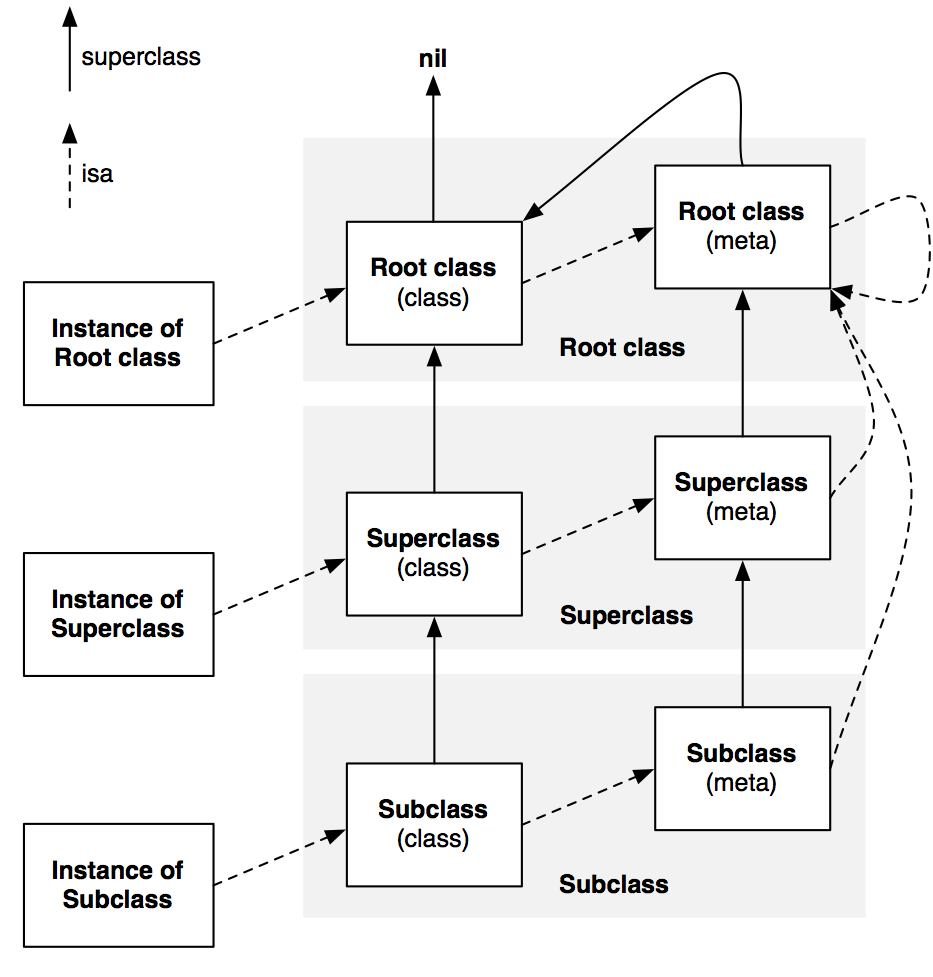

<!-- more -->

## `OC` 设计理念

  `OC` 底层是使用 `C/C++` 实现。定一个继承 `NSObject` 的类，这个类底层使用 `C` 语言中的 `struct` 结构体来实现的。 

### ❓`OC` 的动态性

::: details 💡

  首先理解两个“动态语言与静态语言”

  `OC` 的 `runtime` 文档中介绍中就详细写明了，`runtime` 的设计是为了将 `OC` 中的更多的处理延迟到编译后。

  - 动态类型 (Dynamic typing) : 编译时并不确定对象类型，在运行时才判断对象的类型。`OC` 中一切对象都可以用 `id` 指针指向。
  - 动态绑定 (Dynamic binding) : 方法的调用也是运行时才决定，而并非编译时。
  - 动态加载 (Dynamic loading) : 运行时可以动态加载其它模块或框架

:::

### ❓类结构体的组成，`isa` 指针指向了什么？

::: details 💡

  先给出答案 `isa` 指针是指向类对象，每一个对象都包含 `isa` 指针，通过这个指针可以找到类对象。
  
  当一个对象调用某个方法时(消息发送)，运行时先在当前方法列表中查找，如果不存在，通过 `isa` 指针查找类对象中是否存在方法，如果还不存在会通过父类指针进一步往上查找，最后还是找不到就会抛出未找到异常。
  
  ```objc
  // id 就是 objc_object
  struct objc_object {
    Class _Nonnull isa;         // 指向对象所属的类
  };
  // Class 就是 objc_class
  struct objc_class {
    Class _Nonnull isa;         // 指向元类
    Class _Nullable superclass; // 指向父类
    cache_t cache;              // 方法缓存
    class_data_bits_t bits;     // 包含方法列表和其他信息
  };
  ```

:::

### ❓`OC` 底层方法列表的数据结构是什么？

::: details 💡

  底层是通过结构体来实现了，结构里面的通过数组来存储方法列表
    
  ```objc
  // 方法列表结构体
  struct method_list_t {
    uint32_t entsize;        // 结构体的大小
    uint32_t method_count;   // 方法的数量
    method_t method_list[1]; // 方法列表
  };
  // 方法结构体
  struct method_t {
    SEL sel;                // 方法的名称
    const char *types;      // 方法的类型
    IMP imp;                // 对应的实现（函数指针）
  };
  ```

:::

### ❓`id`、`nil`、`NULL` 区别

::: details 💡

  - `id` : 可以指向任意的 `OC` 对象
  - `nil` : 一种特殊的指针，指向为空的 `OC` 对象
  - `NULL` : 也是表示空指针，一般代表 `C` 指针为空

:::

### ❓`+load` 与 `+initialize` 区别

::: details 💡

  这两个都是类方法，可以从下面几个方面去对比两者的区别
  
  - 调用时机
    * `+load` : 这是在运行时加载时，进行触发调用。
    * `+initialize` : 会在类第一次使用时，进行触发调用。
  
  - 调用次数
    * `+load` : 只会在运行时加载时，调用一次。
    * `+initialize` : 第一次调用时，调用一次。

  - 调用父类
    * `+load` : 不会调用父类的 `+load`
    * `+initialize` : 如果当前类没有

  - 手动调用
    * `+load` : 不能手动调用，运行时进行调用的。手动调用会触发异常。
    * `+initialize` : 可以手动调用。
  
:::
  
  > ❓`+load` 的调用顺序
  
::: details 💡
  
  - `+load` 方法调用顺序与编译连接顺序有关。
  - 不同类之间的`+load`方法的调用顺序不能确定，取决于编译连接顺序。
  - 如果父类、子类和分类都实现了 `+load` 方法，`+load` 方法的调用顺序是：先调用父类的`+load`，再调用子类的`+load`，最后调用分类的`+load`。
  
:::
  
### ❓`@Property` 本质是什么？

::: details 💡  
  
  > `@property` 是 `Objective-C` 中的一个关键字，用于声明一个属性。主要作用是为类的实例变量（属性）生成对应的访问器方法，即 `getter` 方法和 `setter` 方法。
  
  `@property` 访问器
  - 原子性 : `atomic`、`nonatomic`
  - 读写性 : `readwrite`、`readonly`
  - 内存管理 : `assign`、`strong`、`weak`、`copy`

  `@property` 优点
  - 隔离性：可以封装实例变量的直接访问，将类的内部实现与外部接口隔离，提高数据的安全性。
  - 可维护性：可以在 `getter` 和 `setter` 中添加特定的逻辑如设置新值时进行验证，获取值时返回一个计算后的值等，提高代码的可维护性。 
  
  > `@property` 底层实现
  
  声明 `@property` 后，编译器会根据属性的特性在 `class_rw_t` 结构中的 `methods` 和 `properties` 中生成 `getter` 和 `setter` 方法以及相应的属性。然后在运行时，这些 `getter` 和 `setter` 方法以及属性被引入到`objc_class`的结构中。
  
  ```objc
  struct objc_class {
      Class isa;              // metaclass 的指针
      Class super_class;      // 父类
      cache_t cache;          // 缓存
      class_data_bits_t bits; // 类的相关信息，包含了一个指向 class_rw_t 数据结构的指针
  };
  // 可读写结构，存储运行时添加的类信息
  struct class_rw_t {
      uint32_t flags;
      uint32_t version;
      const class_ro_t *ro;           // 只读结构体，保存编译时确定的类信息
      method_array_t methods;         // 方法列表
      property_array_t properties;    // 属性列表
      protocol_array_t protocols;     // 协议列表
      Class firstSubclass;
      Class nextSiblingClass;
  };
  ```
  
:::
  
  >  ❓`assign`、`strong`、`weak`、`copy` 区别？
  
::: details 💡
  
  - `assign`：是赋值特性，简单设置变量，不更改引用计数。
    > 主要用在基本的数据类型（如 int、float）或 C 数据类型（如 结构体、C 数组）而不是对象。
  
  - `strong`（类似于：retain）：是所有权（owning）特性。
    > 采用 `ARC`（自动引用计数）环境下，编译器会自动在设置方法中插入 `retain` 调用，使对象的引用计数增加，从而表示当前对象拥有数据值。
  
  - `weak`：是非拥有关系（non-owning）特性，即弱引用。
    > 当用 `weak` 修饰对象时，被指向的对象引用计数不会增加，更重要的是，当对象被释放时，被 `weak` 修饰的变量会自动被置为 `nil`，防止野指针的出现。`weak` 修饰的属性适合在已经存在对对象的`strong`引用，或者对象之间存在相互循环引用的情况下使用。
  
  - `copy`：是拷贝特性。
    > 适合 `NSString`、`NSArray`、`NSDictionary` 等不可变对象。最重要的一点是：使用 `copy` 保持封装性，对象在内部可能需要一个数据的完整副本，并且把这个副本给外界使用，防止作为接口提供的对象的初始数据被改变。

  选择哪种属性修饰符要视情况而定，如果数据是不可变的，那么选择 `assign` 或 `copy` 较好；如果数据是可变的，可以选择 `strong` 或 `weak`。

:::
  
### ❓`OC` 中的三种字符串？ 
    
::: details 💡
    
  - `__NSCFConstantString` ：在编译时被创建的常量字符串对象，如`NSString *str = @"Hello, World!"`。这些对象会在编译时就被创建，并且在程序的整个生命周期中都不会被销毁。
  
  - `__NSTaggedPointerString` ：使用 `Tagged Pointer` 技术来提高内存使用效率，通常用于存储较小的字符串数据。
  
  - `__NSCFString` ：本质上是一个 `Core Foundation` 字符串的引用（`CFStringRef`），这种类型的字符串通常会在运行时程序动态创建的对象字符串。

:::

  > `Tagged Pointer` 了解吗？ 

::: details 💡

  > `iOS 7` 之后 Apple 为了优化引入的一项技术。从字面意思上来看`Tagged Pointer`就是带有标签的指针。
  
  一般来说，在 64-bit 架构下，一个指针的值需要占用 8 byte 的内存空间；然而对于一些非常小的数据，比如 NSNumber、NSDate、NSString 等，使用 8 byte 存储对象指针就显得非常浪费。为了解决这个问题，苹果引入了 `Tagged Pointer` 技术，通过标签直接将小的数据对象嵌入到指针中，这样对于小的数据对象，就无需额外的内存来存储了，能够显著提高内存的利用率。需要注意，一个对象是否使用 `Tagged Pointer` 是由系统决定的，不能人为控制。
  
  具体到 `NSString` 这种场景中，如果字符串的内容非常短，那么它的实现方式可能就是 `Tagged Pointer`，直接将字符串内容存在指针中，提高了内存利用率。
  
:::
  
### ❓`NSDictionary` 大致实现原理

::: details 💡

  `NSDictionary` 在内部实现上采用了哈希表的数据结构
    
:::
    
## `block`
  
### ❓`block` 与 函数指针
  
::: details 💡
  
  - `block`：一种特殊的数据类型，可以存储一段代码，并且这段代码可以在任何时候被执行。可以访问在声明他的那个作用域中定义的变量，这被称为“变量捕获”。
  
  - 函数指针：函数指针是存储着函数地址的指针变量，本质上是一个地址值，也就是函数在内存中的起始地址。函数指针不能像 `block` 那样访问变量，只能通过传参的方式去使用外部的数据。
  
:::
  
### ❓`block` 底层实现？

::: details 💡

  `block` 底层是使用结构体实现的。
  
  根据内存分区不同，分为三种 `block`
    
   - `__NSGlobalBlock__` : 全局 `block`，类似全局静态变量，存放在静态区 
   - `__NSStackBlock__` : 栈区 `block`，保存在栈区
   - `__NSMallocBlock__` : 堆区 `block`，保存在堆区

:::

## `Category`

::: details 💡

  > `Category`(类别)：`Objective-C` 的一个特性，提供了一种给已存在类添加方法的机制.
    
  - `Category` : 只能添加方法，不能添加实例变量(除非通过关联对象)。分类中的方法是运行时添加到方法列表中的。
  - `Extension` : 可以添加方法和计算属性，也可以添加构造方法，也可以实现以一个协议。编译时已经确定，不支持动态添加方法。

:::

### ❓如果分类中添加与类相同的方法签名会发生什么？
  
::: details 💡
  
  分类中的方法是运行时添加到方法列表中，并且是添加中已有方法的前面。所以当分类与原类中的方法相同时，分类中的方法会优先调用，覆盖掉原类中的方法。
 
:::
 
### ❓分类是如何实现的？它为什么会覆盖掉原来的方法？
 
::: details 💡

  底层实现：是一个 `objc_category` 结构体，它包含了类名(name)、类(cls)、类别中所有方法的列表(method_list)、类别的协议列表(protocol_list)、类别中所有的属性列表(property_list)。
    
  加载过程：在程序运行时的 `load` 阶段进行的，所有类和分类的 `+load` 方法（如果有）被调用。在调用 `+load` 方法之前，`runtime` 会先将分类的方法、协议、属性合并到类的数据结构中。这个过程中，分类的方法被放在了原来类方法列表的前面，所以在类和分类中有相同方法名的方法的时候，分类的方法会被优先调用，原类的方法被覆盖。

:::
 
### ❓分类中如何添加属性？
 
::: details 💡
 
  可以使用关联对象（`Associated Objects`）让分类拥有“伪属性”。
 
 在Objective-C中，分类（Category）的定义中并不支持直接添加属性（instance variable）。但我们可以通过 Objective-C 的关联对象（Associative References）机制实现给分类添加属性。 

以下是一个例子，演示如何给一个分类添加一个属性：

  ```objc
  #import "NSObject+Property.h"
  #import <objc/runtime.h>

  static const void *MyKey = &MyKey;

  @implementation NSObject (Property)
  // getter
  - (NSString *)myProperty {
    // `objc_getAssociatedObject` 用于取关联对象。
    //  - 首个参数是要存取的对象
    //  - 第二个参数是键，我们用一个静态常量 `MyKey` 作为键（每个关联到对象的键必须全局唯一）
    return objc_getAssociatedObject(self, MyKey);
  }
  // setter
  - (void)setMyProperty:(NSString *)myProperty {
    // `objc_setAssociatedObject` 第三个参数是存储的值，第四个参数是关联策略
    // `OBJC_ASSOCIATION_COPY_NONATOMIC`，表示这是一个 copy ，非原子操作的特性
    objc_setAssociatedObject(self, MyKey, myProperty, OBJC_ASSOCIATION_COPY_NONATOMIC);
  }
  @end
  ```

在这个示例中，我们定义了一个 `NSObject` 的分类并为它添加了一个 `myProperty` 属性。

。对于 ，例如在这里我们将它设为了 。

  通过关联对象可以间接实现在分类中"添加"属性，这也是 `Objective-C` 动态的特性之一。
 
:::

## `runtime`

### ❓`OC` 对象模型

::: details 💡


> Objective-C 类图




:::

### ❓`isa` 是什么？

::: details 💡

  > `isa`： `OC` 对象的一个指针，它是每个 `OC` 对象的第一个成员变量，用于指向该对象的类对象。
    
  `Objective-C` 的对象模型中，对象分为实例对象、类对象、元类对象，这三种对象都含有 `isa` 指针。

  - 实例对象: 实例对象的`isa`指向它的类对象；实例对象主要存储实例变量的值。

  - 类对象: 类对象的`isa`指向元类对象；类对象主要存储实例方法、属性、以及遵守的协议等信息。

  - 元类对象: 元类对象的`isa`指向自身；元类对象主要存储类方法等信息。

  当发送消息给一个对象时，`runtime` 通过这个对象的 `isa` 指针找到它的类对象，然后在类对象的方法列表中查找对应的方法进行调用。

:::

### ❓`runtime` 如何通过 `selector` 找到对应的 `IMP` 地址

::: details 💡

  - 消息的接受者（receiver）会在自己的类和超类（superclasses）的方法列表中查找与消息匹配的 `selector`。
  - 如果找到了匹配的 `selector`，那么会从方法列表中取出对应的函数指针（IMP），并且调用这个函数。
  - 如果没有找到匹配的 `selector`，那么会进入消息转发（forwarding）流程。

:::

### ❓`super` 是什么？

::: details 💡

  `super` 并不是一个指针，在 `OC` 进行消息调用时，其实是有两个隐藏参数的，一个是接收者(receiver)，一个是方法选择器(selector)。
  
  常见的 `self` 表示的是接收者。而 `super` 其实是一个编译器标示符，当发送给 `super` 一个消息时，调用者仍然是 `self` ，但是运行时会从当前类的父类开始查找方法。
  
> 以下代码输出？

  ```objc
  @interface Animal
  @end
  @interface Dog : Animal
  @end
  @implementation Dog
  - (instancetype)init {
    self = [super init];
    if (self) {
        NSLog(@"%@", NSStringFromClass([self class]));
        NSLog(@"%@", NSStringFromClass([super class]));
    }
    return self;
  }
  @end
  ```
  
  也就是说 `super` 并不会改变消息的接收者，所以当我们调用 `[super class]` 时，虽然是从父类开始查找 `class` 方法，但是方法的接收者依然是 `self` 本身，其类别自然是当前类本身。这也是为什么我们再调用 `[super class]` 时还会返回 `Dog` 类的原因。

:::

  > `super` 的底层实现？

::: details 💡

  `OC` 中 `super` 的实现是通过 `runtime` 的 `objc_msgSendSuper` 和 `objc_msgSendSuper_stret` 两个函数来完成的。具体来说，当编译器遇到 `[super method]` 这种形式的调用时，会转化为 `objc_msgSendSuper(super_cls, sel)` 的形式。

  ```c
  // super 结构体
  struct objc_super {
    __unsafe_unretained id receiver;        // 消息的接收者
    __unsafe_unretained Class super_class;  // 父类(开始查找的类)
  };
  // objc_msgSendSuper
  void objc_msgSendSuper(struct objc_super *super, SEL op, ...)
  ```

:::

###, 消息转发, 弱引用表

## `RunLoop`

### ❓`RunLoop` 有几种事件源？有几种模式？

::: details 💡

  `RunLoop`是用来管理事件和处理 `IO` 的基本架构
  
  三种事件源

  - `Timer`：定时器事件
    > `RunLoop` 按照设定的时间区间接收定时器事件。
  - `Source`：输入源事件
    > 包括两种类型：source0 & source1
    * source0 : 自定义的输入源，需要程序员自己生成和管理。
    * source1 ： 基于 `Port` 的输入源，接收来自其他线程或进程的消息，然后在当前线程上调用指定的处理方法。
  - `Observer`：观察者事件
    > 可以设置在 `RunLoop` 各个运行阶段接收的事件。

  运行模式

  - `NSDefaultRunLoopMode`（kCFRunLoopDefaultMode）：默认模式
    > 如果不手动指定模式，`RunLoop` 就在这个模式下运行。
  - `UITrackingRunLoopMode`：界面跟踪模式
    > 用于 `ScrollView` 滚动时。
  - `UIInitializationRunLoopMode`：启动 App 时第进入的模式
    > 启动完成后就不再使用。
  - `NSRunLoopCommonModes`（kCFRunLoopCommonModes）：这是一个占位模式，不是一种真正的 Mode。
    > 可以将事件源（`Timer/Observer/Source`）添加到 `CommonModes` 中，`RunLoop` 运行在哪种 Mode 时，只要这种 Mode 被标记为 Common 的属性，则 `RunLoop` 就会处理相应的事件。

:::

### ❓`Runloop` 内部实现逻辑？

::: details 💡

  `RunLoop` 的内部实现可以简单地概括为一个 `while` 循环，在这个循环中处理各种输入源的事件。`RunLoop` 在开启后会一直在这个循环中执行，直到接收到停止 `RunLoop` 的消息。

  - `RunLoop` 在启动时会从预设的 `Mode` 中选择一个，然后进入 `RunLoop` 的循环。
  
  - 进入循环周期
    * 首先，处理所有到期的定时器事件。
    * 然后，处理所有的输入源事件。输入源的事件包括来自 `Port` 的消息，以及用户定义的其他事件。
    * 然后，如果有观察者的话，`RunLoop` 会通知观察者当前 `RunLoop` 的状态。
    * 最后，如果在处理事件的过程中没有任何源需要处理，那么 `RunLoop` 会进入休眠等待被唤醒。

  - 继续下一次循环，直到接收到结束 `RunLoop` 的消息。

:::

### ❓以下代码输出是什么？

  ```objc
  NSLog(@"1");
  dispatch_async(dispatch_get_global_queue(0, 0), ^{
    NSLog(@"2");
    [self performSelector:@selector(test) withObject:nil afterDelay:10];
    NSLog(@"3");
  });
  NSLog(@"4");
  - (void)test {
    NSLog(@"5");
  }
  ```

::: details 💡

  > 打印顺序 : 1, 4, 2, 3

  "1"和"4"是普通的直接执行代码，因此会按照顺序输出。
  
  "2"和"3"位于异步并发队列中，会在新线程中执行，所以会在"1"和"4"之后开始执行。

  "5"不会输出。原因是`[self performSelector:@selector(test) withObject:nil afterDelay:10];`这一行代码被放在异步并发队列中，并且是在子线程中执行，但是这种执行方式是依赖 `RunLoop` 的，而新创建的线程默认是没有启动 `RunLoop` 的，所以`performSelector:afterDelay:`方法会失效。


  > 如果想要使 "5" 能够打印，应该怎么处理？
    
  ```objc
  // 方案一 : 放入主线程 RunLoop
  [self performSelectorOnMainThread:@selector(test) withObject:nil waitUntilDone:NO];
    
  // 方案二 : 在子线程中手动启动 RunLoop
  NSRunLoop *runLoop = [NSRunLoop currentRunLoop];
  [self performSelector:@selector(test) withObject:nil afterDelay:5.0];
  [runLoop run];
  ```

:::