> `Markdown` 主要是为了方便写作而生的，编写完之后最终是转化为了 `HTML` 文档，而且也是完全兼容 `HTML` 格式文档，可以插入 `HTML` 格式文档。整理 `Markdown` 常用的标记语法。

<!-- more -->

## Reference

- [Markdown 官网语法](http://daringfireball.net/projects/markdown/syntax)
- [Markdown 基本语法](https://github.com/younghz/Markdown)
- [Markdown 中文网](http://www.markdown.cn/)

## Editor

- [MWeb](http://zh.mweb.im/)
- [MarkdownPad](http://markdownpad.com)
- [Milkdown](https://milkdown.dev/) 👉🏻 [🐙](https://github.com/Milkdown/milkdown)
    > 🍼 Plugin driven WYSIWYG markdown editor framework.
- [MacDown][https://macdown.uranusjr.com/] 👉🏻 [🐙](https://github.com/MacDownApp/macdown)
    > Open source Markdown editor for macOS.

## Usage

### Span (行内元素)

   | 效果 | 格式
   | -- | --
   | **强调**      | `**文本**`
   | *斜体*        | `*文本*`  
   | ~~删除线~~    | `~~文本~~`
   | 内嵌代码      | `` `代码` ``
   | 链接          | `[显示文本](链接地址)`
   | 图片          | ``
   | Email         | `<mail@mail.com>`

### Block (块区元素)
 
  | 效果 | 格式
  | -- | --
  | 换行符                | 在行尾输入两个以上空格
  | 标题 - Setext 形式    | `====`、`----`
  | 标题 - atx 形式       | `# 标题1`、`## 标题2`、`### 标题3`...
  | 引用                  | `> 引用文本`  (区块引用可以嵌套使用其他`Markdown`的标记)
  | 分割线                | 三个以上的星号、减号、底线（中间可以插入空格） `****`、`----`、`- - -`、`____`
  | 列表 - 无序列表        | `*`、`+`、`-`  
  | 列表 - 有序列表        | `1.`、`2.`、`3.`...
  | 代码区块              | 代码区块需要使用4个空格或者1个Tab制表符就可以
  | 代码块                | 通过符号\`\`\`首尾包含即可，还可以设置代码语言、描述、链接地址
  | 表格                  | 表格标题需要用`|`分隔线分割，第二行需要(至少一个)`|`分割线，内容区域分割线与标题区域对应即可

  \`\`\` [代码语言] [代码描述(文件名、位置...)] [链接地址] [链接描述] 
    code
  \`\`\`

  ```md
  // 表格对齐方式 : 通过第二行控制
  //      + 左对齐(默认) : `:-`、`:---`  
  //      + 居中 : `:`、`:-:`、`:---:`  
  //      + 右对齐 : `-:`、`---:`  
  
  // 写法一：
  One        | Two       | Three
  ---        | ---       | ---
  T1(0,0)    | T1(0,1)   | T1(0,2)
  T1(1,0)    | T1(1,1)   | T1(1,2)
  T1(2,0)    | T1(2,1)   | T1(2,2)
  // 写法二：
  | One      | Two       | Three     |
  | ---      | ---       | ---       |
  | T2(0,0)  | T2(0,1)   | T2(0,2)   |
  | T2(1,0)  | T2(1,1)   | T2(1,2)   |
  | T2(2,0)  | T2(2,1)   | T2(2,2)   |
  // 写法三：格式简洁、清晰（推荐）
  | One        | Two       | Three
  | :---       | :---:     | ---:
  | T3(0,0)    | T3(0,1)   | T3(0,2)
  | T3(1,0)    | T3(1,1)   | T3(1,2)
  | T3(2,0)    | T3(2,1)   | T3(2,2)
  ```

  One         | Two       | Three
  ---         | ---       | ---
  T1(0,0)     | T1(0,1)   | T1(0,2)
  T1(1,0)     | T1(1,1)   | T1(1,2)
  T1(2,0)     | T1(2,1)   | T1(2,2)
      
  | One       | Two       | Three     |
  | ---       | ---       | ---       |
  | T2(0,0)   | T2(0,1)   | T2(0,2)   |
  | T2(1,0)   | T2(1,1)   | T2(1,2)   |
  | T2(2,0)   | T2(2,1)   | T2(2,2)   |
      
  | One         | Two       | Three
  | :---        | :---:     | ---:
  | T3(0,0)     | T3(0,1)   | T3(0,2)
  | T3(1,0)     | T3(1,1)   | T3(1,2)
  | T3(2,0)     | T3(2,1)   | T3(2,2)

- 其它元素

  | 效果 | 格式
  | -- | --
  | 自动链接  | `<链接地址>`
  | 脚注      | 在文文本中插入脚注 `[^n]`,文章结尾脚注格式 `[^n]:脚注内容`
  | 反斜杠    | 用于展示Markdown中已定义的标记 `\标记符号`
  | 锚点      | 插入锚点 `[锚点描述](#锚点名)` ，在锚点要跳转的地方插入 `## [锚点文本](id:锚点名)`
  
## [Mermaid](https://github.com/mermaid-js/mermaid)
> Generation of diagrams like flowcharts or sequence diagrams from text in a similar manner as markdown

### Flow Chart : 流程图

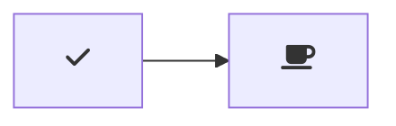


```mermaid
graph TB
    sq[Square shape] --> ci((Circle shape))

    subgraph A
        od>Odd shape]-- Two line<br/>edge comment --> ro
        di{Diamond with <br/> line break} -.-> ro(Rounded<br>square<br>shape)
        di==>ro2(Rounded square shape)
    end

    %% Notice that no text in shape are added here instead that is appended further down
    e --> od3>Really long text with linebreak<br>in an Odd shape]

    %% Comments after double percent signs
    e((Inner / circle<br>and some odd <br>special characters)) --> f(,.?!+-*ز)

    cyr[Cyrillic]-->cyr2((Circle shape Начало));

     classDef green fill:#9f6,stroke:#333,stroke-width:2px;
     classDef orange fill:#f96,stroke:#333,stroke-width:4px;
     class sq,e green
     class di orange
```

### Sequence Diagram : 时序图

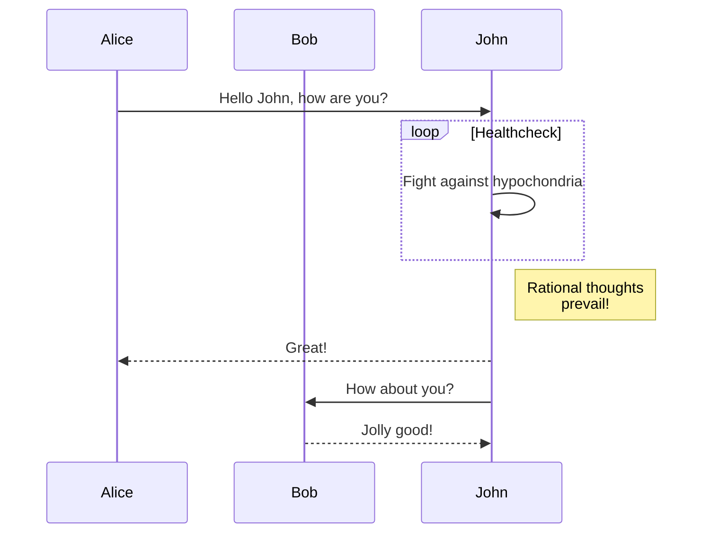

### Class Diagram: 类图

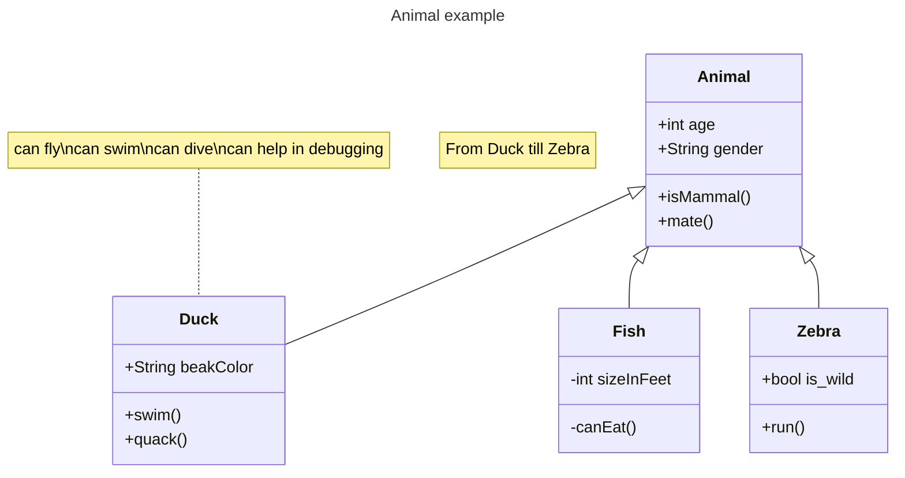

### State Diagram: 状态图

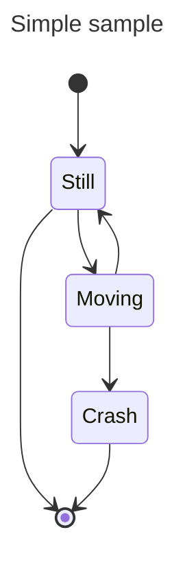

### Entity Relationship Diagram : 实体关系图

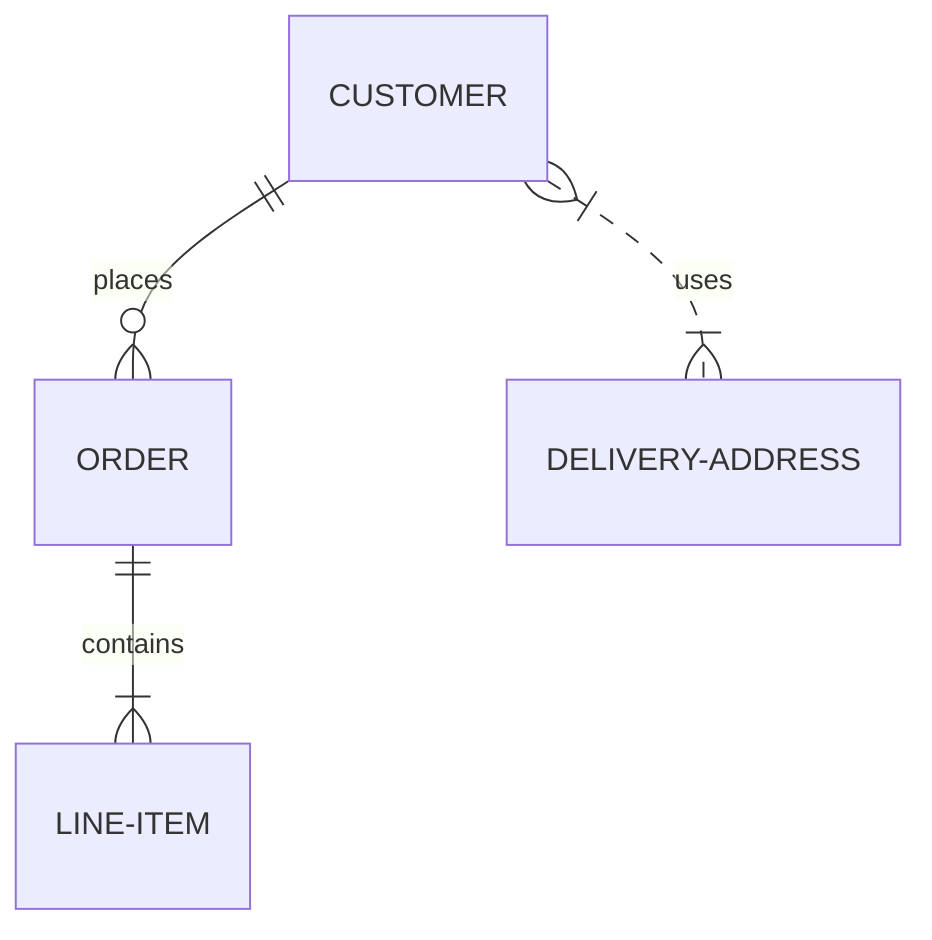

### User Journey Diagram : 用户体验旅程图

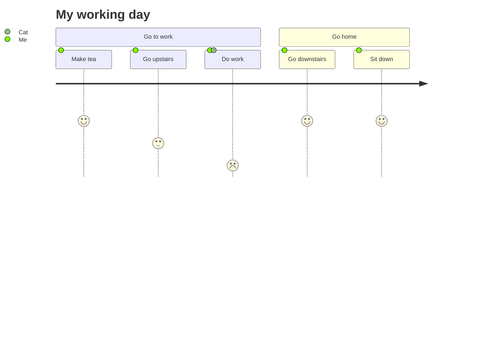

### Gantt Diagram : 甘特图

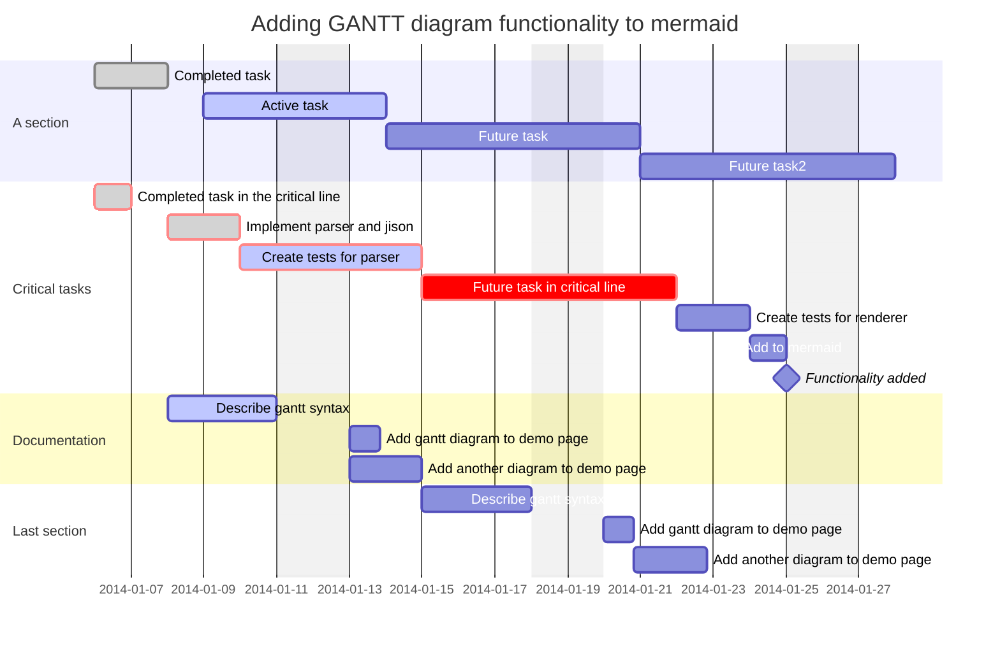

### Pie Chart : 饼图

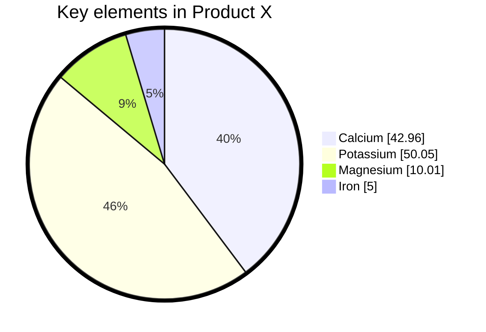

### Quadrant Chart : 象限图

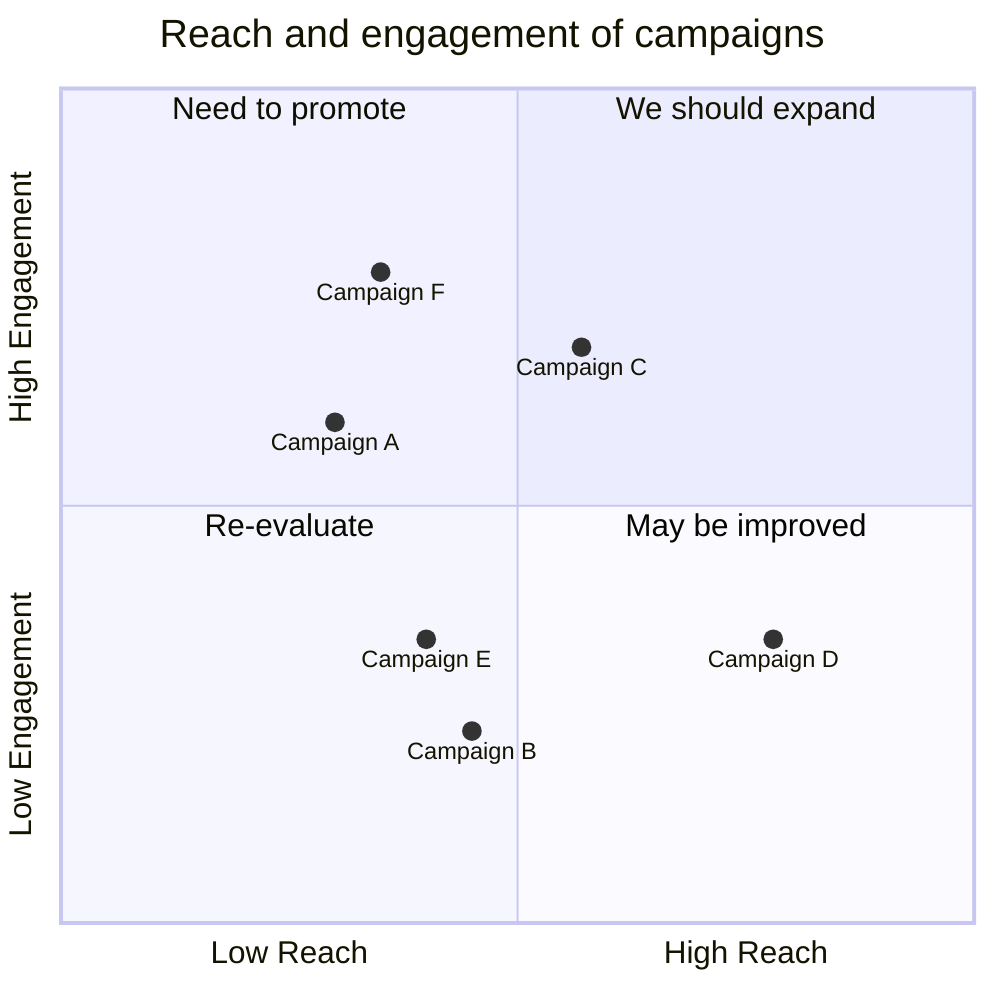

### Requirement Diagram : 需求图

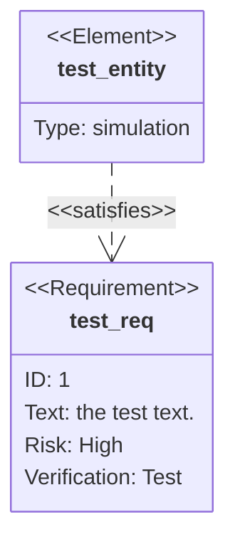

### Git Graph : Git 图

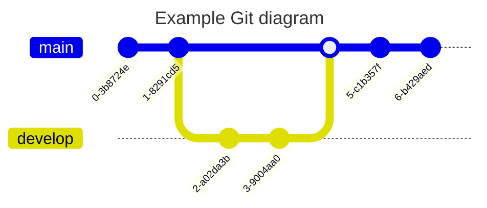

### C4 Diagram

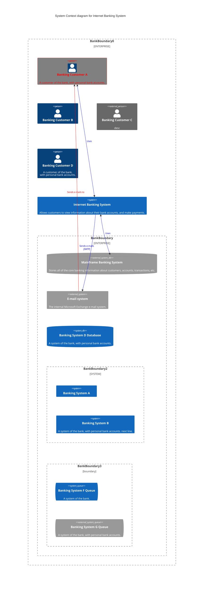

### Mindmap : 思维导图

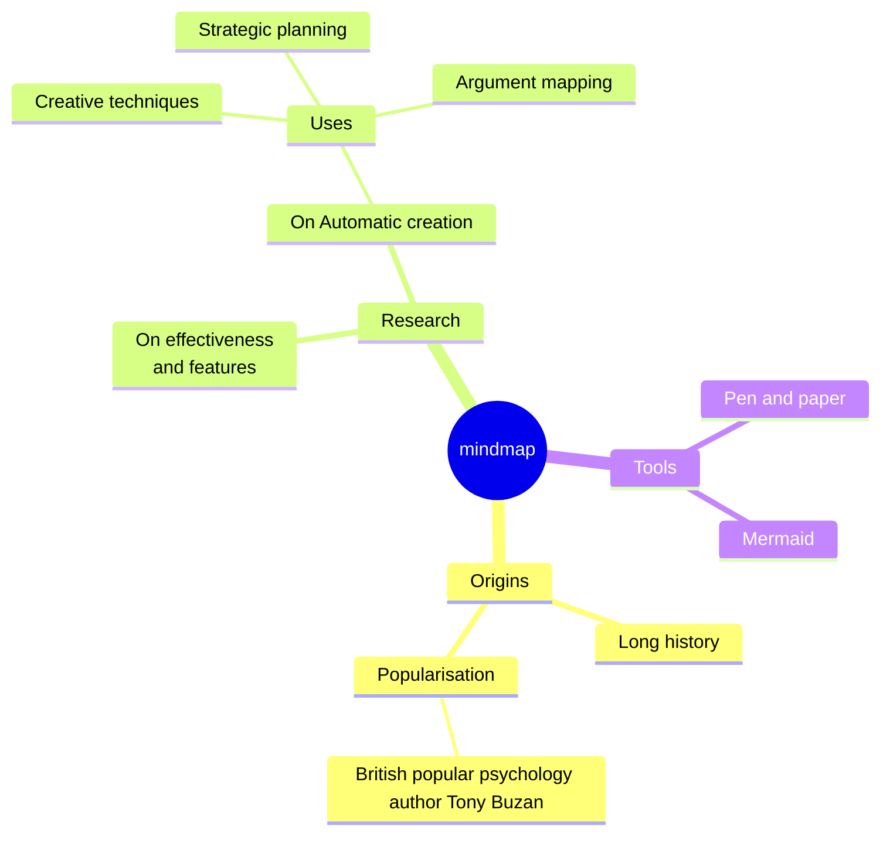

### Timeline : 时间线

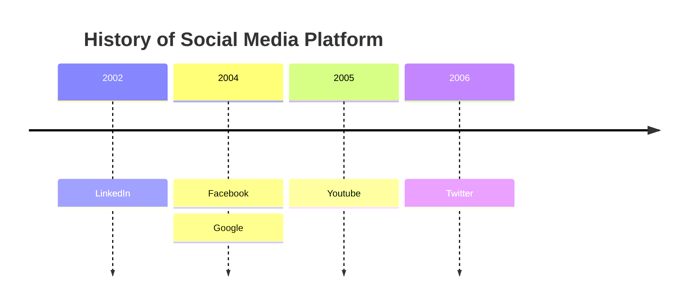

### ZenUML : UML 图

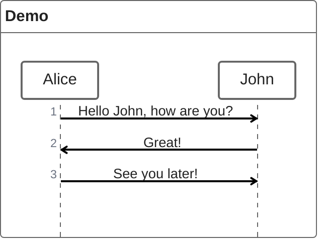
